[toc]

# 前置知识

## vscode 界面布局

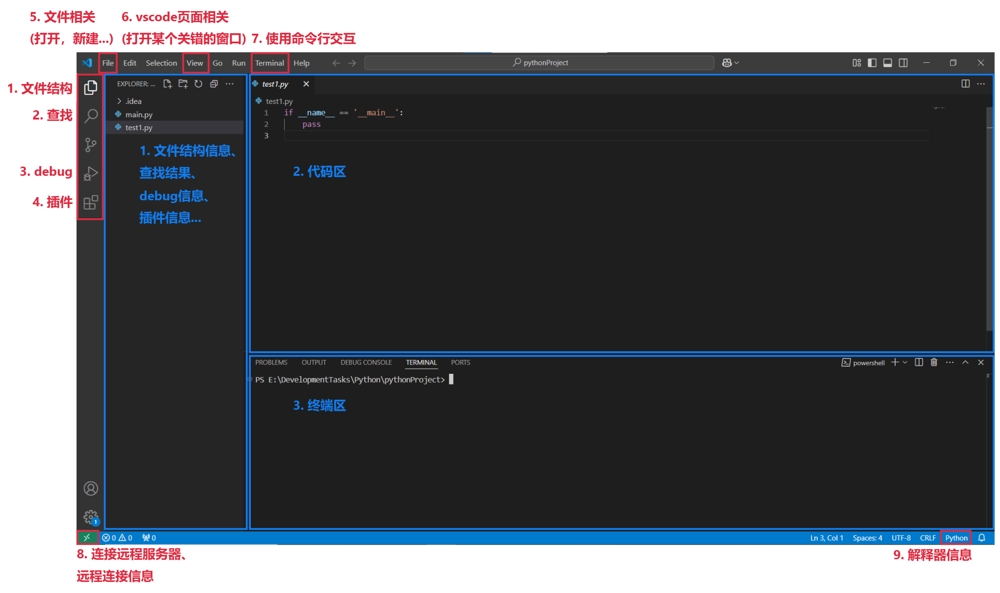

## 打开文件或目录

- `File` -> New, Open


## 插件

- `Extensions` -> 安装、管理插件

- 插件分为本地安装的插件和远程服务器上安装的插件

  > 如果已经建立了远程连接，本地的插件上传了服务器才可以使用 (`.vscoder-server` 目录下)，而服务器上安装的插件不用下载到本地就可以使用

### 离线安装插件

1. 进入[微软插件商城](https://marketplace.visualstudio.com/vscode)

2. 找到某个插件的详情页，点击 `Download Extension`，

   

   下载后得到一个 **`.vsix` 文件**

3. `Extensions` -> `右上角的三个小点` -> `Install from VSIX...`

### 常用插件

- <u>*编程语言类插件*</u>

  > vscode 默认支持 javascript、html 等语言，但是<u>*不包含 python、java、C 等*</u>语言的编译器或解释器和语法检查、自动补全等，这些都需要自行安装
  >
  > 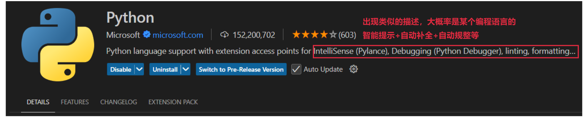

  - `Python`：Python 的解释器、语法检查、智能补全等继承在一起的插件

- <u>*远程连接类插件*</u>

  - `Remote - SSH`、`Remote - SSH: Editing Configuration Files`、`Remote Explorer`：用于 ssh 连接

- <u>*debug 类*</u>

  - `Python Debugger`：用于 Python debug

- <u>*代码格式化类*</u>

  - `Black Formatter`：用于 Python 的代码格式化工具

### 修改插件的安装位置

0. vscode 默认将插件存储在 `C:\Users\您的用户名\.vscode\extensions` (Windows 系统，Linux 系统同理)

1. <u>*修改 vscode 的快捷方式*</u>，增加 `--extensions-dir` 参数，

   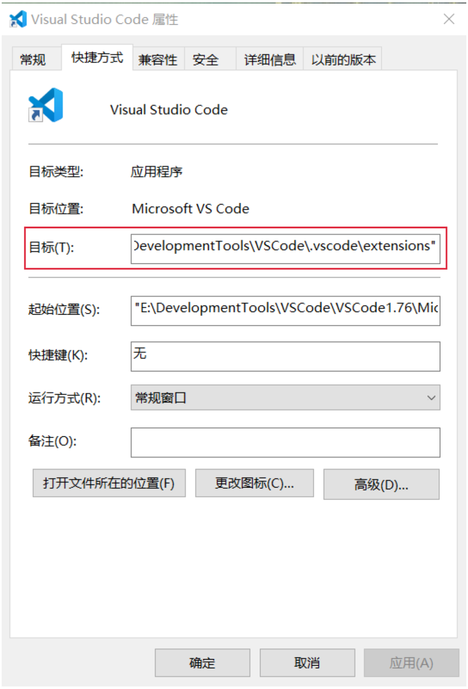

   ```
   e.g. 将目标这一项修改为：
   "E:\DevelopmentTools\VSCode\VSCode1.76\Microsoft VS Code\Code.exe" --extensions-dir "E:\DevelopmentTools\VSCode\.vscode\extensions"
   ```


## 保存和自动保存

- <u>*vscode 默认不开启自动保存*</u>
- `File` -> 勾选 `Auto Save` -> 打开自动保存


## 连接远程服务器

### 创建新的连接 / 管理已有连接

1. <u>*在本地机器上*</u>安装 `Remote - SSH`、`Remote - SSH: Editing Configuration Files` 和 `Remote Explorer` 这三个插件

2. 点击对应位置，

   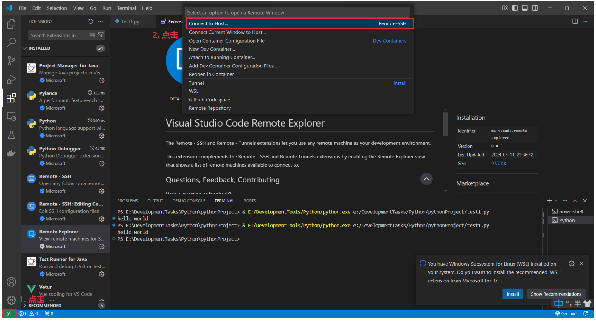

3. <u>*进入配置界面*</u>，

   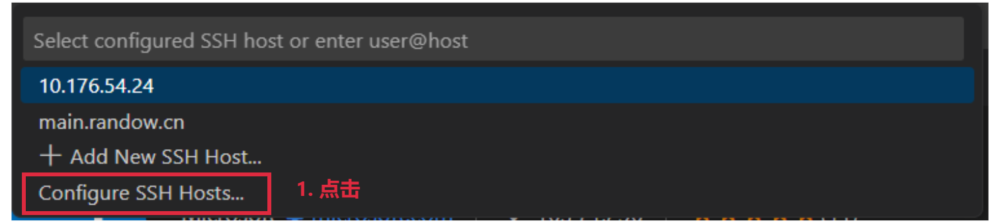

   选择已有配置文件所在位置

   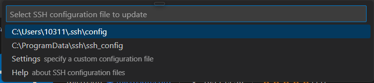

4. 看到类似如下的<u>*配置信息*</u>，

   > 下面的配置文件，实现了登录 10.176.54.24 服务器上的一个进行了 `-p 25001:22` 映射的 docker 容器

   ```
   Host 10.176.54.24
     HostName 10.176.54.24
     Port 25001
     User root
   ```

   - `Host`：为当前链接起的名字，<u>*不同链接要使用不同更多名字*</u>
   - `HostName`：被请求服务器的地址
   - `Port`：被请求服务器 ssh 服务监听的端口
   - `User`：在被请求服务器中以什么用户登录 (一般容器内都是以 root 身份登录)

### 进入已有连接

0. 如果已经安装了 `Remote Explorer` 插件，可以便捷地进入已有远程连接

1. 点击对应位置，

   > 这里的 10.176.54.24 是上面 config 中配置的 `Host`

   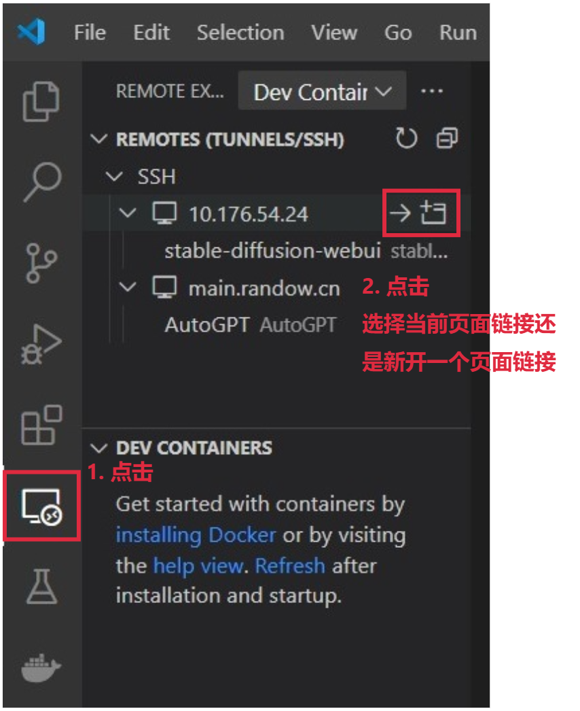

   > 如果有些连接突然无法进入了，检查上面的 config 文件，必要可以全部删除了重新配置

### `.vscode-server`

0. 被请求的服务器中会出现 `/root/.vscode-server` 目录，其中存储了与连接相关的信息

   如果连接失败或者出处于离线状态 (`.vscode-server` 中存在一些联网下载的文件)，需要<u>*手动设置 `.vscode-server`*</u>

1. [离线设置 `.vscode-server` 的教程](https://www.cnblogs.com/michaelcjl/p/18262833)

   > `.vscode-server` 在较新的版本中已经不再使用 `/bin`，而是使用 `/cli`


## 与命令行交互

```
使用快捷键 ctrl+` 唤出命令行
```


# 对于 Python

## 设置 Python 解释器

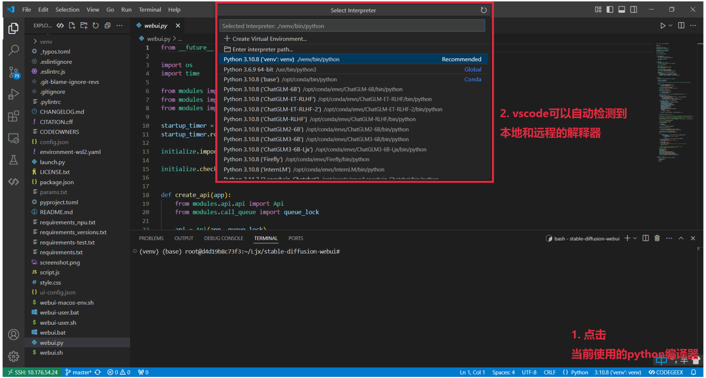


## 运行 Python File

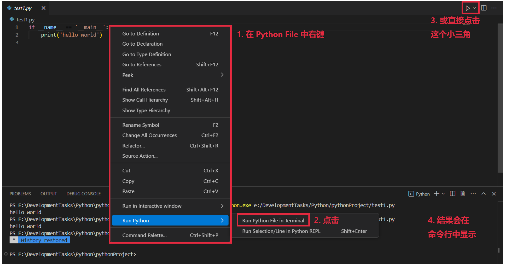


## 进行 Python debug

1. 创建 `launch.json`，

   > 不同编程语言的 `launch.json` 会有一定区别；一般会需要自定义

   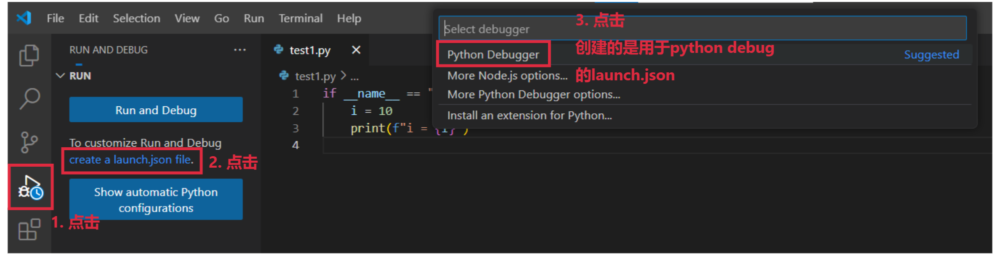

   vscode 提供了一些预制的 `launch.json`；<u>*普通的 python file 用第一个就可以*</u>

   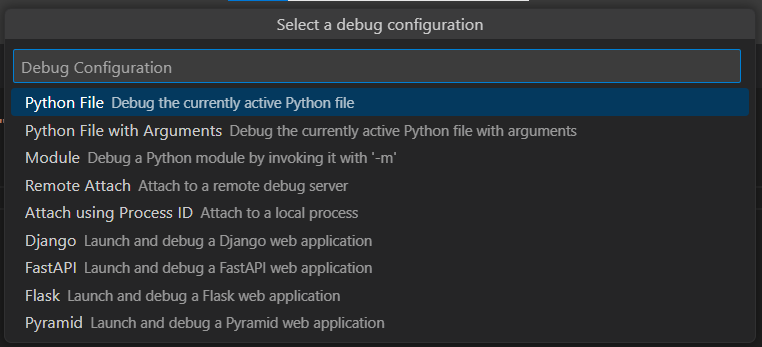

2. 会出现 `/workpath/.vscode/launch.json`

   ```json
   {
     "version": "0.2.0",
     "configurations": [
   
       {
         "name": "Python Debugger: Current File",
         "type": "debugpy",
         "request": "launch",
         "program": "${file}",
         "console": "integratedTerminal",
         "python": "${command:python.interpreterPath}",
         "args": [
   
         ],
         "env": {
           "CUDA_VISIBLE_DEVICES": "3,4"
         },
         "justMyCode": false
       }
     ]
   }
   ```

   - `type`：不同的语言对应不同的调试适配器；Python 对应 `debugpy`
   - `request`：
     - `"launch"`：启动一个新进程进行调试
     - `"attach"`：连接到一个已经运行的进程 (e.g. 容器中某个正在运行的进程)
   - `program`：指定被调试的 python file；`${file}` 表示目前查看的 python file 被调试
   - `python`：指定使用的解释器
   - `args`：运行时需要添加的参数
   - `env`：设置环境变量
   - `justMyCode`：如果想要对第三方包 debug，设置为 `false`

3. 开始 debug，

   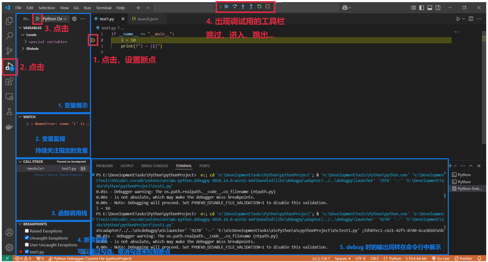


# 参考资料

- [youtube 上 vscode 官方的教学视频](https://www.youtube.com/playlist?list=PLj6YeMhvp2S5UgiQnBfvD7XgOMKs3O_G6)