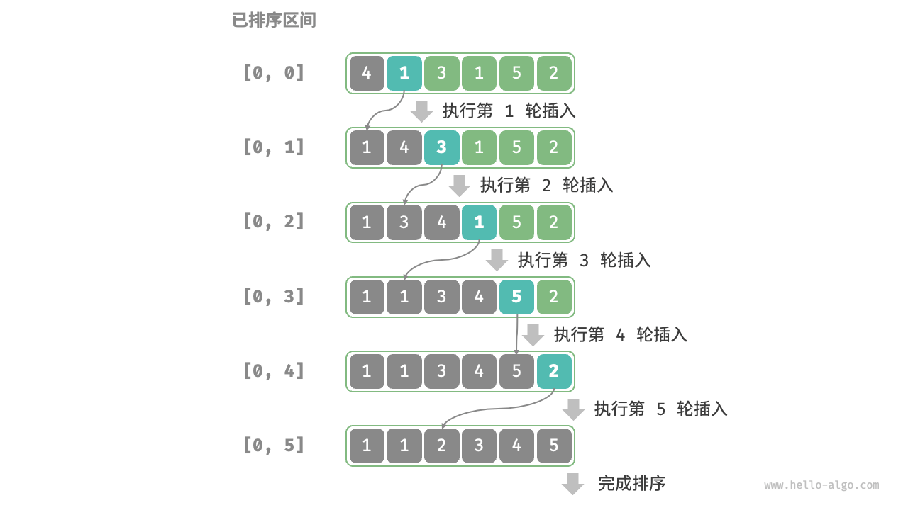
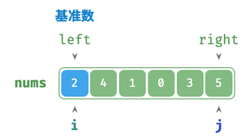
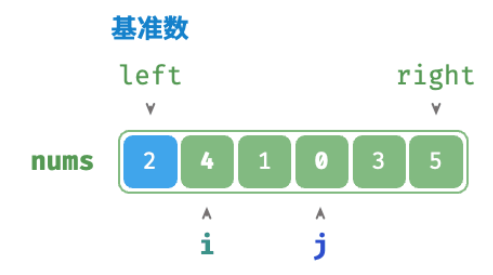
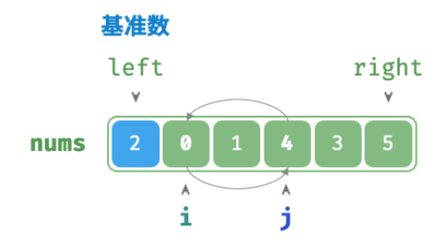
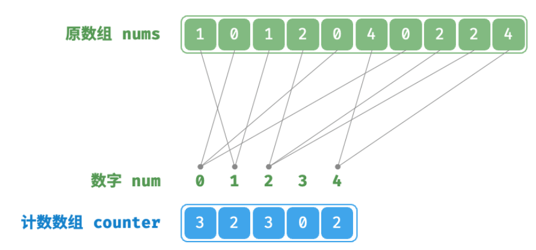
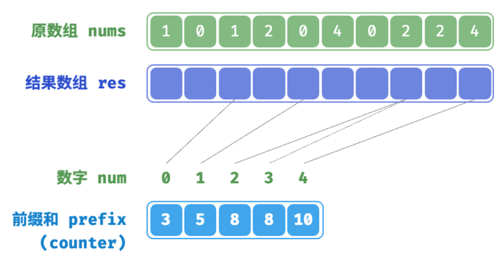
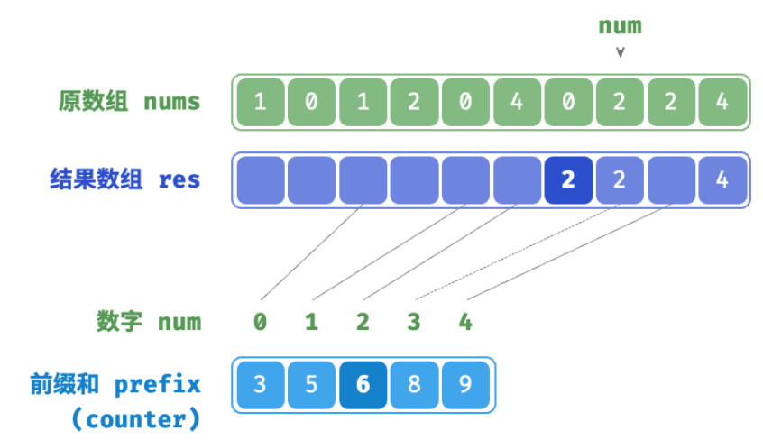
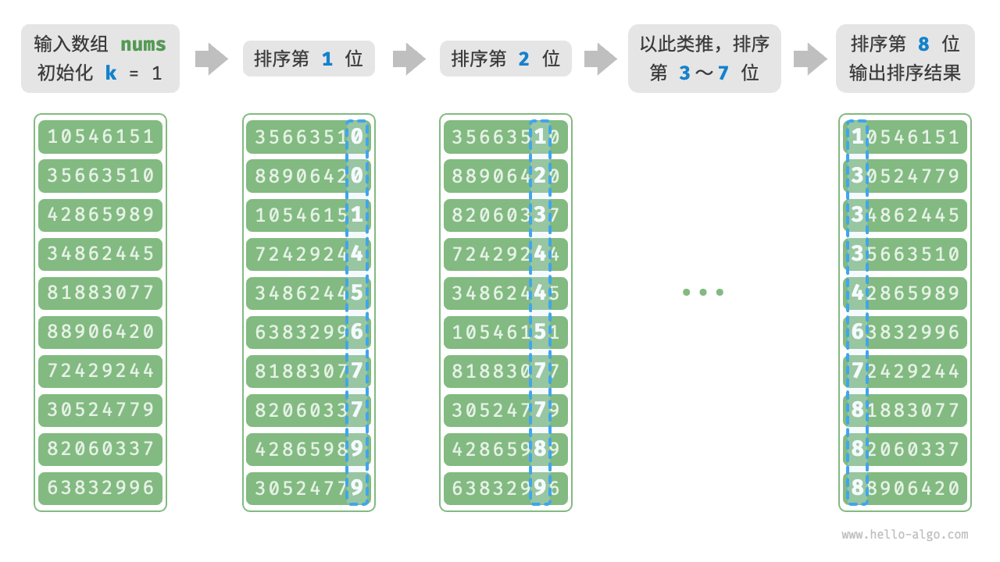
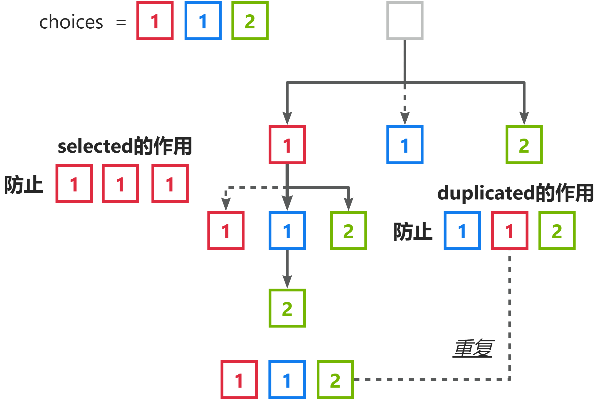
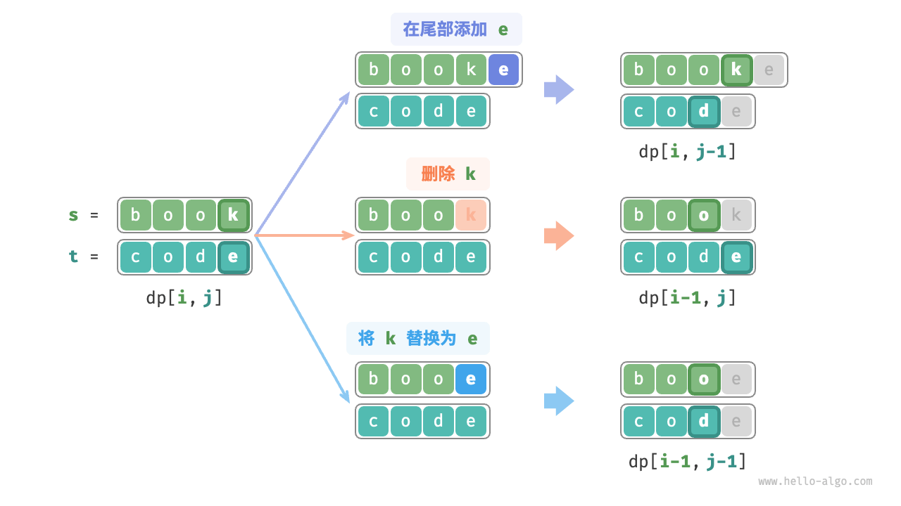

[toc]

# 1 搜索

## 二分查找

### 二分查找

- 使用**向下取整** (i.e. `//`)
- 每次在**双闭区间** `[i, j]` 中查找，这样代码书写更加方便
- 在<u>*结束查找*</u>后，**i** 指向的值是**大于等于 target 中的最小值**，**j** 指向的值是**小于等于 target 中的最大值**

```python
def binary_search(nums: list[int], target: int) -> int:
    """二分查找（双闭区间）"""
    # 初始化双闭区间 [0, n-1] ，即 i, j 分别指向数组首元素、尾元素
    i, j = 0, len(nums) - 1
    # 循环，当搜索区间为空时跳出（当 i > j 时为空）
    while i <= j: # 在[i, j]双闭区间中查找
        # 理论上 Python 的数字可以无限大（取决于内存大小），无须考虑大数越界问题
        m = (i + j) // 2  # 计算中点索引 m
        if nums[m] < target:
            i = m + 1  # 此情况说明 target 在区间 [m+1, j] 中
        elif nums[m] > target:
            j = m - 1  # 此情况说明 target 在区间 [i, m-1] 中
        else:
            return m  # 找到目标元素，返回其索引
    return -1  # 未找到目标元素，返回 -1
```

### 二分查找插入点

**二分查找插入点，序列无重复：**

- <u>*问题描述*</u>：对于无重复有序序列，找到<u>*大于等于*</u>指定值的元素中最小元素的 index
- <u>*大于等于*</u>指定值的元素中最小元素的 index，就是**最后的 i**

```python
def binary_search_insertion_simple(nums: list[int], target: int) -> int:
    """二分查找插入点（无重复元素）"""
    i, j = 0, len(nums) - 1  # 初始化双闭区间 [0, n-1]
    while i <= j:
        m = (i + j) // 2  # 计算中点索引 m
        if nums[m] < target:
            i = m + 1  # target 在区间 [m+1, j] 中
        elif nums[m] > target:
            j = m - 1  # target 在区间 [i, m-1] 中
        else:
            return m  # 找到 target ，返回插入点 m
    # 未找到 target ，返回插入点 i
    return i
```

**二分查找插入点，序列有重复：**

- <u>*问题描述*</u>：对于有重复有序序列，找到<u>*大于等于*</u>指定值的元素中最小元素的 index，且 index 要越小越好

```python
def binary_search_insertion(nums: list[int], target: int) -> int:
    """二分查找插入点（存在重复元素）"""
    i, j = 0, len(nums) - 1  # 初始化双闭区间 [0, n-1]
    while i <= j:
        m = (i + j) // 2  # 计算中点索引 m
        if nums[m] < target:
            i = m + 1  # target 在区间 [m+1, j] 中
        elif nums[m] > target:
            j = m - 1  # target 在区间 [i, m-1] 中
        else:
            j = m - 1  # 首个小于 target 的元素在区间 [i, m-1] 中
    # 返回插入点 i
    return i
```

### 二分查找边界

**查找左边界：**

- 和*“二分查找插入点，序列有重复”*的做法一致

**查找右边界：**

- <u>*问题描述*</u>：对于有重复有序序列，找到<u>*大于等于*</u>指定值的元素中最小元素的 index，且 index 要越大越好

- <u>*方法1*</u>：**复用查找左边界**

  - 先找到值为 target+1 的元素的 index，然后右边界就是 index-1

  ```python
  def binary_search_right_edge(nums: list[int], target: int) -> int:
      """二分查找最右一个 target"""
      # 转化为查找最左一个 target + 1
      i = binary_search_insertion(nums, target + 1)
      # j 指向最右一个 target ，i 指向首个大于 target 的元素
      j = i - 1
      # 未找到 target ，返回 -1
      if j == -1 or nums[j] != target:
          return -1
      # 找到 target ，返回索引 j
      return j
  ```

- <u>*方法2*</u>：**复用查找元素**

  - 转为查找值为 **target-0.5** 的元素，并返回**最后的 i**；或者转为查找值为 **target+0.5** 的元素，并返回**最后的 j**
  - 该方法需要保证**原列表中不存在** target-0.5 或 target+0.5


## 线性查找和哈希查找

- <u>*问题描述*</u>：给定一个整数数组 `nums` 和一个目标元素 `target` ，请在数组中搜索“和”为 `target` 的两个元素，并返回它们的数组索引，返回任意一个解即可

---

**线性查找：**

- 使用<u>*暴力枚举*</u>的方式，以时间换空间

```python
def two_sum_brute_force(nums: list[int], target: int) -> list[int]:
    """方法一：暴力枚举"""
    # 两层循环，时间复杂度为 O(n^2)
    for i in range(len(nums) - 1):
        for j in range(i + 1, len(nums)):
            if nums[i] + nums[j] == target:
                return [i, j]
    return []
```

**哈希查找：**

- 通过判断 `target-nums[i]` 是否在<u>*哈希表*</u> (e.g. 字典) 中，以空间换时间

```python
def two_sum_hash_table(nums: list[int], target: int) -> list[int]:
    """方法二：辅助哈希表"""
    # 辅助哈希表，空间复杂度为 O(n)
    dic = {}
    # 单层循环，时间复杂度为 O(n)
    for i in range(len(nums)):
        if target - nums[i] in dic:
            return [dic[target - nums[i]], i]
        dic[nums[i]] = i
    return []
```


# 2 排序

- 排序的**稳定性**，指的是<u>*值相等的元素的相对位置在排序后是否发生改变*</u>


## 选择排序

- 每轮从未排序区间选择最小的元素，将其放到已排序区间的末尾
- <u>*算法特性*</u>：不稳定，原地排序

```python
def selection_sort(nums: list[int]):
    """选择排序"""
    n = len(nums)
    # 外循环：未排序区间为 [i, n-1]
    for i in range(n - 1):
        # 内循环：找到未排序区间内的最小元素
        k = i
        for j in range(i + 1, n):
            if nums[j] < nums[k]:
                k = j  # 记录最小元素的索引
        # 将该最小元素与未排序区间的首个元素交换
        nums[i], nums[k] = nums[k], nums[i]
```


## 冒泡排序

- 从数组最左端开始向右遍历，依次比较相邻元素大小，如果“左元素 > 右元素”就交换二者；一次遍历完成后，未排序区间最大的元素会被移动到未排序区间的最右端
- <u>*算法特性*</u>：稳定，原地排序

```python
def bubble_sort(nums: list[int]):
    """冒泡排序"""
    n = len(nums)
    # 外循环：未排序区间为 [0, i]
    for i in range(n - 1, 0, -1):
        # 内循环：将未排序区间 [0, i] 中的最大元素交换至该区间的最右端
        for j in range(i):
            if nums[j] > nums[j + 1]:
                # 交换 nums[j] 与 nums[j + 1]
                nums[j], nums[j + 1] = nums[j + 1], nums[j]
```

---

**增加 `flag` 的冒泡排序：**

- 如果<u>*某轮“冒泡”中没有执行任何交换操作*</u>，说明数组<u>*已经完成排序*</u>，可直接返回结果；因此，可以增加一个标志位 `flag` 来监测这种情况，一旦出现就立即返回

```python
def bubble_sort_with_flag(nums: list[int]):
    """冒泡排序（标志优化）"""
    n = len(nums)
    # 外循环：未排序区间为 [0, i]
    for i in range(n - 1, 0, -1):
        flag = False  # 初始化标志位
        # 内循环：将未排序区间 [0, i] 中的最大元素交换至该区间的最右端
        for j in range(i):
            if nums[j] > nums[j + 1]:
                # 交换 nums[j] 与 nums[j + 1]
                nums[j], nums[j + 1] = nums[j + 1], nums[j]
                flag = True  # 记录交换元素
        if not flag:
            break  # 此轮“冒泡”未交换任何元素，直接跳出
```


## 插入排序

- 在未排序区间选择一个基准元素，将该元素与其左侧已排序区间的元素逐一比较大小，并将该元素插入到正确的位置

  每次选择的<u>*基准元素的左侧都是已排序的区间*</u>

  

- <u>*算法特性*</u>：稳定，原地排序

- <u>*插入排序的速度快的原因*</u>：

  - 插入排序有着更少的交换操作 (交换操作需要中间值，而插入排序只需要<u>*赋值*</u>操作)

```python
def insertion_sort(nums: list[int]):
    """插入排序"""
    # 外循环：已排序区间为 [0, i-1]
    for i in range(1, len(nums)):
        base = nums[i]
        j = i - 1
        # 内循环：将 base 插入到已排序区间 [0, i-1] 中的正确位置
        while j >= 0 and nums[j] > base:
            nums[j + 1] = nums[j]  # 将 nums[j] 向右移动一位
            j -= 1
        nums[j + 1] = base  # 将 base 赋值到正确位置
```


## 快速排序

- 选择数组中的某个元素作为“基准数”，将所有小于基准数的元素移到其左侧，而大于基准数的元素移到其右侧；然后继续排序“基准数”左侧和右侧两个未排序的子数组

  1. 选取数组<u>*最左端元素作为基准数*</u>，初始化两个指针 i 和 j 分别指向数组的两端

     

  2. 设置一个循环，在每轮中，先使用 i 寻找第一个比基准数大的元素，然后使用 j 寻找第一个比基准数小的元素；然后交换这两个元素

     

     

  3. 循环执行步骤 2. ，直到 i 和 j 相遇时停止，最后<u>*将基准数交换至两个子数组的分界线*</u>；继续处理左侧子数组和右侧子数组

- <u>*算法特性*</u>：不稳定，原地排序

- <u>*快速排序的速度快的原因*</u>：

  - 能更好地利用缓存
  - 快速排序的比较、赋值、交换等操作的总数量最少

- <u>*快速排序对于“基准数”的选择*</u>：如果基准数选的不好，左右两侧的子数组长度差距过大，会造成时间复杂度上升

```python
def partition(self, nums: list[int], left: int, right: int) -> int:
    """哨兵划分"""
    # 以 nums[left] 为基准数
    i, j = left, right
    while i < j:
        while i < j and nums[j] >= nums[left]:
            j -= 1  # 从右向左找首个小于基准数的元素
        while i < j and nums[i] <= nums[left]:
            i += 1  # 从左向右找首个大于基准数的元素
        # 元素交换
        nums[i], nums[j] = nums[j], nums[i]
    # 将基准数交换至两子数组的分界线
    nums[i], nums[left] = nums[left], nums[i]
    return i  # 返回基准数的索引


def quick_sort(self, nums: list[int], left: int, right: int):
    """快速排序"""
    # 子数组长度为 1 时终止递归
    if left >= right:
        return
    # 哨兵划分
    pivot = self.partition(nums, left, right)
    # 递归左子数组、右子数组
    self.quick_sort(nums, left, pivot - 1)
    self.quick_sort(nums, pivot + 1, right)
```


## 归并排序

- 包含<u>*划分*</u>和<u>*合并*</u> 2 个阶段：
  1. 通过递归不断地将数组从中点处分开，将长数组的排序问题<u>*转换为短数组的排序问题*</u>
  2. 当子数组长度为 1 时终止划分，开始合并；持续地将左右两个较短的有序数组合并为一个较长的有序数组，直至结束
- <u>*算法特性*</u>：稳定，非原地排序
- 归并排序如果使用<u>*链表*</u>在空间和时间上是更为便捷的

```python
def merge(nums: list[int], left: int, mid: int, right: int):
    """合并左子数组和右子数组"""
    # 左子数组区间为 [left, mid], 右子数组区间为 [mid+1, right]
    # 创建一个临时数组 tmp ，用于存放合并后的结果
    tmp = [0] * (right - left + 1)
    # 初始化左子数组和右子数组的起始索引
    i, j, k = left, mid + 1, 0
    # 当左右子数组都还有元素时，进行比较并将较小的元素复制到临时数组中
    while i <= mid and j <= right:
        if nums[i] <= nums[j]:
            tmp[k] = nums[i]
            i += 1
        else:
            tmp[k] = nums[j]
            j += 1
        k += 1
    # 将左子数组和右子数组的剩余元素复制到临时数组中
    while i <= mid:
        tmp[k] = nums[i]
        i += 1
        k += 1
    while j <= right:
        tmp[k] = nums[j]
        j += 1
        k += 1
    # 将临时数组 tmp 中的元素复制回原数组 nums 的对应区间
    for k in range(0, len(tmp)):
        nums[left + k] = tmp[k]

        
def merge_sort(nums: list[int], left: int, right: int):
    """归并排序"""
    # 终止条件
    if left >= right:
        return  # 当子数组长度为 1 时终止递归
    # 划分阶段
    mid = (left + right) // 2 # 计算中点
    merge_sort(nums, left, mid)  # 递归左子数组
    merge_sort(nums, mid + 1, right)  # 递归右子数组
    # 合并阶段
    merge(nums, left, mid, right)
```


## 堆排序

- （1）输入数组并建立大顶堆；完成后，最大元素位于堆顶

  （2）将堆顶元素（第一个元素）与堆底元素（最后一个元素）交换；堆底元素排序完成

  （3）从堆顶元素开始，从顶到底执行堆化操作

  （4）循环执行第 2 步和第 3 步，依次循环

- <u>*算法特性*</u>：不稳定，原地排序

```python 
def sift_down(nums: list[int], n: int, i: int):
    """堆的长度为 n ，从节点 i 开始，从顶至底堆化"""
    while True:
        # 判断节点 i, l, r 中值最大的节点，记为 ma
        l = 2 * i + 1
        r = 2 * i + 2
        ma = i
        if l < n and nums[l] > nums[ma]:
            ma = l
        if r < n and nums[r] > nums[ma]:
            ma = r
        # 若节点 i 最大或索引 l, r 越界，则无须继续堆化，跳出
        if ma == i:
            break
        # 交换两节点
        nums[i], nums[ma] = nums[ma], nums[i]
        # 循环向下堆化
        i = ma

        
def heap_sort(nums: list[int]):
    """堆排序"""
    # 建堆操作：堆化除叶节点以外的其他所有节点
    for i in range(len(nums) // 2 - 1, -1, -1):
        sift_down(nums, len(nums), i)
    # 从堆中提取最大元素，循环 n-1 轮
    for i in range(len(nums) - 1, 0, -1):
        # 交换根节点与最右叶节点（交换首元素与尾元素）
        nums[0], nums[i] = nums[i], nums[0]
        # 以根节点为起点，从顶至底进行堆化
        sift_down(nums, i, 0)
```


## 桶排序

- **桶排序**适用于处理<u>*体量很大的数据*</u> (e.g.，输入数据包含 100 万个元素，由于空间限制，系统内存无法一次性加载所有数据；此时，可以将数据分成 1000 个桶，然后分别对每个桶进行排序，最后将结果合并)

  每个桶内的具体排序方式可以视情况选择

- 桶排序关键在于<u>*将元素尽可能均匀分配到各个桶中*</u>；e.g. 可以将数据先粗略地分到 3 个桶中，然后再将商品较多的桶继续划分为 3 个桶，直至所有桶中的元素数量大致相等

```python
def bucket_sort(nums: list[float]):
    """桶排序"""
    # 初始化 k = n/2 个桶，预期向每个桶分配 2 个元素
    k = len(nums) // 2
    buckets = [[] for _ in range(k)]
    # 1. 将数组元素分配到各个桶中
    for num in nums:
        # 输入数据范围为 [0, 1)，使用 num * k 映射到索引范围 [0, k-1]
        i = int(num * k)
        # 将 num 添加进桶 i
        buckets[i].append(num)
    # 2. 对各个桶执行排序
    for bucket in buckets:
        # 使用内置排序函数，也可以替换成其他排序算法
        bucket.sort()
    # 3. 遍历桶合并结果
    i = 0
    for bucket in buckets:
        for num in bucket:
            nums[i] = num
            i += 1
```


## 记数排序

- 借助 `counter` **统计 `nums` 中各数字的出现次数**，其中 `counter[num]` 对应数字 `num` 的出现次数；然后使用 `counter` 重新构建一个有序序列

---

**当元素均为非负整数时的记数排序：**

- 需要<u>*先找到最大的元素 `m`*</u>，否则无法知道序列什么时候停止

```python
def counting_sort_naive(nums: list[int]):
    """计数排序"""
    # 简单实现，无法用于排序对象
    # 1. 统计数组最大元素 m
    m = 0
    for num in nums:
        m = max(m, num)
    # 2. 统计各数字的出现次数
    # counter[num] 代表 num 的出现次数
    counter = [0] * (m + 1)
    for num in nums:
        counter[num] += 1
    # 3. 遍历 counter ，将各元素填入原数组 nums
    i = 0
    for num in range(m + 1):
        for _ in range(counter[num]):
            nums[i] = num
            i += 1
```

**当元素均为对象、非负整数时的记数排序：**

- 当选择某一个对象的属性进行排序后，无法仅通过 `counter` 恢复原来的序列 (因为对象中的其它属性值已经丢失了)

  通过 `counter` 计算得到前缀和 `prefix` 数组，`prefix[num]-1` 记录的是<u>*最后一个 `num`*</u> 在有序序列 `res` 中应该在的可以放置的位置

  

  

  

- <u>*逆序遍历*</u>原数组，可以保证算法的<u>*稳定*</u>

- <u>*算法特性*</u>：稳定，非原地排序

```python
def counting_sort(nums: list[int]):
    """计数排序"""
    # 完整实现，可排序对象，并且是稳定排序
    # 1. 统计数组最大元素 m
    m = max(nums)
    # 2. 统计各数字的出现次数
    # counter[num] 代表 num 的出现次数
    counter = [0] * (m + 1)
    for num in nums:
        counter[num] += 1
    # 3. 求 counter 的前缀和，将“出现次数”转换为“尾索引”
    # 即 counter[num]-1 是 num 在 res 中最后一次出现的索引
    for i in range(m):
        counter[i + 1] += counter[i]
    # 4. 倒序遍历 nums ，将各元素填入结果数组 res
    # 初始化数组 res 用于记录结果
    n = len(nums)
    res = [0] * n
    for i in range(n - 1, -1, -1):
        num = nums[i]
        res[counter[num] - 1] = num  # 将 num 放置到对应索引处
        counter[num] -= 1  # 令前缀和自减 1 ，得到下次放置 num 的索引
    # 使用结果数组 res 覆盖原数组 nums
    for i in range(n):
        nums[i] = res[i]
```


## 基数排序

- **基数排序**可以看做<u>*按位进行的记数排序*</u>

  > e.g. 一共 8 位，对每一位进行记数排序

  

- <u>*算法特性*</u>：稳定，非原地排序 (与<u>*记数排序*</u>的具体实现有关)

```python
def digit(num: int, exp: int) -> int:
    """获取元素 num 的第 k 位，其中 exp = 10^(k-1)"""
    # 传入 exp 而非 k 可以避免在此重复执行昂贵的次方计算
    return (num // exp) % 10

def counting_sort_digit(nums: list[int], exp: int):
    """计数排序（根据 nums 第 k 位排序）"""
    # 十进制的位范围为 0~9 ，因此需要长度为 10 的桶数组
    counter = [0] * 10
    n = len(nums)
    # 统计 0~9 各数字的出现次数
    for i in range(n):
        d = digit(nums[i], exp)  # 获取 nums[i] 第 k 位，记为 d
        counter[d] += 1  # 统计数字 d 的出现次数
    # 求前缀和，将“出现个数”转换为“数组索引”
    for i in range(1, 10):
        counter[i] += counter[i - 1]
    # 倒序遍历，根据桶内统计结果，将各元素填入 res
    res = [0] * n
    for i in range(n - 1, -1, -1):
        d = digit(nums[i], exp)
        j = counter[d] - 1  # 获取 d 在数组中的索引 j
        res[j] = nums[i]  # 将当前元素填入索引 j
        counter[d] -= 1  # 将 d 的数量减 1
    # 使用结果覆盖原数组 nums
    for i in range(n):
        nums[i] = res[i]

def radix_sort(nums: list[int]):
    """基数排序"""
    # 获取数组的最大元素，用于判断最大位数
    m = max(nums)
    # 按照从低位到高位的顺序遍历
    exp = 1
    while exp <= m:
        # 对数组元素的第 k 位执行计数排序
        # k = 1 -> exp = 1
        # k = 2 -> exp = 10
        # 即 exp = 10^(k-1)
        counting_sort_digit(nums, exp)
        exp *= 10
```


# 3 分治

- （1）**问题可以分解**：原问题可以分解成规模更小、类似的子问题，以及能够以相同方式递归地进行划分

  （2）**子问题是独立的**：子问题之间没有重叠，互不依赖，可以独立解决

  （3）**子问题的解可以合并**：原问题的解通过合并子问题的解得来


## 分治实现二分查找

同上，略

## 分治实现树的构建

- <u>*问题描述*</u>：给定前序遍历和中序遍历，构建树

- 1. <u>*问题可以分解*</u>：单次迭代为构建左子树、构建右子树，初始化根节点 3 个操作；直至达到最小子问题（空子树）时终止
  2. <u>*子问题是独立的*</u>：左子树和右子树是相互独立的，它们之间没有交集
  3. <u>*子问题的解可以合并*</u>：一旦得到了左子树和右子树（子问题的解），我们就可以将它们链接到根节点上
- <u>*解决思路*</u>：通过前序遍历得到根结点，根据根结点将中序遍历划分为左子树和右子树

```python
def dfs(
    preorder: list[int],
    inorder_map: dict[int, int],
    i: int,
    l: int,
    r: int,
) -> TreeNode | None:
    """构建二叉树：分治"""
    # 子树区间为空时终止
    if r - l < 0:
        return None
    # 初始化根节点
    root = TreeNode(preorder[i])
    # 查询 m ，从而划分左右子树
    m = inorder_map[preorder[i]]
    # 子问题：构建左子树
    root.left = dfs(preorder, inorder_map, i + 1, l, m - 1)
    # 子问题：构建右子树
    root.right = dfs(preorder, inorder_map, i + 1 + m - l, m + 1, r)
    # 返回根节点
    return root


def build_tree(preorder: list[int], inorder: list[int]) -> TreeNode | None:
    """构建二叉树"""
    # 初始化哈希表，存储 inorder 元素到索引的映射
    inorder_map = {val: i for i, val in enumerate(inorder)}
    root = dfs(preorder, inorder_map, 0, 0, len(inorder) - 1)
    return root
```

## 分治实现汉诺塔

```python
def move(src: list[int], tar: list[int]):
    """移动一个圆盘"""
    # 从 src 顶部拿出一个圆盘
    pan = src.pop()
    # 将圆盘放入 tar 顶部
    tar.append(pan)

def dfs(i: int, src: list[int], buf: list[int], tar: list[int]):
    """求解汉诺塔问题 f(i)"""
    # 若 src 只剩下一个圆盘，则直接将其移到 tar
    if i == 1:
        move(src, tar)
        return
    # 子问题 f(i-1) ：将 src 顶部 i-1 个圆盘借助 tar 移到 buf
    dfs(i - 1, src, tar, buf)
    # 子问题 f(1) ：将 src 剩余一个圆盘移到 tar
    move(src, tar)
    # 子问题 f(i-1) ：将 buf 顶部 i-1 个圆盘借助 src 移到 tar
    dfs(i - 1, buf, src, tar)

def solve_hanota(A: list[int], B: list[int], C: list[int]):
    """求解汉诺塔问题"""
    n = len(A)
    # 将 A 顶部 n 个圆盘借助 B 移到 C
    dfs(n, A, B, C)
```


# 4 回溯

- 回溯算法属于暴力搜索，涉及**尝试**、**回退**、**剪枝**（提前回头）和**启发式搜索**（最可能的优先尝试）

---

**回溯算法框架：**

```python
def backtrack(state: State, choices: list[choice], res: list[state]):
    """回溯算法框架"""
    # 判断是否为解
    if is_solution(state):
        # 记录解
        record_solution(state, res)
        # 不再继续搜索
        return
    # 遍历所有选择
    for choice in choices:
        # 剪枝：判断选择是否合法
        if is_valid(state, choice):
            # 尝试：做出选择，更新状态
            make_choice(state, choice)
            backtrack(state, choices, res)
            # 回退：撤销选择，恢复到之前的状态
            undo_choice(state, choice)
```

## 回溯实现全排列

**实现无相同元素的全排列：**

- 通过 `selected` 数组进行<u>*剪枝*</u>，记录 state 中已经被选择过的元素

```python
def backtrack(
    state: list[int], choices: list[int], selected: list[bool], res: list[list[int]]
):
    """回溯算法：全排列 I"""
    # 当状态长度等于元素数量时，记录解
    if len(state) == len(choices):
        res.append(list(state))
        return
    # 遍历所有选择
    for i, choice in enumerate(choices):
        # 剪枝：不允许重复选择元素
        if not selected[i]:
            # 尝试：做出选择，更新状态
            selected[i] = True
            state.append(choice)
            # 进行下一轮选择
            backtrack(state, choices, selected, res)
            # 回退：撤销选择，恢复到之前的状态
            selected[i] = False
            state.pop()

def permutations_i(nums: list[int]) -> list[list[int]]:
    """全排列 I"""
    res = []
    backtrack(state=[], choices=nums, selected=[False] * len(nums), res=res)
    return res
```

**实现有相同元素的全排列：**

- 通过 `duplicated` 数组，记录 state 中已经被选择过的元素的<u>*值*</u>

  

```python
def backtrack(
    state: list[int], choices: list[int], selected: list[bool], res: list[list[int]]
):
    """回溯算法：全排列 II"""
    # 当状态长度等于元素数量时，记录解
    if len(state) == len(choices):
        res.append(list(state))
        return
    # 遍历所有选择
    duplicated = set[int]()
    for i, choice in enumerate(choices):
        # 剪枝：不允许重复选择元素 且 不允许重复选择相等元素
        if not selected[i] and choice not in duplicated:
            # 尝试：做出选择，更新状态
            duplicated.add(choice)  # 记录选择过的元素值
            selected[i] = True
            state.append(choice)
            # 进行下一轮选择
            backtrack(state, choices, selected, res)
            # 回退：撤销选择，恢复到之前的状态
            selected[i] = False
            state.pop()

def permutations_ii(nums: list[int]) -> list[list[int]]:
    """全排列 II"""
    res = []
    backtrack(state=[], choices=nums, selected=[False] * len(nums), res=res)
    return res
```

## 回溯实现子集和

**求无相同元素数组的子集和：**

- <u>*问题描述*</u>：给定一个正整数数组 `nums` 和一个目标正整数 `target`，请找出所有可能的组合，使得组合中的元素和等于 `target`；给定数组<u>*无重复元素*</u>，<u>*每个元素可以被选取多次*</u>
- <u>*解题思路*</u>：如果已经超过了 `target` 则进行<u>*剪枝*</u>

```python
def backtrack(
    state: list[int],
    target: int,
    total: int,
    choices: list[int],
    res: list[list[int]],
):
    """回溯算法：子集和 I"""
    # 子集和等于 target 时，记录解
    if total == target:
        res.append(list(state))
        return
    # 遍历所有选择
    for i in range(len(choices)):
        # 剪枝：若子集和超过 target ，则跳过该选择
        if total + choices[i] > target:
            continue
        # 尝试：做出选择，更新元素和 total
        state.append(choices[i])
        # 进行下一轮选择
        backtrack(state, target, total + choices[i], choices, res)
        # 回退：撤销选择，恢复到之前的状态
        state.pop()

def subset_sum_i_naive(nums: list[int], target: int) -> list[list[int]]:
    """求解子集和 I（包含重复子集）"""
    state = []  # 状态（子集）
    total = 0  # 子集和
    res = []  # 结果列表（子集列表）
    backtrack(state, target, total, nums, res)
    return res
```

**求相同元素数组的子集和：**

- <u>*问题描述*</u>：给定一个正整数数组 `nums` 和一个目标正整数 `target`，请找出所有可能的组合，使得组合中的元素和等于 `target`；给定数组<u>*有重复元素*</u>，<u>*每个元素只可以被选择一次*</u>

- <u>*解题思路*</u>：

  1. 先对数组<u>*从小到大进行排序*</u>，可以加快剪枝

  2. 使用 `start` 跳过相同的元素进行<u>*剪枝*</u>

```python
def backtrack(
    state: list[int], target: int, choices: list[int], start: int, res: list[list[int]]
):
    """回溯算法：子集和 II"""
    # 子集和等于 target 时，记录解
    if target == 0:
        res.append(list(state))
        return
    # 遍历所有选择
    # 剪枝二：从 start 开始遍历，避免生成重复子集
    # 剪枝三：从 start 开始遍历，避免重复选择同一元素
    for i in range(start, len(choices)):
        # 剪枝一：若子集和超过 target ，则直接结束循环
        # 这是因为数组已排序，后边元素更大，子集和一定超过 target
        if target - choices[i] < 0:
            break # 因为是有序的数组, 所以可以直接break而不是continue
        # 剪枝四：如果该元素与左边元素相等，说明该搜索分支重复，直接跳过
        if i > start and choices[i] == choices[i - 1]:
            continue
        # 尝试：做出选择，更新 target, start
        state.append(choices[i])
        # 进行下一轮选择
        backtrack(state, target - choices[i], choices, i + 1, res)
        # 回退：撤销选择，恢复到之前的状态
        state.pop()

def subset_sum_ii(nums: list[int], target: int) -> list[list[int]]:
    """求解子集和 II"""
    state = []  # 状态（子集）
    nums.sort()  # 对 nums 进行排序
    start = 0  # 遍历起始点
    res = []  # 结果列表（子集列表）
    backtrack(state, target, nums, start, res)
    return res
```

## n 皇后问题

- <u>*问题描述*</u>：根据国际象棋的规则，皇后可以攻击与同处一行、一列或一条斜线上的棋子；给定 n 个皇后和一个 n×n 大小的棋盘，寻找使得所有皇后之间无法相互攻击的摆放方案

- <u>*解决思路*</u>：

  1. 因为是 n 个皇后和一个 n×n 大小的棋盘，所以每行每行都要放，<u>*逐行放置*</u>就可以保证一定不会出现行冲突

  2. 使用 `cols` 记录列冲突，`diags1` 记录主对角线冲突，`diags2` 记录次对角线冲突，进行<u>*剪枝*</u>

     <u>*主对角线*</u>上所有格子的 <u>*row−col 为恒定值*</u>；<u>*次对角线*</u>上的所有格子的 <u>*row+col 是恒定值*</u>

```python
def backtrack(
    row: int,
    n: int,
    state: list[list[str]],
    res: list[list[list[str]]],
    cols: list[bool],
    diags1: list[bool],
    diags2: list[bool],
):
    """回溯算法：n 皇后"""
    # 当放置完所有行时，记录解
    if row == n:
        res.append([list(row) for row in state])
        return
    # 遍历所有列
    for col in range(n):
        # 计算该格子对应的主对角线和次对角线
        diag1 = row - col + n - 1
        diag2 = row + col
        # 剪枝：不允许该格子所在列、主对角线、次对角线上存在皇后
        if not cols[col] and not diags1[diag1] and not diags2[diag2]:
            # 尝试：将皇后放置在该格子
            state[row][col] = "Q"
            cols[col] = diags1[diag1] = diags2[diag2] = True
            # 放置下一行
            backtrack(row + 1, n, state, res, cols, diags1, diags2)
            # 回退：将该格子恢复为空位
            state[row][col] = "#"
            cols[col] = diags1[diag1] = diags2[diag2] = False

def n_queens(n: int) -> list[list[list[str]]]:
    """求解 n 皇后"""
    # 初始化 n*n 大小的棋盘，其中 'Q' 代表皇后，'#' 代表空位
    state = [["#" for _ in range(n)] for _ in range(n)]
    cols = [False] * n  # 记录列是否有皇后
    diags1 = [False] * (2 * n - 1)  # 记录主对角线上是否有皇后
    diags2 = [False] * (2 * n - 1)  # 记录次对角线上是否有皇后
    res = []
    backtrack(0, n, state, res, cols, diags1, diags2)

    return res
```


# 5 动态规划

- 1. 将数组 `dp` 称为 dp 表，dp[i] 表示状态 i 对应子问题的解
  2. 将最小子问题对应的状态（e.g. 到达第 1 阶和第 2 阶楼梯的方法数）称为初始状态
  3. 将递推公式，e.g. `dp[i]=dp[i−1]+dp[i−2]` 称为状态转移方程

- <u>*动态规划的适用范围*</u>：

  1. 原问题的最优解是从子问题的最优解构建得来的

  2. 下一步选择尽量仅由当前状态（e.g. 当前所在楼梯阶数）独立决定，不与前一个状态（e.g. 上一轮所在楼梯阶数）有关

     如果下一步依赖于上一步，有时可以通过<u>*扩展状态转移方程*</u>来解决，有时则完全无法解决

## 爬楼梯

**爬楼梯：**

- <u>*问题描述*</u>：给定一个共有 n 阶的楼梯，你每步可以上 1 阶或者 2 阶，请问有多少种方案可以爬到楼顶

```python
def climbing_stairs_dp(n: int) -> int:
    """爬楼梯：动态规划"""
    if n == 1 or n == 2:
        return n
    # 初始化 dp 表，用于存储子问题的解
    dp = [0] * (n + 1)
    # 初始状态：预设最小子问题的解
    dp[1], dp[2] = 1, 2
    # 状态转移：从较小子问题逐步求解较大子问题
    for i in range(3, n + 1):
        dp[i] = dp[i - 1] + dp[i - 2]
    return dp[n]


# 可以使用变量代替数组, 节省空间
def climbing_stairs_dp_comp(n: int) -> int:
    """爬楼梯：空间优化后的动态规划"""
    if n == 1 or n == 2:
        return n
    a, b = 1, 2
    for _ in range(3, n + 1):
        a, b = b, a + b
    return b
```

**有权重的爬楼梯：**

- <u>*问题描述*</u>：给定一个楼梯，你每步可以上 1 阶或者 2 阶，每一阶楼梯上都贴有一个非负整数，表示你<u>*在该台阶所需要付出的代价*</u>；给定一个非负整数数组 cost ，其中 cost[i] 表示在第 i 个台阶需要付出的代价，cost[0] 为地面 (起始点)；请计算最少需要付出多少代价才能到达顶部？

- <u>*状态转移方程*</u>：
  $$
  dp[i]=\min(dp[i-1],\;dp[i-2])+cost[i]
  $$

**下一阶段依赖上一阶段的爬楼梯：**

- <u>*问题描述*</u>：给定一个共有 n 阶的楼梯，你每步可以上 1 阶或者 2 阶，<u>*但不能连续两轮跳 1 阶*</u>，请问有多少种方案可以爬到楼顶？

- <u>*状态转移方程*</u>：

  状态 [i, j] 表示处在第 i 阶并且上一轮跳了 j 阶
  $$
  \left\{
  \begin{array}{l}
  dp[i,\;1] = dp[i-1,\;2]\\
  dp[i,\;2] = dp[i-2,\;1]+dp[i-2,\;2]
  \end{array}
  \right.
  $$
  最终答案为，`dp[n][1] + dp[n][2]`

## 最小路径和

- <u>*问题描述*</u>：给定一个 n×m 的二维网格 `grid` ，网格中的每个单元格包含一个非负整数，表示该单元格的代价；机器人以左上角单元格为起始点，每次只能向下或者向右移动一步，直至到达右下角单元格。请返回从左上角到右下角的最小路径和

- <u>*状态转移方程*</u>：
  $$
  dp[i,\;j]=\min(dp[i-1,\;j],\;dp[i,\;j-1])+grid[i,\;j]
  $$
  最终答案为，`dp[n-1][m-1]`

## 0-1背包问题

- <u>*问题描述*</u>：给定 n 个物品，第 i 个物品的重量为 wgt[i−1]、价值为 val[i−1] ，和一个容量为 cap 的背包；每个物品只能选择一次，问在限定背包容量下能放入物品的最大价值

  - dp 从 1 开始编号，wgt 和 val 从 0 开始编号

- <u>*状态转移方程*</u>：

  `dp[i][c]` 表示前 i 个物品在容量为 c 的背包中的最大价值
  $$
  dp[i][c]=\max(dp[i-1,\;c],\;dp[i-1,\;c-wgt[i-1]]+val[i-1])
  $$

```python
def knapsack_dp(wgt: list[int], val: list[int], cap: int) -> int:
    """0-1 背包：动态规划"""
    n = len(wgt)
    # 初始化 dp 表
    dp = [[0] * (cap + 1) for _ in range(n + 1)]
    # 状态转移
    for i in range(1, n + 1):
        for c in range(1, cap + 1):
            if wgt[i - 1] > c:
                # 若超过背包容量，则不选物品 i
                dp[i][c] = dp[i - 1][c]
            else:
                # 不选和选物品 i 这两种方案的较大值
                dp[i][c] = max(dp[i - 1][c], dp[i - 1][c - wgt[i - 1]] + val[i - 1])
    return dp[n][cap]
```

## 完全背包问题

**完全背包问题：**

- <u>*问题描述*</u>：给定 n 个物品，第 i 个物品的重量为 wgt[i−1]、价值为 val[i−1] ，和一个容量为 cap 的背包；<u>*每个物品可以重复选取*</u>，问在限定背包容量下能放入物品的最大价值

- <u>*状态转移方程*</u>：

  `dp[i][c]` 表示前 i 个物品在容量为 c 的背包中的最大价值；因为可以选择重复的物品，所以再选择放入第 i 个物品后，<u>*仍然可以从前 i 个物品中进行下一步选择*</u>
  $$
  dp[i][c]=\max(dp[i-1,\;c],\;dp[i,\;c-wgt[i-1]]+val[i-1])
  $$

**零钱兑换问题，求最少钱币个数：**

- <u>*问题描述*</u>：给定 n 种硬币，第 i 种硬币的面值为 coins[i−1] ，目标金额为 amt ，<u>*每种硬币可以重复选取*</u>，问能够凑出目标金额的最少硬币数量；如果无法凑出目标金额，则返回 −1

- <u>*状态转移方程*</u>：
  $$
  dp[i][a]=\max(dp[i-1,\;a],\;dp[i,\;a-coins[i-1]]+1)
  $$

**零钱兑换问题，求钱币组合个数：**

- <u>*问题描述*</u>：给定 n 种硬币，第 i 种硬币的面值为 coins[i−1] ，目标金额为 amt ，每种硬币可以重复选取，问凑出目标金额的硬币组合数量

- <u>*状态转移方程*</u>：

  `dp[i][a]` 表示<u>*前 i 种硬币能够凑出金额 a 的组合数量*</u>
  $$
  dp[i][a]=dp[i-1,\;a]+\;dp[i,\;a-coins[i-1]]
  $$

## 编辑距离问题

- <u>*问题描述*</u>：输入两个字符串 s 和 t ，返回将 s 转换为 t 所需的<u>*最少编辑步数*</u>；你可以在一个字符串中进行三种编辑操作：插入一个字符、删除一个字符、将字符替换为任意一个字符

- <u>*状态转移方程*</u>：

  `dp[i][j]` 表示<u>*将 s 的前 i 个字符更改为 t 的前 j 个字符所需的最少编辑步数*</u>

  - 在 s[i−1] 之后添加 t[j−1] ，则剩余子问题 dp[i, j−1]
  - 删除 s[i−1] ，则剩余子问题 dp[i−1, j]
  - 将 s[i−1] 替换为 t[j−1] ，则剩余子问题 dp[i−1, j−1]

  
  $$
  dp[i][j] = \min(dp[i][j - 1],\; dp[i - 1][j],\; dp[i - 1][j - 1]) + 1
  $$


# 6 贪心

- 1. **问题分析**：梳理与理解问题特性，包括状态定义、优化目标和约束条件等。这一步在回溯和动态规划中都有涉及
  2. **确定贪心策略**：确定如何在每一步中做出贪心选择。这个策略能够在每一步减小问题的规模，并最终解决整个问题
  3. **正确性证明**：通常需要证明问题具有贪心选择性质和最优子结构。这个步骤可能需要用到数学证明，例如归纳法或反证法等

## 贪心实现硬币兑换

- <u>*问题描述*</u>：给定 n 种硬币，第 i 种硬币的面值为 coins[i−1] ，目标金额为 amt ，每种硬币可以重复选取，问能够凑出目标金额的最少硬币数量。如果无法凑出目标金额，则返回 −1
- <u>*解题思路*</u>：每次都选择最接近剩余金额的硬币

## 分数背包问题

- <u>*问题描述*</u>：给定 n 个物品，第 i 个物品的重量为 wgt[i−1]、价值为 val[i−1] ，和一个容量为 cap 的背包。每个物品只能选择一次，<u>*但可以选择物品的一部分，价值根据选择的重量比例计算*</u>，问在限定背包容量下背包中物品的最大价值
- <u>*解题思路*</u>：
  1. 将物品按照单位价值从高到低进行排序
  2. *遍历所有物品，<u>每轮贪心地选择单位价值最高的物品</u>*
  3. 若剩余背包容量不足，则使用当前物品的一部分填满背包

## 最大容量问题

- <u>*问题描述*</u>：输入一个数组 ht ，其中的每个元素代表一个垂直隔板的高度。数组中的任意两个隔板，以及它们之间的空间可以组成一个容器。容器的容量等于高度和宽度的乘积（面积），其中高度由较短的隔板决定，宽度是两个隔板的数组索引之差。请在数组中选择两个隔板，使得组成的容器的容量最大，返回最大容量
- <u>*解题思路*</u>：<u>*只有移动短板才是有可能使得容量增大的*</u>
  1. 初始状态下，指针 i 和 j 分列数组两端
  2. 计算当前状态的容量 cap[i,j] ，并更新最大容量
  3. 比较板 i 和板 j 的高度，并<u>*将短板向内移动一格*</u>
  4. 循环执行第 `2.` 步和第 `3.` 步，直至 i 和 j 相遇时结束

## 最大切分乘积问题

- <u>*问题描述*</u>：给定一个正整数 n ，将其切分为至少两个正整数的和，求切分后所有整数的乘积最大是多少
- <u>*解题思路*</u>：
  1. 输入整数 n ，从其不断地切分出因子 3 ，直至余数为 0、1、2 
     - 当 n≥4 时，切分出一个 2 后乘积会变大，这<u>*说明大于等于 4 的整数都应该被切分*</u>
     - 有 3×3>2×2×2 。这意味着<u>*切分出 3 比切分出 2 更优*</u>
  2. 当余数为 0 时，代表 n 是 3 的倍数，因此不做任何处理。
  3. 当余数为 2 时，不继续划分，保留。
  4. 当余数为 1 时，由于 2×2>1×3 ，因此应将最后一个 3 替换为 2 


# 参考资料

- [hello-algo](https://www.hello-algo.com/)
