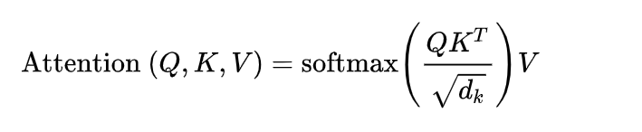

[toc]

# Attention & Self-Attention

- 假设需要将 "A bank on the bank of river." 这句英语翻译为中文，对于多义词 "bank"，我们一般会考虑<u>*上下文*</u>来判断翻译为哪个含义 (e.g. 通过 "river" 判断后一个 "bank" 是河岸的意思)

  这个过程可以看做 3 个步骤，（1）目前被翻译的词 (i.e. token)，称作 **query** (e.g. 后一个 "bank")（2）通过其它的词 (i.e. 上下文) 来找到哪个词对 query 的理解更重要 (i.e. 给予更多的**注意力 attention**)，起这个作用时，其它的词都称作 **key**（3）其它的词本身的含义 (e.g. "river" 的含义是河流) 与注意力结合，就表示这个词应该如何对 query 的翻译，当起这个作用时，其他词称作 **value**

- 简言之，<u>*query 和 key 计算得到一个类似权重的值，然后 query 的新值是 value 的加权和*</u>

  此外，"A bank on the bank of river." 中的每个单词 (或者说 token) 会轮流扮演 query、key、value，这种特殊的机制称作**自注意力 self attention**

- 把上面这些翻译为数学语言，

  

  - 通过<u>*线性变换*</u>的方式，将一个 token encoding 变为 query、key 和 value

    > 一般地，<u>*query、key、value 拥有相同的维度*</u>

  - <u>*attention 的计算方式*</u>有多种 (e.g. 加性 attention、<u>*点积 attention*</u>，还有带参数的 attention 等等)；具体指的是 query 和 key 如何计算”权重“

    常用的是**点积 attention**

  - $\sqrt d_k$ 的作用是进行<u>*归一化*</u>，$d_k$ 指的是 <u>*query、key、value embedding 的维度*</u>

    > softmax 的效果会受到 $d_k$ 影响，所以需要归一化

  - softmax 保证了“权重”的总和为 1

# Multi-Head Self-Attention

- 比如在翻译任务中， "A bank on the bank of river." 中为了准确翻译出 "bank" 的含义，除了需要关注 "bank" 在上下文中的语义，还需要关注语序、词汇之间的对应关系等

  i.e. 要构建出<u>*多组 query、key、value*</u>，来关注不同的特征

- <u>*在增加头的数量的同时，会对 query、key、value embedding 进行降维*</u> (e.g. 假设原来的维度是 $d_k$，使用了 4 头注意力，那么会降至 $d_k/4$ 的维度)

  > 为了防止 ${d_k}/{n_{head}}$ 无法整除，一般会通过线性变换将维度调整为 $n_{head}\times\lfloor{d_k}/{n_{head}}\rfloor$

  一般<u>*通过 reshape 的方式进行多头的拆分*</u>

- 计算完成后，一般<u>*通过 reshape 的方式将多头重新拼接回去*</u> (i.e. 将 embedding 拼起来变长)

