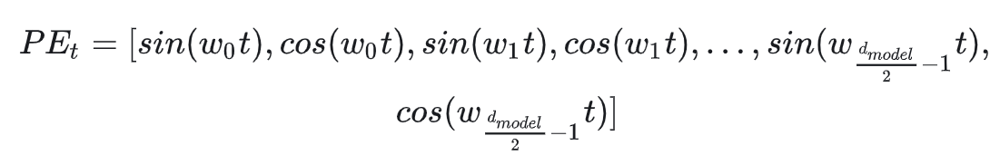
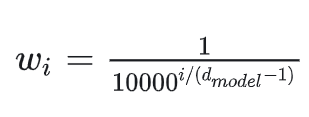

[toc]

# 位置编码

- Attention 不能体现出距离/时序上的差别；位置信息包括，比如，

  - <u>*绝对位置信息*</u>。$a_1$ 是第一个 token，$a_2$ 是第二个 token 等
  - <u>*相对位置信息*</u>。$a_2$ 在 $a_1$ 的后面一位，$a_4$ 在 $a_2$ 的后面两位等
  - <u>*不同位置间的距离*</u>。$a_1$ 和 $a_3$ 差的位置是 2，$a_1$ 和 $a_4$ 差的位置是 3 等
- 一般地，位置编码的融合方式是**加法融合**

# 三角 Sinusoidal 位置编码

- 不难想到，可以使用二进制编码表示位置信息，

  

  但是二进制编码不连续 (i.e. 不够平滑)，相邻位置之间的编码差异可能很大

- 仔细观察，二进制编码的核心是<u>*从低位到高位变化频率逐渐变慢*</u>

  放到三角函数上，是从低位到高位波长逐渐变长

  > 对于三角函数来说，比如 $\sin(\alpha x)$，<u>*$\alpha$ 越小，波长越长*</u>，变化频率越慢

  另一方面，三角函数存在周期性，这可能导致位置信息不准确，一般需要<u>*尽可能长的波长*</u>以保证在一个周期内

  综上，将<u>*位置为 $t$ 的位置向量*</u>设置为，

  

  

  > $w_0$ 是高位

