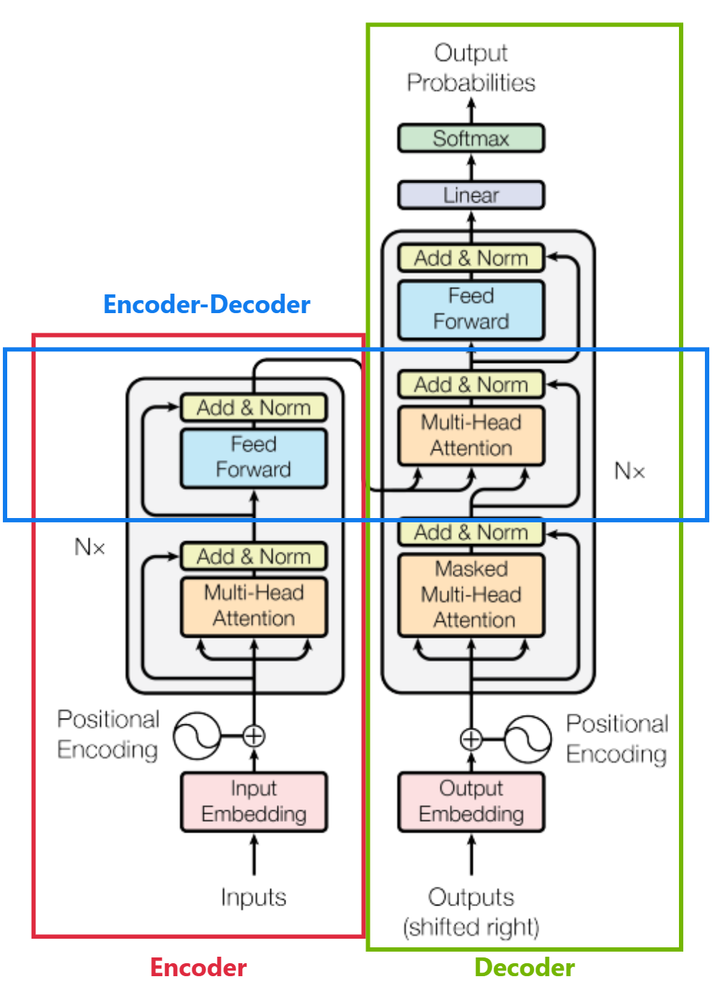

[toc]

# Transformer

## Encoder

- Encoder 的输入是被处理的对象 (training 与 inference 中都是) (e.g. 翻译任务中的原文)
- <u>*Add & Norm*</u>：包含两部分，Add 表示<u>*残差网络 Residual*</u>；Norm 则是<u>*层归一化 layer normalization*</u>
- <u>*Feed Forward (i.e. FFN)*</u>：一般是一个线性网络

> 在 Encoder 中，只使用了 self-attention

## Decoder

- Decoder 在<u>*推理过程中*</u>的输入，是上一时间步模型的预测

  在<u>*训练过程中*</u>，使用到了 **Teacher Forcing**，i.e. 使用 gt 作为输入，而不是使用模型在前一步生成的预测值

  由于 Decoder 需要上一步的输出，所以在最开始会有一个特殊的输入 <u>*start token*</u> (e.g. `<START>`)，由于加上了这个 token，就像整个 gt 向右移动了，所以在 decoder 部分会有一个 `(shifted right)`

- <u>*Masked Multi-Head Attention*</u>：在推理过程中，Decoder 的输入应该是<u>*只能看到“上文”的*</u>，所以在<u>*训练过程中*</u>需要模拟真实情况，i.e. <u>*只计算和“上文”的 attention*</u>

  可以通过 <u>*mask*</u> 来实现这个需求，i.e. 如果该位置不应该计算 $QK^T$，则将这一项置为 $-\infin$，而 $softmax(-\infin)=0$

  > i.e. softmax 计算得到的权重不会收到这些被 mask 的项的影响 (如果是计算过 softmax 后再将 value 项置 0，那么这些项仍然被分配了权重)

- Decoder 的输出，一般是一个<u>*分类器*</u>，预测 token 的 id

> Decoder 中也只使用 self-attention

## Encoder-Decoder

- encoder-decoder 中，<u>*encoder 的输出作为 key、value，decoder 的输入 (i.e. MMHA 的输出) 作为 query*</u>

> Encoder-Decoder 中只使用了 cross-attention

