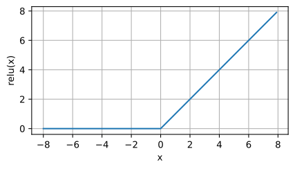
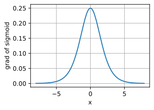

[toc]

# MLP (多层感知机)

$$
h_i=w_{i,1}x_1+w_{i,2}x_2+w_{i,3}x_3+w_{i,4}x_4+b_{i,1}
$$

# 激活函数

- 激活函数主要为了**引入非线性**

## sigmoid

$$
sigmoid=\frac1{1+e^{-h_i}}
$$

## tanh

$$
tanh=\frac{1-e^{-2h_i}}{1+e^{-2h_i}}
$$

## ReLU

- 可以**缓解梯度消失问题**

$$
ReLU=\max(x,\;0)
$$

## softmax

- 一般用于**分类问题**，得到 $o_i$ 是某个分类的概率

$$
softmax=\frac{e^{o_i}}{\sum_k o_k}
$$

# 损失函数

## MSE / L2 Loss

$$
\frac1{2n}\sum\limits_{i=1}^n(y_i-\hat y_i)^2
$$

## Cross Entropy (交叉熵)

- 一般用于**分类问题的损失函数**

$$
CE=-\sum\limits_{i=1}^N\hat y_i\ln y_i
$$

# 权重衰退

- 权重可以选择的取值范围越大，模型能力越强，损失函数越小，**但也更容易过拟合**；**限制权重的取值范围可以缓解过拟合**

- 通过加上一个<u>*正则项*</u>，为了使损失函数更小，**权重会更倾向于小的值** (i.e. 在 0 的左右<u>*较小的范围*</u>中选择权重)
  $$
  L^\prime=L+\lambda w^2
  $$

# 优化算法

## 反向传播 / 梯度下降

$$
w=w-\alpha\frac{\partial J(w,b)}{\partial w}\\
b=b-\alpha\frac{\partial J(w,b)}{\partial b}
$$

- **$\alpha$ 表示 learning rate (学习率)**

## 小批量随机梯度下降

- 每次使用**一个 batch 进行参数更新**

## Adam 算法

- $g_t$ 表示梯度，$m_t$ 表示动量，$v_t$ 表示累积的平方梯度，$\eta$ 表示学习率

  > $\epsilon$ 是一个很小的值，防止分母为 0
  >
  > $\beta$ 是一个接近 1 的值，一般 $\beta_1=0.9$，$\beta_2=0.9999$

  - **momentum (动量)** 让模型更容易保持在正确的更新路线上，不容易震荡

  - 除以 $1-\beta$ 是为了保证早期梯度不会过小

    > $m_0$ 和 $v_0$ 的初始值为 0，会导致 $m_1=(1-\beta_1)g_1$ 和 $v_1=(1-\beta_2)g^2_1$ 这两项非常小，这可能导致梯度不稳定
    >
    > 而除以 $1-\beta$ 后，$m_1=g_1$，$v_1=g^2_1$，就可以缓解问题

  - **累积平方梯度**，简言之，因为 $\sqrt {\hat v_t}$ 这一项在分母，所以如果之前的梯度较小，等价于之后会适当提升学习率；反之亦然

# K 折交叉验证

- 将原始训练数据被分成 **K 个不重叠的子集**； **在 K−1 个子集上进行训练**， 并在**剩余的一个子集上进行验证**

# 欠拟合与过拟合

# 训练稳定性

## 梯度消失

- 有一些**激活函数的导数值 < 1** (e.g. sigmoid)，而在反向传播中涉及**导数值相乘**的操作，从而导致**梯度消失**

  

- **初始值过小**
- **学习率过小**

## 梯度爆炸

- 与梯度消失同理，**导数值 > 1** 也可能导致**梯度爆炸**

- **初始值过大**

- **学习率过大**

## 初始化

- 通过 **Xavier 初始化**可以较好的设置初始值

## Dropout (暂退法)

- **将一定比例的计算结果置 0** (i.e. 可以看做是让一部分权重失效，减少模型的复杂度)，从而**缓解过拟合**
- 在**推理过程中，Dropout 层不会被使用**

## Normalization (归一化)

- **归一化**的目的主要是**将输出放缩到同一的分布上** (i.e. 可以理解为，每一层的模型不需要额外学习这一层数据数量级是 10、100 还是 0.1)

### Batch Normalization (批量归一化)

- **对每个 batch 的数据进行归一化** (i.e. 单位是样本)

### Layer Normalization (层归一化)

- **对每个样本进行归一化** (i.e. 单位是样本中的元素)

### Group Normalization (组归一化)

- 将**一个样本中的元素分为若干组**，然后对**每组进行归一化**

