[toc]

# 背景: ELBO, VAE, and Hierarchical VAE

- 假设给定了一个**图像数据集 $\{x_i\}$**，这些图像是从**真实分布 p(x)** 中采样得到的，**生成模型的目的就是根据 $\{x_i\}$ 反过来预测出 p(x)** (预测的分布一般记作 $p_{\theta}(x)$)

  利用 $p_{\theta}(x)$ 可以采样得到新的图像 (i.e. 生成出新的图像) 或判断一个图像是否在这个分布中

## ELBO 与 VAE

- 如果希望计算 p(x)，一般需要从<u>*另一个分布 p(z) 中进行采样*</u>

  p(z) 一般称作 **latent distribution (隐变量分布)**，**隐变量 (latent variable)**一般<u>*维度更低、包含更核心信息*</u> (e.g. 颜色、亮度、纹理等)

  > 如果 p(z) 完全没有约束，也很难还原出有意义的图像
  >
  > 而相比于完全随机采样，按照正态分布进行采样就是增加了约束 (虽然不太清楚为什么这点约束就足够产生有意义的图像，可能是实验得到的吧)
- 理论上，可以通过 $p(x)=\int p(x,z)dz$ 或 $p(x)=\frac{p(x,z)}{p(z|x)}$ 来计算 $p(x)$，但是，<u>*并不是很好计算*</u>；**ELBO** 的核心思想是**使用其它的分布来计算/替代 p(x)**

- **ELBO** 的推理方式如下，

  > 简单来说，$q_{\phi}(z|x)$ 是拥有可学习参数的分布，一般使用某种网络结构代替
  >
  > $D_{KL}$ 表示 KL 散度，表示两个分布之间的差距
  
  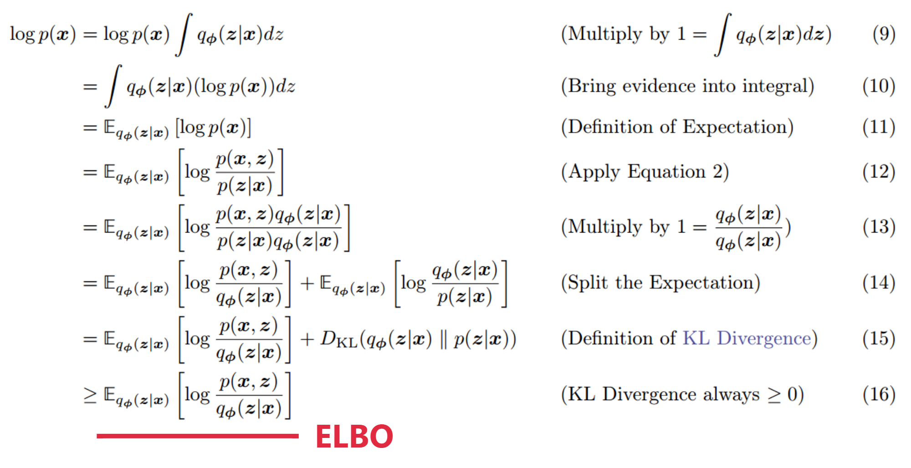

  - **最大化 ELBO**，相当于最小化 $D_{KL}$ (i.e. 模拟的<u>*分布 q 和真实的分布 p 更加接近*</u>)，相当于 <u>*ELBO 更加接近 p(x)*</u>

- 对 ELBO 进一步拆解，

  > 这里的 $p_{\theta}(x|z)$ 也是拥有可学习参数的分布

  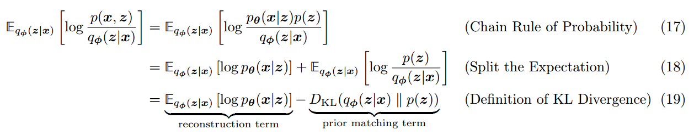

  - 最大化 ELBO，相当于**最大化 reconstruction term**，**最小化 prior matching term**；随着 reconstruction term 接近 ELBO，也意味着接近 p(x)，即可以**使用 ${\log p_{\theta}(x|z)}$ 来计算/代替 p(x)**；同时，**隐变量 z 来自于 $q_{\phi}(z|x)$ 并且受到 $p(z)$ 的约束**

- 根据式 (19) 中的“一来一回”，就有了 **VAE** 中的 <u>*Encoder、Decoder 结构*</u>，

  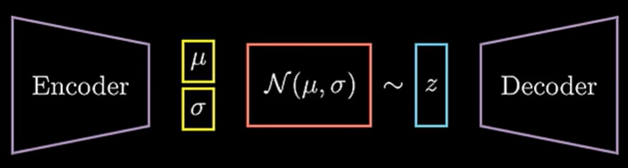

- VAE 使用的 **Loss Function** 为，

  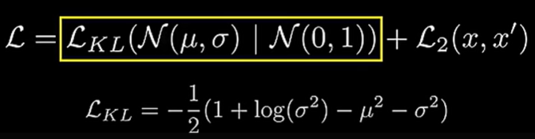

  - 上图中的 ${L_2}$ 替换了式 (19) 中的 reconstruction term，i.e. 不使用最大似然，而是<u>*直接比较原始图像和生成图像*</u>之间的差距 (这样应该更好计算)

  - 对于先验 $p(z)$，是需要进行猜测的，一般使用<u>*标准正态分布*</u>；考虑到还要计算 $D_{KL}$，$q_{\phi}(z|x)$ 也<u>*使用正态分布进行建模*</u> (把使用模型预测分布的问题，<u>*简化为了预测正态分布的均值和方差的问题*</u>)

    正态分布的 $D_{KL}$ 是有解析式的 (i.e. 上式中的 $L_{KL}$)，可以方便地计算出来

- <u>*VAE 的训练*</u>，

  理论上，有了 $q_{\phi}(z|x)$ 就可以从中采样出隐变量 z 了，但是一些采样方式 (e.g. 蒙特卡洛) 是无法反向传播的，通过 **reparameterization trick 重参数技巧** (i.e. 引入随机变量 $\epsilon$，同时不影响反向传播)，实现梯度回传 (可以看做将随机采样问题，转化为对某一个具体的样本的问题)

  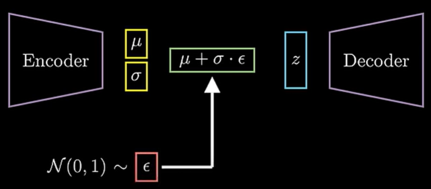

## HVAE

- 简单来说，**HVAE** 是<u>*计算隐变量的隐变量*</u>，

  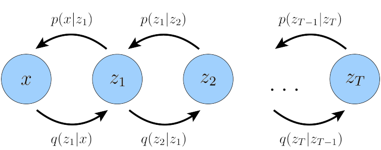

  而 **MHVAE** (i.e. 上图) 则是增加了马尔可夫链约束

  > 马尔科夫链：下一个状态只与当前状态有关

- MHVAE 的 <u>*ELBO*</u> 如下，

  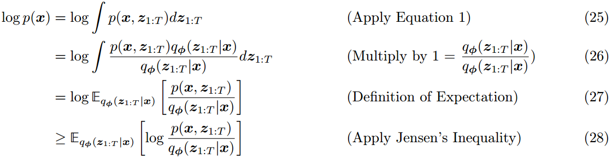

- 类似的，ELBO 可以进一步拆分，

  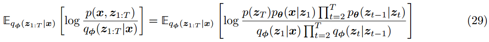

# VDM (Variational Diffusion Models)

- <u>*VDM 是特殊的 MHVAE*</u>，相较于 MHVAE 增加了下面这些限制，

  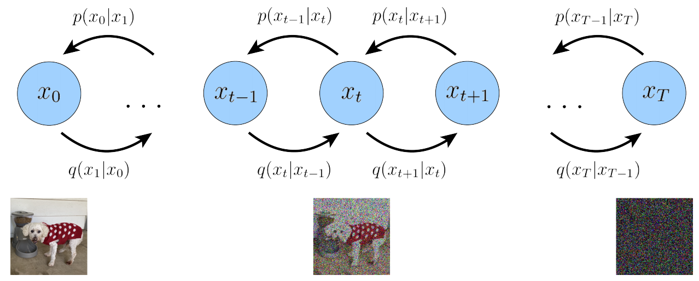

  - **隐变量的维度与输入图片维度一致**

  - encoder (i.e. $q_{\phi}$) **不再需要学习**，**$x_{t}$ 是以 $x_{t-1}$ 为中心的高斯分布**

    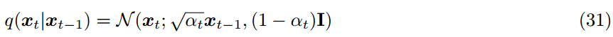

    - **$\alpha_t$ 是一个超参数**

  - **$x_T$ 接近标准高斯分布**

    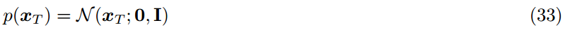

- <u>*在 VDM 中重新推断 ELBO*</u>，

  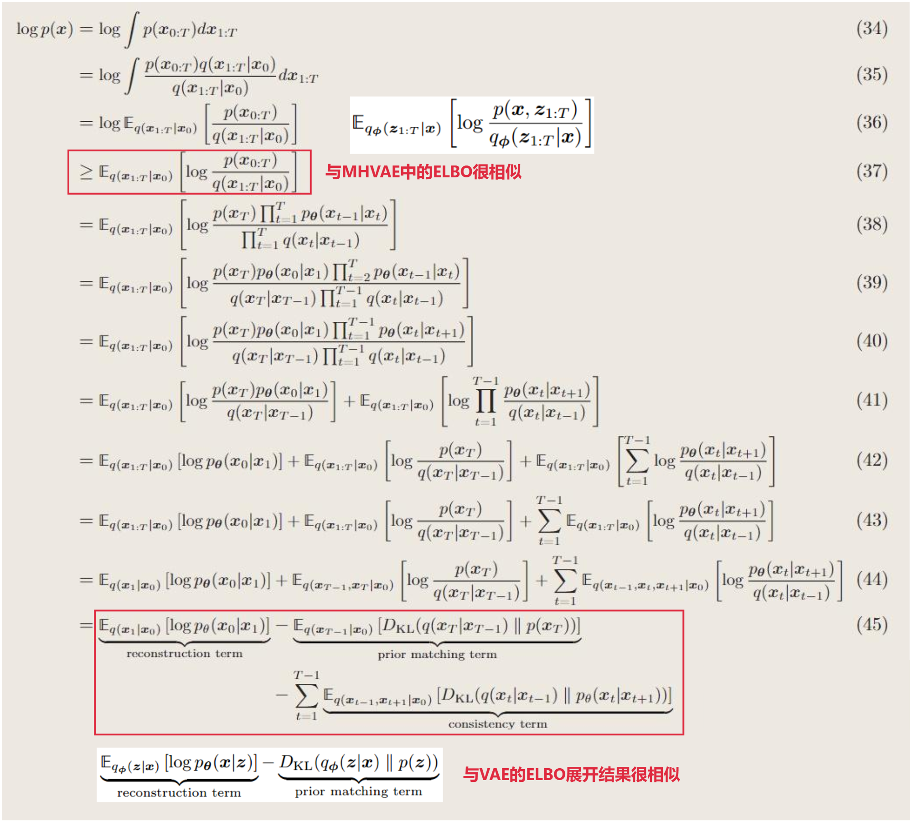

  - 与 VAE 类似，在最小化 $D_{KL}$ 的同时，<u>*最大化 $p_{\theta}(x_0|x_1)$ 就是最大化 ELBO，就是在接近 $p(x)$*</u>

- <u>*consistency term 中现在有 $x_{t-1}$ 和 $x_{t+1}$ 两个变量*</u>，可以<u>*继续减少变量*</u>，减轻优化的负担

  > 就当做一个结论来理解吧

  利用<u>*马尔科夫链的性质*</u>，重新推导 ELBO 得到，、

  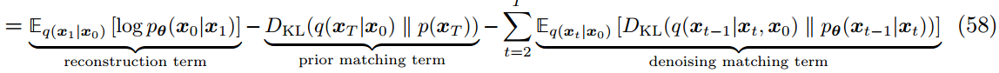

  - **reconstruction term**：和 VAE 中的类似

  - **prior matching term**：也与 VAE 中的类似，只要 T 足够大 (i.e. 加噪的次数足够多)，$x_t$ 总会逐渐接近标准高斯分布，i.e. 这一项的 $D_{KL}$ 会接近 0，<u>*可以忽视*</u>

  - **denoising matching term**：**真实的去噪结果 (i.e. $q$) 和推测的去噪结果 (i.e. $p_{\theta}$) 能够尽量接近**

    > 这一项从 $t=2$ 开始计算到 $t=T$，i.e. 如果要得到最接近的 $p_{\theta}$，在<u>*每个时间步*</u>预测噪声的过程中都要尽量正确

- 在式 58 中，$q(x_{t-1}|x_t,x_0)$ 通过贝叶斯可以转化为加噪过程 (i.e. $q(x_{t}|x_{t-1})$)，进而不需要通过参数学习得到 (可以通过加噪公式得到)，

  > $p(x)$ 和 $p(z)$ 不是同一个 p.d.f.，所以没有限定 $q$ 只能表示加噪过程而不能表示去噪过程
  >
  > 但通过下标可以判断 $p$ 不存在需要学习的参数，而 $p_{\theta}$ 是需要学习的

  - 首先，可以先推理出<u>*“一步加噪”*</u>的公式 (i.e. 直接通过 $x_0$ 加噪到 $x_t$ 而不需要一步一步加噪)，

    > 式 (61) 来自式 (31) 的假设 (这也解释了为什么在推理过程中还会需要指定 $\alpha$，因为去噪过程与加噪公式中的假设也是相关的)
    >
    > 会存在不同的 noise shedule 的方式

    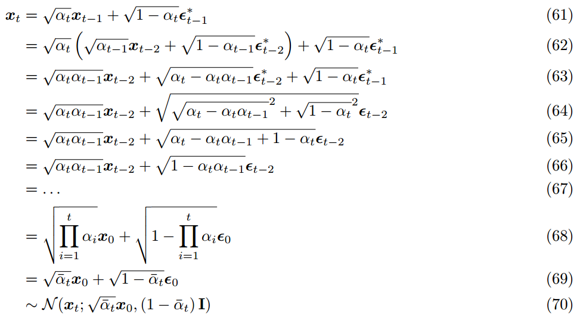

    之后通过<u>*重参数技巧*</u>，就可以直接从 $x_0$ 采样 $x_t$ 了

  - 将式 70 代入，利用贝叶斯公式整理式 58 中 <u>*denoising matching term*</u> 项中 $q(x_{t-1}|x_t,x_0)$ 项，

    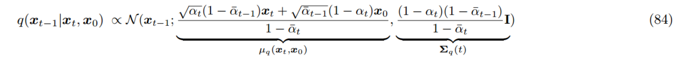

    i.e. denoising matching term 中的真值计算完成了
  
    > $\sum_q(t)$ 中不存在任何需要学习的参数，在 $p_{\theta}$ 中这一项可以是学习的，也可以直接拿过去用
    >
    > $\mu_q(x_t,x_0)$ 这一项包含了 $x_0$，而在推理过程中是不知道 $x_0$ 的，所以是需要学习的
    
  - 根据式 84，真值是一个正态分布，那么自然地对于式 58 中的 <u>*$p_{\theta}(x_{t-1}|x_t)$ 的建模也是一个正态分布 (i.e. 通过网络学习均值 $\mu_{\theta}$ 和方差)*</u>
  
    对于式 58 中的 denoising matching term，两个正态分布的 $D_{KL}$ 是可以套用公式的 (VAE 中有类似的操作)，
  
    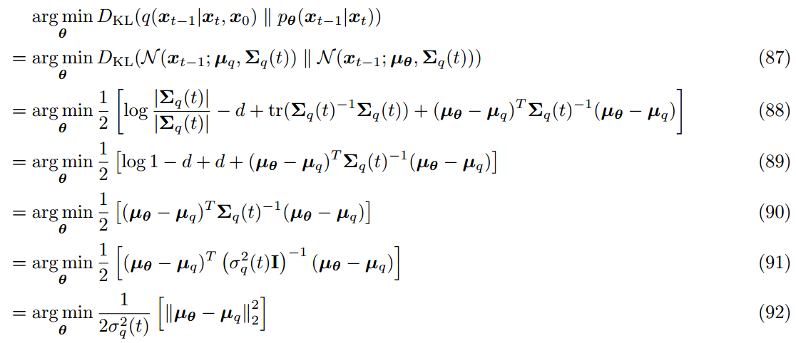
  
    i.e. 为了最小化这个 $D_{KL}$，等价于 $p_{\theta}$ 中学习到的均值 $\mu_{\theta}$ 要尽量接近式 84 中的真值
  
  - 根据式 92 进一步拆分，上面提到 $\mu_q$ 中需要学习的是 $x_0$，那么引入，
  
    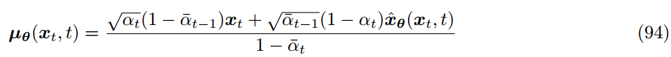
  
    > 既然已经知道真值 (正态分布) 的结构，那么很自然的想法就是除了需要学习的部分，其它全部照抄；所以式 (94) 其实就是抄了一遍式 (84)
    >
    > 与 $\mu_q$ 相比只是将 $x_0$ 变成了可学习的
  
    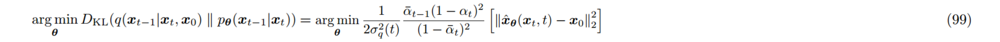
  
    但是，实践表明使用网络<u>*直接预测 t 时刻的完整的图片是比较困难*</u>
  
  - 重新利用式 70 的“一步加噪”的公式，
  
    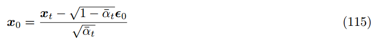
  
    > 根据式 (115) 也可以看出模型需要预测出的是在 $t$ 时刻添加的整体噪声 (需要和式 (58) 区分一下，虽然式 (58) 看起来在预测 $t-1$ 相对 $t$ 时刻添加的噪声，但实际不是这样的)
    >
    > 这里会有一个矛盾，就是如何模型每个阶段都在学习一次性预测所有的噪声，为什么不直接“一步去噪”呢？一方面的解释可能是虽然我们希望模型学会“一步去噪”，但模型几乎是没有可能学会这么困难的任务的；另一方面根据式 (58)，虽然模型学习的是预测全部的噪声，但式 (130) 也是从式 (58) 推导出来的，所以某种程度上<u>*学习一次预测所有噪声能够达到的最好学习效果，是能够预测好 $t-1$ 相对 $t$ 时刻添加的噪声*</u>
    >
    > 当然，不同的公式推导方向也会得到不同的结果 (比如 Euler Sampler 确实会有“一步去噪”)
  
    再次<u>*重新整理出 $\mu_q$ 和 $\mu_{\theta}$，*</u>
  
    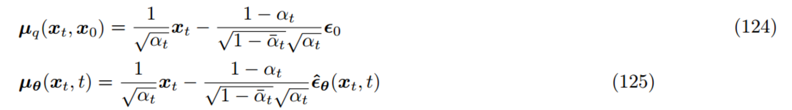
  
    根据式 92，代入整理，
    
    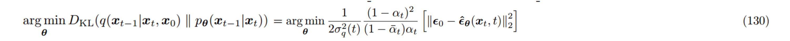
    
    i.e. 不需要预测 t 时刻的整张图像，而是**使用网络在 t 时刻预测 $x_t$ 相对于 $x_0$ 一共添加了多少的噪声 $\epsilon$**
    
    > 在扩散模型中，完整的噪声指的是 $\epsilon$ 而<u>*不是*</u> $x_t-x_0$
  

## VDM 的训练过程

- 虽然根据式 (58)，训练过程应该是计算从 $t=T$ 一直累积到 $t=2$ 时刻连续的损失函数；但是<u>*实际的代码实现中*</u>，一般会选择每一次<u>*随机选择一个时间步，然后仅进行一次噪声预测*</u>，不进行损失函数的累积 (i.e. 将连续的损失函数计算，拆分为了独立的噪声预测任务)

# SGM (Score-based Generative Models)

- **SGM** 是 VDM 的另一种解释视角

- 首先，需要引入 **Tweedie’s Formula**，对于<u>*符合正态分布的随机变量 z*</u>，

  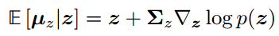

  > 当做结论来用就好

- 根据 Tweedie’s Formula，以及根据式 70，$x_t$ 是一个符合正态分布的随机变量且 $\mu_{x_t}=\sqrt{\bar{\alpha}_t}x_0$

  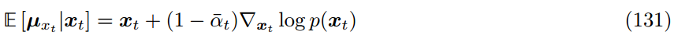

  代入整理可得，

  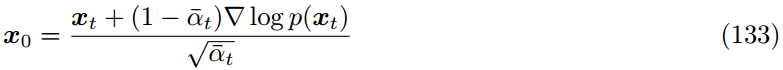

- 代入式 84 同样替换掉 $x_0$，这里得到新的 $\mu_q$ 和 $\mu_{\theta}$ 的表达，

  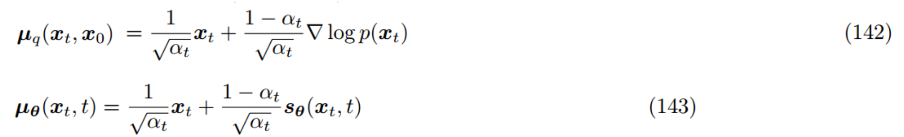

  同样代入式 92 重新计算 $D_{KL}$ 的表达式，

  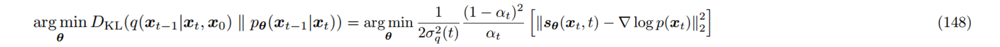

- $\nabla\log p(x_t)$ 不太好计算，利用式 115 和式 133，可以得到，

  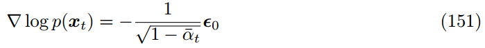

  i.e. $\nabla\log p(x_t)$ 是加噪 $\epsilon_0$ 的反方向；$\nabla\log p(x_t)$ 也称作 **score function**，其意义是<u>*去噪方向*</u>
  
  > 简言之，梯度与预测出的噪声是可以统一的

# Guidance

## Classifier Guidance

- 除了 $p(x)$，有时我们更关注的是在条件 $y$ 下的 $p(x|y)$；这里的条件 $y$，可以是 prompt 也可以是 image 等

- 根据 SGM 中的思路，展开 $p(x|y)$ 的 score function

  > score function 和 $\epsilon$ 只差了一个系数，所以两者的展开也没有差很多

  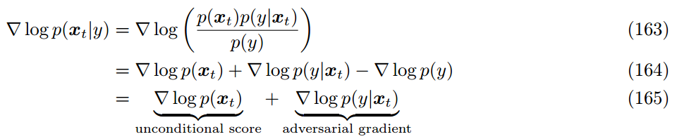

  i.e. 除了原始的 score function，<u>*还需要训练一个根据输出图像 $x_t$ 预测条件 $y$ 的分类器*</u>

  > 但是这个分类器是比较难训练的，因为 $x_t$ 可能是一个噪声很大的图

- 为了更好地根据条件 $y$ 来生成，一般会加入一个超参数 $\gamma$，

  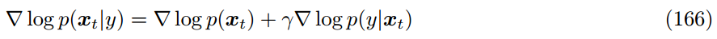

## CFG (Classifier-Free Guidance)

- 为了省去额外训练分类器的过程，根据式 165 和式 166 整理得到，

  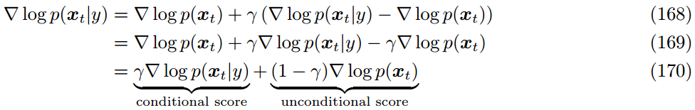

  i.e. 在生成过程中，**根据条件 $y$ 生成一个图像，再无视条件 $y$ 生成一个图像**

- 一般来说，CFG 中的 <u>*$\gamma$ 是一个大于 1 的值，如 7.5*</u>

# 引用文献

- [论文：从大一统的角度审视扩散模型](https://arxiv.org/abs/2208.11970)

# 参考资料

- [youtube 上的 VAE 介绍](https://www.youtube.com/watch?v=qJeaCHQ1k2w)

- [对于"论文：从大一统的角度审视扩散模型"的解读](https://blog.csdn.net/zjuPeco/article/details/132297170)
