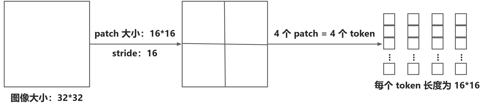

[toc]

# 背景：ViT

## ViT

- **ViT** (Vision Transformer) 的核心思想，是将图像以**分 patch** 的方式，处理为 token，从而**利用 transformer** 处理图像任务

- 如何进行分 **patch**：

  、

  <u>*对于多通道*</u>，一般选择<u>*沿着通道展平为 token*</u>，i.e. $[r_1,g_1,b_1,r_2,g_2,b_2,...]$

- **ViT 的主要网络结构**：

  1. **patch + flatten**，以获得 token
  2. 通过 **linear 层降维**
  3. 使用一个 **transformer encoder** 处理这些 token
     
     （1）为<u>*每个 token 加上位置编码 PE*</u>
     
     （2）<u>*做 self-attention*</u>
  4. 连接一个 **classifier** (如果是图像分类任务)
  
  > ViT 没有使用 transformer decoder，因为不需要通过已经预测出的结果继续预测后面的生成结果 (e.g. 翻译任务)
  >
  > ViT 只用了 transformer encoder，所以没有 cross attention
  

# 参考资料

- [youtube 上 ViT 的介绍](https://www.youtube.com/watch?v=tkZMj1VKD9s)