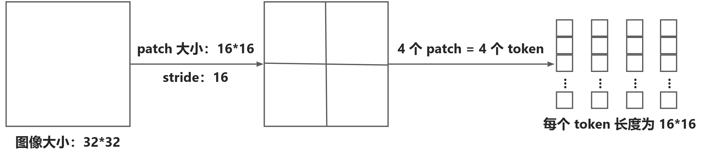
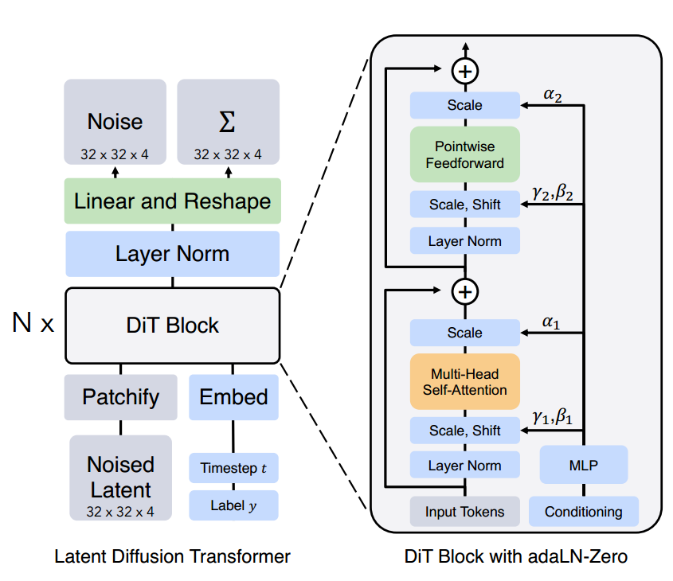
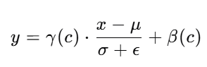
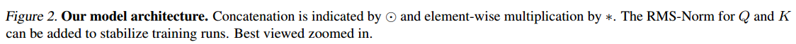
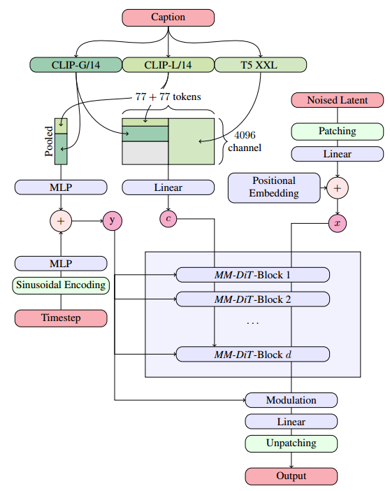
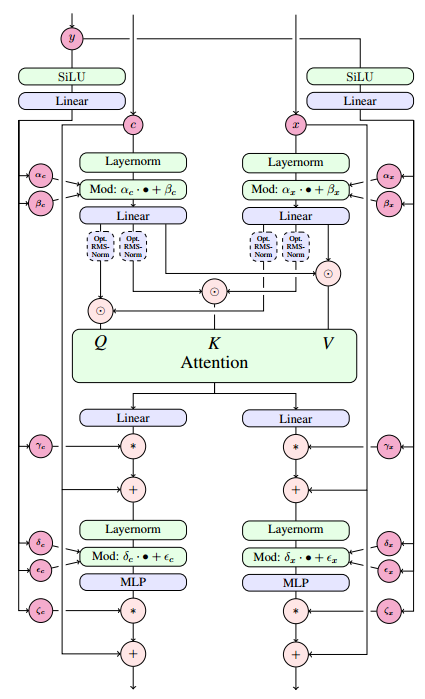

[toc]

> [An Image is Worth 16x16 Words: Transformers for Image Recognition at Scale](https://arxiv.org/abs/2010.11929)
>
> [Scalable Diffusion Models with Transformers](https://arxiv.org/abs/2212.09748)
>
> [Scaling Rectified Flow Transformers for High-Resolution Image Synthesis](https://arxiv.org/abs/2403.03206)
>
> [On Distillation of Guided Diffusion Models](https://arxiv.org/abs/2210.03142)

# 背景：ViT 与 DiT

## ViT

- **ViT** (Vision Transformer) 的核心思想，是将图像以**分 patch** 的方式，处理为 token，从而**利用 transformer** 处理图像任务

- 如何进行分 **patch**：

  、

  <u>*对于多通道*</u>，一般选择<u>*沿着通道展平为 token*</u>，i.e. $[r_1,g_1,b_1,r_2,g_2,b_2,...]$

- **ViT 的主要网络结构**：

  1. **patch + flatten**，以获得 token
  2. 通过 **linear 层降维**
  3. 使用一个 **transformer encoder** 处理这些 token
     
     （1）为<u>*每个 token 加上位置编码 PE*</u>
     
     （2）<u>*做 self-attention*</u>
  4. 连接一个 **classifier** (如果是图像分类任务)
  
  > ViT 没有使用 transformer decoder，因为不需要通过已经预测出的结果继续预测后面的生成结果 (e.g. 翻译任务)
  >
  > ViT 只用了 transformer encoder，所以没有 cross attention
  

## DiT

- *<u>将 latent feature map 通过 DiT 中 patchify 的操作转为 embedding</u>*

- 其它的<u>*控制信息*</u> (timestamp embedding，text embedding e.t.c.) 则通过 <u>*adaLN-Zero*</u> 的方式注入

  - <u>*adaLN*</u> 归一化层的计算公式为，

    

    其中的 $\gamma(c)$ 和 $\beta(c)$ 通过网络 (e.g. linear 层) 学习得到 (简言之，在将 embedding 归一化到均值为 0，方差为 1 的分布上后，再对 embedding 进行<u>*放缩 scale 和偏移 shift*</u>)

  - <u>*adaLN-Zero*</u> 则是使用<u>*零初始化*</u>

# SD 3.x

## Framework

> 感觉看图就行了，基本上是 DiT 那一套

**MM-DiT Blk**

- sd 3.x 中的 MM-DiT 使用的是 DoubleStreamBlock 结构 (FLUX 提出)，i.e. condition 和 latent embedding <u>*并行被 adaLN-Zero 处理*</u> (DiT 的原始论文中更接近 SingleStreamBlock)，在 self attn 中才进行融合

# FLUX 1.x

## 相对于 sd 3.x 的提升

### 文本编码器部分

- FLUX 1.x 将 sd 3.x 中的 <u>*2 个 CLIP 减少到了 1 个*</u>

### 位置编码

- 使用了 <u>*RoPE*</u> 位置编码

### DiT 结构调整

- 在 sd 3.x 中 MM-DiT 同时使用了 <u>*DoubleStreamBlock 结构*</u>和 <u>*SingleStreamBlock 结构*</u>，

### cfg 蒸馏

- FLUX 1.x 的 cfg 通过蒸馏 distillation 学习得到，通过教师网络，<u>*cfg 被编码为 embedding 一起注入到了生成过程中*</u>；这样可以省去生成 uncondition 的过程

# 参考资料

- [youtube 上 ViT 的介绍](https://www.youtube.com/watch?v=tkZMj1VKD9s)