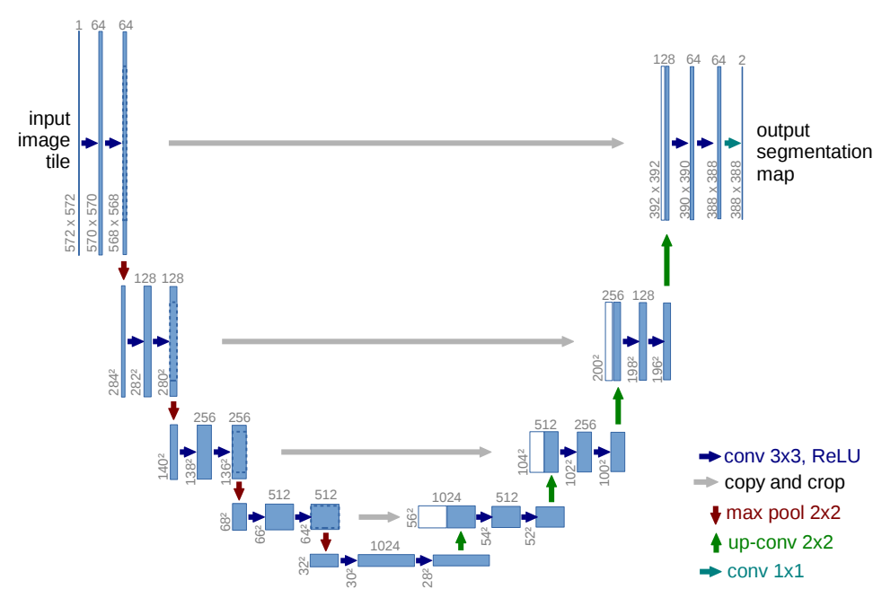
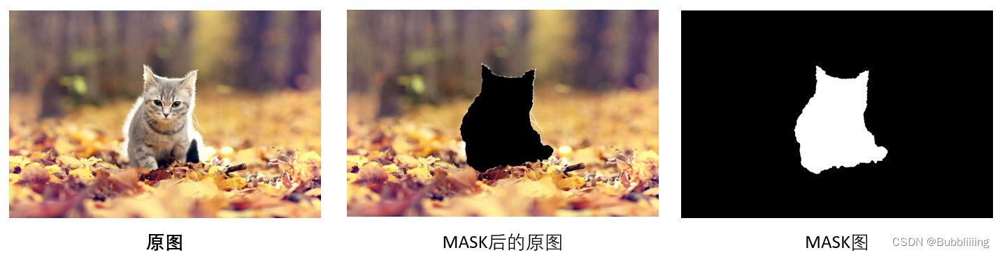

[toc]

# 背景：UNet

## UNet

- 左边<u>*下采样 Downsampe*</u>，右边<u>*上采样 Upsample*</u>，一张图片经过一层层下采样计算，尺寸逐渐减小，再经过右边层层上采样，恢复到原尺寸
- 灰色箭头表示<u>*跳跃连接 skip connection*</u>，通过<u>*在通道维度上拼接实现*</u>

> UNet 有着比较明显的层结构，每一层有时也叫做 level

# Stable-Diffusion-v1

Stable Diffusion v1 由四大部分组成，

1. <u>*Sampler 采样器*</u>
2. <u>*VAE*</u>
3. <u>*UNet 主网络，噪声预测*</u>
4. <u>*CLIPEmbedder 文本编码器*</u>

## 文生图

### CLIPEmbedder

- 一般会使用现成的 OpenAI CLIP 模型，得到一个 `(batch_size, 77, 768)` 的 text embedding

### VAE

- 在原始的 diffusion 中对每个像素都进行学习，但其实没有必要，通过 VAE <u>*降维*</u>后再进行训练，推理的时候通过 VAE Decoder 还原出完整的图像

- 一般地，通过设置 `Downsampling Factor` 参数 (e.g. factor=8，则  512×512×3 的图像会降维到 64×64×4)

  > 通道数在 encode 后会变成 4，这个数可能是经验吧

> 在文生图任务中，初始输入的高斯噪声不会通过 VAE Encoder，而是按照下采样后的形状直接生成，可能是因为没什么意义吧

### UNet

- (ResBlock + SpatialTransformer) × 2 + Downsample / Upsample 组成 UNet 的一层

#### ResBlock 模块

- <u>*ResBlock 用于结合时间步 Timesteps Embedding*</u>

- 时间步的维度是 `(batch_size, )`，模仿<u>*三角 Sinusoidal 位置编码*</u>的方式进行<u>*维度提升*</u>，通过<u>*线性网络与特征图的通道维度数对齐*</u>

  <u>*以相加的方式融合*</u>

#### SpatialTransformer 模块

- <u>*SpatialTransformer 用于结合文本编码 Text Embedding*</u>
- SpatialTransformer <u>*先经过一个 Self Attention*</u>，特征图自己进行计算；再经过一个 Cross Attention，<u>*特征图作为 query，text embedding 作为 key、value*</u>

#### CFG 部分

- <u>*正向提示词 (positive prompt) 与负向提示词 (negative prompt) 与 CFG：*</u>

  - 在 CFG 的公式中，需要计算 $\epsilon(x)$ 和 $\epsilon(x|y)$，i.e. 计算一次没有提示词的版本，再计算一次有提示词的版本

    CFG 中原来的思想是向有条件 $y$ 引导的梯度移动更多，而远离无条件引导的梯度；而<u>*负向提示词就是要被远离*</u>，因此一般将 $\epsilon(x)$ 改成计算 $\epsilon(x|\hat y)$

  - 一般地，<u>*相关的输入会在 `batch_size` 维度上 concat 起来*</u>

## 图生图

- 初始输入不再是高斯噪声，而是<u>*经过一定加噪的原始图像*</u>
- 生成流程分为四个部分：
  1. 通过 VAE Encoder
  2. 添加噪声；一般涉及两个参数，<u>*`denoise_strength` 和 `steps`*</u> (e.g. `denoise_strength=0.8`, `steps=20`，则会通过 “一步加噪” 公式给原始图像添加 0.8×20=16 步噪声，在去噪过程中也只进行 16 步)
  3. 进行去噪
  4. 通过 VAE Decoder

## Inpainting

### 基于微调的 Inpainting 模型

- 一般会将下面三张图在通道维度上拼接后送入 diffusion model

  经过 VAE Encoder 后，一般是一个 4+4+1=9 通道的图

> 不太清楚之后走的是文生图还是图生图还是其它的路线，可能不同模型也不一样吧

### Training-Free 的 Inpainting 模型

- 使用图生图的思路，虽然存在 mask，但是 mask 不作为输入的一部分，
  1. 将整张原始图片进行编码和加噪操作
  2. 将生成图像中 mask 的部分提取出来，其它部分替换为原始图像 (i.e. gt)；将替换好的图像作为输入
  3. 进行去噪和解码操作
  4. 重复 2、3 步

# 参考资料

- [stable diffusion v1.x 的官方源码](https://github.com/CompVis/stable-diffusion)
- [对于 stable diffusion v1 具体实现、函数解释的 blog](https://blog.csdn.net/weixin_44791964/article/details/130588215)

- [对于 stable diffusion v1 在图生图任务上的解释的 blog](https://blog.csdn.net/weixin_44791964/article/details/131992399)

- [对于 stable diffusion v1 在 Inpainting 任务上的解释的 blog](https://blog.csdn.net/weixin_44791964/article/details/131997973)

- [对于 stable diffusion v1 各个网络的具体模块组成，输入、输出维度](https://blog.cnbang.net/tech/3823/)