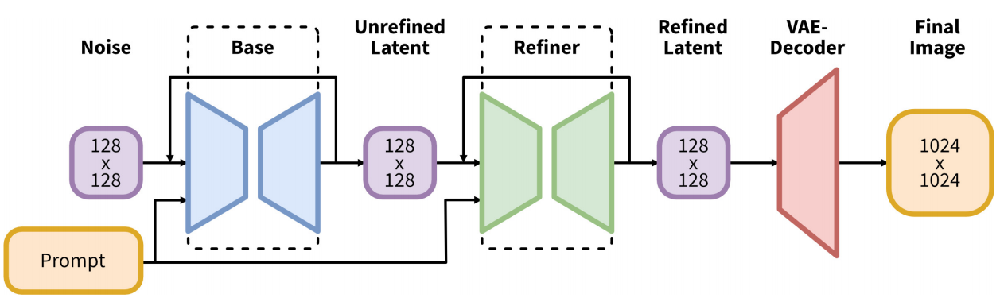

[toc]

> [SDXL: Improving Latent Diffusion Models for High-Resolution Image Synthesis](https://arxiv.org/abs/2307.01952)
>
> [源码](https://github.com/Stability-AI/generative-models)

# 相对于 SD 1.x 的提升

## 结构调整

### 更多的 transformer

- 将两层 CrossAttnDownBlock2D (ResBlk + SpatialTransformer) 中 <u>*Transformer 的层数分别增加为 2 层和 10 层*</u>

  对 MidBlock2DCrossAttn 也调整为 *<u>10 层 Transformer</u>*

  

### 更大的 text encoder

- 使用 <u>*OpenCLIP ViT-bigG (dim=1280) 和 CLIP ViT-L (dim=768) 提取出 text embedding 然后 concat 在一起 (dim=2048)*</u> 作为 text embedding

  此外，使用 <u>*OpenCLIP ViT-bigG 输出的 text embedding 进行池化*</u> (可以看作是对每个 token 得到的 embedding 求平均，或选择某个特殊的 token，e.g. `[CLS]`)，经过 linear 层后对齐维度，<u>*与 timestamp embedding 相加融合*</u>，以更好地提取<u>*全局 text embedding 信息*</u>

### 后处理 refiner

- 在 latent space 上，经过第一阶段生成后，<u>*增加第二阶段的 i2i*</u> 来优化生成的图像，再经过 VAE Decoder

  

## 训练、推理数据调整

### 图像大小作为 condition 嵌入

- 在 SD 1.x 中，在推理中对于 512 × 512 以外分辨率的图像生成效果不佳，在训练中则会丢弃掉很多数据或人工增强的数据导致不自然的情况
- sdxl 将输入<u>*图像的原始长和宽通过傅里叶变换提升维度*</u>，concat 在一起并调整维度后<u>*与 timestamp embedding 相加融合*</u>

### 图像裁剪信息作为 condition 嵌入

- 在 SD 1.x 中，将裁剪后的图像做为训练数据，会导致生成图像出现不自然的截断 (e.g. 模型可能觉得裁了下半身的人也是一个完整的人放在生成图像正中的位置)
- sdxl 将输入<u>*裁剪后的图像的上边沿距离原始图像上边沿的距离，和左边沿的距离通过傅里叶变换提升维度*</u>，concat 在一起并调整维度后<u>*与 timestamp embedding 相加融合*</u>

### 后续微调，按照不同长宽比分桶然后注入桶信息

- 将<u>*长宽比接近的图像分配到同一个 bucket 中*</u> (i.e. 长宽比接近的数据会出现在同一个 batch 中)，并将 <u>*bucket 的长和宽信息注入与 timestamp embedding 相加融合*</u>