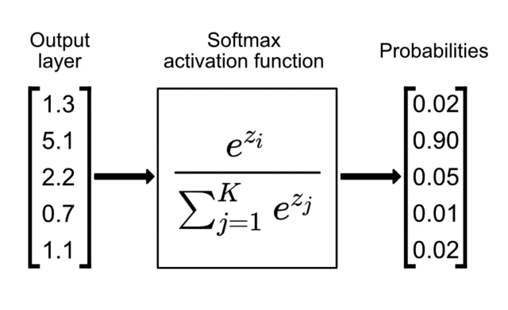

[toc]

# 导入 `PyTroch` 包

```python
import torch
```


# `Tensor`

## 创建张量

**通过数组创建：**

```python
x = torch.tensor([1, 2, 3], dtype=torch.float32)
```

**创建全 0、全 1 张量：**

```python
x = torch.zeros(2, 3)  # 创建一个2x3的全0张量

y = torch.ones(2, 3)   # 创建一个2x3的全1张量
```

**创建符合标准正态分布的随机张量：**

```python
tensor_2x3 = torch.randn(2, 3) # 创建一个形状为2x3的标准正态分布随机张量
```

**创建等差张量：**

```python
x = torch.arange(0, 10, 2)  # 从0开始，步长为2，到10(不包括10)
```


## 常用 `tensor` 属性

- **`shape` 属性**：张量的形状
- **`dtype` 属性**：张量的类型
- **`device` 属性**：张量所在的设备


## 访问元素

### 通过索引访问元素

**索引：**

```python
x = torch.tensor([1, 2, 3])

x = x[0] # 输出: 1
```

**布尔索引：**

```python
x = torch.tensor([1, 2, 3, 4, 5])

x = x[x > 2] # 输出: tensor([3, 4, 5])
```

### 通过切片访问

```python
tensor = torch.tensor([[1, 2, 3, 4],
                       [5, 6, 7, 8],
                       [9, 10, 11, 12]])

x = tensor[0, :] # 输出: tensor([1, 2, 3, 4])

x = x[None, None, :] # None表示增加一个维度, 维度数为1 # 形状为[1, 1, 4]
# x[None, ...]等价于x.unsqueeze(0)

x = x[..., 0] # ...表示其它所有维度, 等价于[:, :, 0]
```


## `tensor` 的常用操作

### 形状操作

- `-1` 表示自动计算某个维度数

```python
x = torch.tensor([1, 2, 3, 4])

y = x.reshape(2, 2)  # 改变形状为2x2 # 输出: tensor([[1, 2], [3, 4]])
```

### 矩阵乘法

```python
A = torch.tensor([[1, 2], [3, 4]])
B = torch.tensor([[2, 0], [1, 3]])

A @ B # 输出: tensor([[4, 6], [10, 12]])
```

### 阿达玛积

```python
A = torch.tensor([[1, 2], [3, 4]])
B = torch.tensor([[2, 0], [1, 3]])

A * B # 输出: tensor([[2, 0],[3, 12]])
```

### 多维数组转一维数组

```python
tensor = torch.tensor([[1, 2], [3, 4]])

torch.flatten(tensor) # 输出: tensor([1, 2, 3, 4])
```

### 维度交换

```python
x = torch.randn(2, 3, 4)

permuted_x = x.permute(0, 2, 1)  # 将x的维度顺序从(2, 3, 4)变为(2, 4, 3)
```

### 张量拆分

```python
x = torch.arange(1, 13).reshape(6, 2)

chunks = x.chunk(3, dim=0) # 沿着列方向(dim=0), 将张量分为3块
# 输出: [[1, 2], [3, 4]]和[[5, 6], [7, 8]]和[[ 9, 10], [11, 12]]
```

### 张量拼接

```python
t1 = torch.tensor([[1, 2], [3, 4]])
t2 = torch.tensor([[5, 6], [7, 8]])
# cat()方法不会创建新的维度
cat_result = torch.cat((t1, t2), dim=0)  # 沿着列方向(dim=0)进行拼接
# 输出: tensor([[1, 2], [3, 4], [5, 6], [7, 8]])

t1 = torch.tensor([1, 2])
t2 = torch.tensor([3, 4])
# stack()方法会创建新的维度
stack_result = torch.stack((t1, t2), dim=0)  # 先给t1,t2增加一个维度(dim=0), 然后再进行拼接
# 输出: tensor([[1, 2], [3, 4]])
```

### 调整设备

```python
x.to('cuda:0') # 将张量x移动到0号GPU上
```

### 评估模式

- 在评估模式下，**归一化层、Dropout 层等会自动发生变化** (e.g. 归一化层使用全部的评价数据计算均值与方差，Dropout 层不进行丢弃)

```python
model.eval()
```


## 广播

**步骤 1**：如果两个数组的维度数上不相同，那么<u>*小维度数组会在最左边补 1*</u>

**步骤 2**：如果两个对应的维度数不相同，且<u>*其中一个维度数为 1*</u>，那么<u>*将 1 提升到另一个更高的维度数*</u>

**步骤 3**：如果两个对应的维度数不相同，且两个维度数<u>*都不为 1*</u>，那么<u>*报错*</u>


# 构建数据集

1. **继承 `Dataset` 类**

   ```python
   class CustomImageDataset(Dataset):
       def __init__(self, annotations_file, img_dir, transform=None, target_transform=None):
           self.img_labels = pd.read_csv(annotations_file) # 读取ground truth
           self.img_dir = img_dir # 设置数据集目录
           self.transform = transform # 图像处理、图像增广
   
       def __len__(self):
           return len(self.img_labels)
   
       def __getitem__(self, idx):
           img_path = os.path.join(self.img_dir, self.img_labels.iloc[idx, 0])
           image = read_image(img_path)
           label = self.img_labels.iloc[idx, 1]
           if self.transform:
               image = self.transform(image)
           return image, label
   ```

2. **加载数据集**

   ```python
   train_dataloader = DataLoader(training_data, batch_size=64, shuffle=True, num_workers=4)
   test_dataloader = DataLoader(test_data, batch_size=64, shuffle=True, num_workers=4)
   ```

3. **遍历数据集**

   ```python
   for batch in train_dataloader: # 每次迭代以batch为单位
       samples, labels = batch # __getitem__()中拥有两个返回值
   ```


# 构建网络结构

## 定义网络结构

```python
class NeuralNetwork(nn.Module):
    # 在__init__()中定义网络结构
    def __init__(self):
        super().__init__()
        self.flatten = nn.Flatten()
        self.linear_relu_stack = nn.Sequential(
            nn.Linear(28*28, 512),
            nn.ReLU(),
            nn.Linear(512, 512),
            nn.ReLU(),
            nn.Linear(512, 10),
        )

    # 在forward()函数中调用定义的网络
    def forward(self, x):
        x = self.flatten(x)
        logits = self.linear_relu_stack(x)
        return logits
```


## `torch.nn` 下常用的网络

**导入 `torch.nn`**

```python
import torch.nn as nn
```

**`nn.Flatten()`**

```python
flatten = nn.Flatten()
flat_image = flatten(input_image) # input_image.shape=(bs, 28, 28)
flat_image.shape # (bs, 28*28)
```

**`nn.Linear()`**

```python
layer1 = nn.Linear(in_features=28*28, out_features=20) # input_image.shape=(bs, 28, 28)
hidden1 = layer1(flat_image)
hidden1.shape # (bs, 20)
```

**`nn.ReLU()`**

```python
layer1 = nn.ReLU() # nn.ReLU()不具有可训练参数
hidden1 = layer1(hidden1) # 不改变形状
```

**`nn.Sequential()`**：网络的容器

```python
seq_modules = nn.Sequential(
    flatten,
    layer1,
    nn.ReLU(),
    nn.Linear(20, 10)
)
input_image = torch.rand(3,28,28)
logits = seq_modules(input_image) # 容器的使用方式和单一的网络一致
```

**`nn.Softmax()`**



```python
inputs = torch.tensor([[2.0, 1.0, 0.1], [1.0, 2.0, 0.1]], requires_grad=True)
softmax = nn.Softmax(dim=1)  # 沿着行方向(dim=1)计算softmax
outputs = softmax(inputs) # 输出: tensor([[0.6590, 0.2424, 0.0986], [0.2424, 0.6590, 0.0986]])
```

**`nn.Conv2d()`**

```python
x = torch.randn(1, 3, 5, 5)
conv_layer = nn.Conv2d(in_channels=3, out_channels=1, kernel_size=3, padding=1)
y = conv_layer(x) # y.shape=(1,1,5,5)
```

**`nn.Dropout()`**

```python
self.dropout = nn.Dropout(0.1) # 10%的计算结果被置0
```


## 查看网络参数

- **`parameters()` 函数**：返回模型参数
- **`named_parameters()` 函数**：额外返回层的名字

```python
# 网络定义
# self.linear_relu_stack = nn.Sequential(
#     nn.Linear(28*28, 512),
#     nn.ReLU(),
#     nn.Linear(512, 512),
#     nn.ReLU(),
#     nn.Linear(512, 10),
# )

for name, param in model.named_parameters():
    print(f"Layer: {name} | Size: {param.size()})
# 输出: Layer: linear_relu_stack.0.weight | Size: torch.Size([512, 784])
# 输出: Layer: linear_relu_stack.0.bias | Size: torch.Size([512])
# 输出: Layer: linear_relu_stack.2.weight | Size: torch.Size([512, 512]) # linear_relu_stack.1是nn.ReLU, 不具有可训练参数, 被跳过了
# ...     
```


# 训练模型

## 梯度计算

```python
x = torch.tensor([[1, 2], [3, 4]], dtype=torch.float32, requires_grad=True) # 在定义时, 通过requires_grad开启梯度计算
y = x * x
z = y.sum() # pytorch要求调用backward()函数的是一个标量; 一般情况下是loss调用回传, 而loss一般是标量
z.backward() # 梯度回传
print(x.grad) # 通过grad属性访问梯度
# 输出: tensor([[2., 4.], [6., 8.]])
```

## 取消梯度

```python
# 方法1.
x.requires_grad_(False)
# 方法2.
with torch.no_grad():
```

## 损失函数

```python
mse_loss = nn.MSELoss() # 均方差/L2损失

cross_entropy_loss = nn.CrossEntropyLoss() # 交叉熵
```

## 优化器

**定义优化器：**

```python
optimizer = torch.optim.SGD(model.parameters(), lr=0.001)

optimizer = torch.optim.Adam(model.parameters(), lr=0.001)
```

**优化器梯度清零：**

- 优化器默认对梯度进行累积，所以<u>*清零步骤一般不可以省略*</u>

```python
optimizer.zero_grad()
```

**优化器参数更新：**

```python
optimizer.step()
```


# 加载权重&存储权重

**存储权重：**

```python
torch.save(model.state_dict(), 'model_weights.pth')
```

**加载权重：**

```python
model.load_state_dict(torch.load('model_weights.pth', weights_only=True))
```

