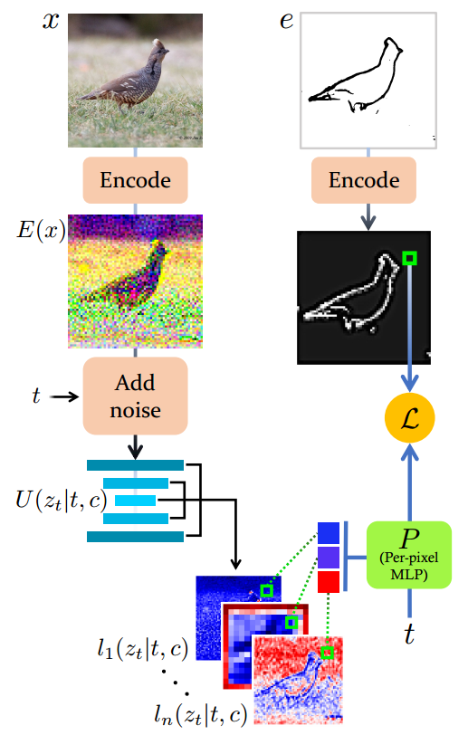

[toc]

> [Sketch-Guided Text-to-Image Diffusion Models](https://arxiv.org/abs/2211.13752)
>
> [unofficial code](https://github.com/ogkalu2/Sketch-Guided-Stable-Diffusion)
>
> SIGGRAPH 2023

# 贡献

- 在 ControlNet 等方法出现之前对控制信息注入的尝试 (论文中使用的控制信息是 sketch)；依靠**针对不同的控制信息** (i.e. sketch) **专门设置的损失函数**在训练过程中进行监督从而实现控制信息的注入

  > 论文中提出了 LGP (Latent Guidance Predictor)，本质是一个 **MLP**；以 sketch 作为控制信息为例，输入是 unet 每一层的输出，输出是生成图像的 sketch
  >
  > 理论上，应该也可以从生成的图像 (经过 vae decoder) 提取出 sketch 然后和 gt 的 sketch 计算损失函数，不清楚为什么一定要重新训练一个 MLP 来提取 sketch；但在训练过程中将生成图像还原为 image 确实对效率有很大的影响 (vae decode 过程会出现明显的显存峰值)，而提取 sketch 的 model 一般是无法直接用到 latent image 上的，所以重新训练一个从 latent image 中提取 sketch 的做法好像也说得过去

# 思路

## Framework

**LGP (Latent Guidance Predictor) 的训练过程**

> LGP 的训练过程是可以借鉴的，主要是如何造 gt

- 猜测 LGP 的训练应该是基于这样一个假设：diffusion model 的图生图的<u>*生成图像和输入图像 (i.e. gt) 大体上长得差不多*</u> (不管是 latent image 还是 image)；根据这个假设，从 gt 中提取出对应的 sketch，然后收集 unet 中每层的输出 (论文中将每层输出 **concat** 在一起) 作为 LGP 的输入，如果生成的 sketch 与直接从 gt 中提取出对应的 sketch 不符，那么就可以基本确定是 LGP 的“能力”不足，i.e. 可以作为训练 LGP 的损失函数

- 有了预训练好的 LGP 后，在训练 diffusion model 的过程中加上 **LGP 提取出的 sketch 和注入的 sketch 之间的 l2 loss** 作为损失函数即可

