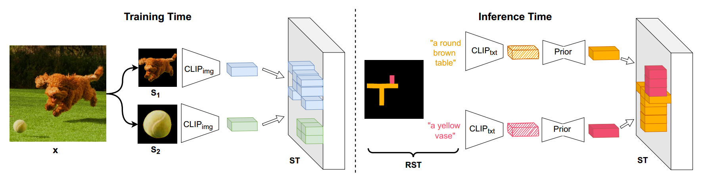

[toc]

> [SpaText: Spatio-Textual Representation for Controllable Image Generation](https://arxiv.org/abs/2211.14305)
>
> CVPR 2023

# 贡献

- 在 ControlNet 和在 AdaXxx-Like 方法出现前的一种 <u>*layout 控制*</u>方式 (论文中使用 segmentation mask)

  将 **clip image embedding** 按照 **segmentation mask** 的“形状“**堆叠**起来，在 channel 上与 latent feature **concat** 在一起

# 思路

## Framework

**training strategy**

- 从 gt 中提取 **segmentation mask** (可能通过 grounding dino e.t.c.)，并从这些 mask 中随机挑选几个并 crop 出一些“实例” (i.e. 上图中的 S1、S2)，然后提取出 **clip image embedding**

  接着，将这些 embedding 按照 segmentation mask 的“形状”**堆叠**起来 (i.e. ST)，简言之，**利用 ST 可以同时注入 semantic 和 spatial 信息**

  > 当有了 ControlNet 后，ControlNet 分支有单独的 encoder hidden state 可以注入独立的 semantic 信息；而有了 AdaXxx-Like 后则是直接在 attn map 上控制 spatial 信息

- 将 ST **concat** 到 latent feature 的 **channel 维度**上，然后正常进行训练即可

  > 原文：we choose to concatenate xt and ST along the RGB channels dimensions, to get a total input of shape (H, W, 3 + dCLIP).

**inference strategy**

- 需要额外训练一个 **Prior 网络**，作用是将 **clip image embedding 对齐为 clip text embedding**

  > 考虑到 clip 的训练过程中就是让 image embedding 和 clip embedding 尽量接近，所以这个网络应该也不难训练

- 其它操作和训练过程一致