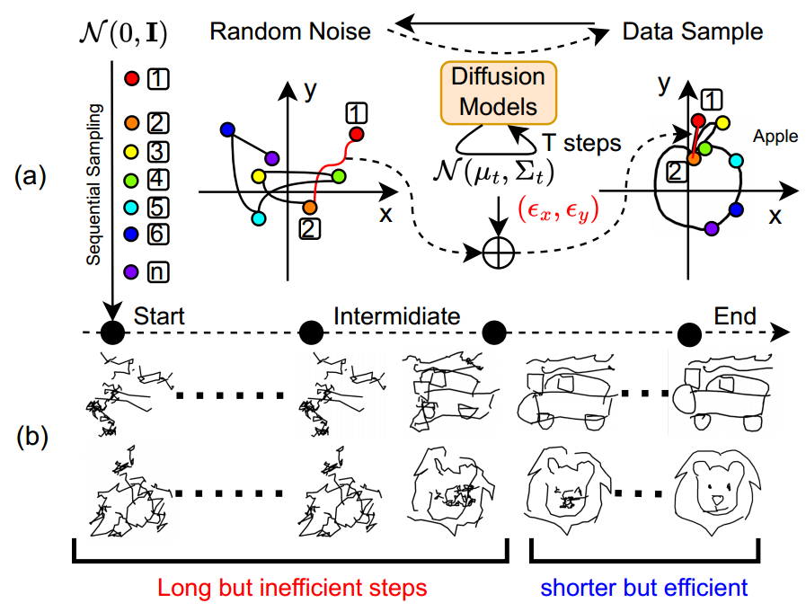
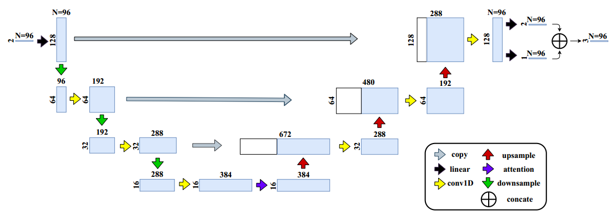
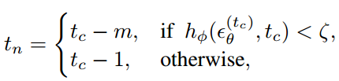
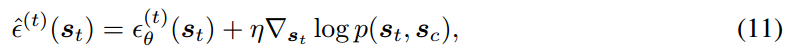
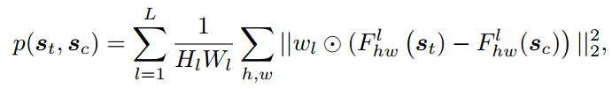

[toc]

> [SketchKnitter: Vectorized Sketch Generation with Diffusion Models](https://openreview.net/pdf?id=4eJ43EN2g6l)
>
> [official code](https://github.com/wangqiang9/SketchKnitter?tab=readme-ov-file)
>
> ICLR 2023

# 贡献

- 通过扩散模型生成简笔画；本质上，是使用扩散模型预测 $(\Delta x,\Delta y,g)$ 三元组其中的 $(\Delta x,\Delta y)$，i.e. 输入输出<u>*特征图为 (N, 2)*</u>

> 像是用 diffusion model 做了序列预测任务；感觉可以用在 online 字体生成上

# 思路

## Framework

**Problem Setup**

- $\Delta x$ 和 $\Delta y$ 表示在 x 轴和 y 轴上的移动距离，$g$ 表示移动过程中是否要进行绘制 (二元)

**Network Structure**

- **2 维的向量会被提升为 128 维，然后输入 U-Net** 作为噪声预测网络的扩散模型进行生成 (论文中与 Bi-direction RNN 的噪声预测网络进行了对比，实验表明 U-Net 结构效果更好)

  > 有点像用扩散模型的方式做了序列预测

**Recognizability Based Shortcut Sampling**

- 论文中提出，在<u>*推理过程中*</u>，去噪早期生成出的图像没有显著的提升，这一个时间段中应该可以<u>*跳过一部分*</u>，而不需要每个时间步都进行噪声预测

- 将当前时间步的输出和时间步作为输入，预测当前生成图像的“可辨识性” (recognizability)；如果 recognizability <u>*小于一定的阈值，则跳过 $m-1$ 个时间步*</u>

  

  $h_{\phi}$ 需要进行预训练

  > 论文中提出 recognizability 的 gt 来自 And the ground truth $r_t$ could be obtained from an extra pre-trained sketch classifier as done in (Song et al., 2018)

**Pen State Estimation**

- 将输出的 128 维 (还没有压缩回 2 维) 向量输入一个 linear，预测 $g$ (是否进行绘制)

**损失函数**

- 重建损失
- Pen State 的 CE Loss

**Conditional Generation to Rectify Bad Sketches**

- 上述的训练都是无条件的，论文中提出通过<u>*梯度引导*</u> (类似 cfg) 的方式增加控制 (e.g. 提供一个很潦草但能看出大致想画啥的简笔画)

  

  简言之，希望<u>*向着尽可能减少 $s_t$ 和 $s_c$ 之间差距的梯度方向移动*</u> ($s_c$ 表示控制信息，$s_t$ 表示生成图像)

  $p(s_t,s_c)$ 通过类似 lpips 的方式计算得到

  

  > 原文：where $F_{hw}^l$ denotes the feature maps for l-th layer of an ImageNet pre-trained VGG Simonyan & Zisserman (2014), $w_l$ is adopted to scale the feature activations channel-wise as per (Zhang et al., 2018).

## 数据集

- 论文的 4.1 和 4.2 章节有介绍数据集

  > 这种任务居然会有专门的数据集

# Ablation

- 推理时跳过一些时间步没有降低生成效果，加速了生成过程
- 预测一幅图使用的 3D 向量数量要始终 (论文提出 N=192)
- 向量表示时使用移动量比绝对位置更有效