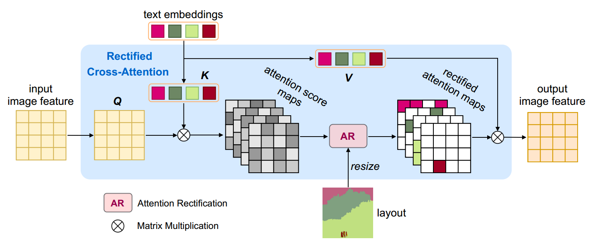
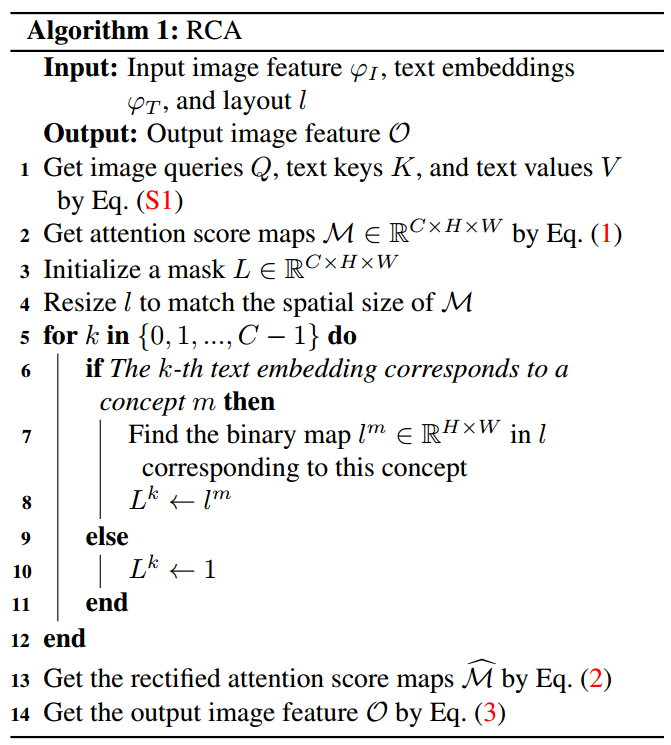
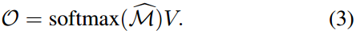

[toc]

> [Freestyle Layout-to-Image Synthesis](https://arxiv.org/abs/2303.14412)
>
> [源码](http://github.com/essunny310/FreestyleNet)

# 贡献

- 通过在 <u>*attn map*</u> 上应用 <u>*segmentation mask*</u> 对每个应该生成的 concept 的<u>*位置信息*</u>进行监督

# 思路

## Framework

- 提出了 **Rectified Cross-Attention (RCA)**

  > 这不是一个 training-free 的方法

- **算法流程**

  

  1. 输入的 prompt 类似于 "dog bowl floor metal wood"，每个单词对应一个 concept

     > 复杂一点的 prompt 也可以，e.g. "dog bowl full of noodles floor metal wood" ("bowl full of noodles" 视作一个 concept)，猜测是在用户输入时或 tokenization 时有一些特殊的操作，而不是模型本身有提取出 concept 的能力

  2. 将用户指定的 segmentation map 按照**不同的 concept 分离到不同的 channel** 中，形成一个 mask (C×H×W)，**C 既是 channel 也是 concept 的数量** (step 3 - 12)
  
     > 原文：We translate the input one-channel semantic layout into a C-channel layout, where each channel is a binary map for an individual concept.
     >
     > 论文中将 channel 维度和 concept 的数量挂钩，应该是增加了调整维度的卷积/线性层，不然 concept 的数量远小于 text embedding 的维度 (e.g. 768)，没办法计算 attn map
  
  3. 重新分配 attn score，将 segmentation mask 以外的部分设置为 `-inf` (经过 softmax 后权重几乎为 0) (step 13 - 14)
  
     > 简言之，通过将 segmentation mask 应用到 attn map 上，即使模型关注到了当前 concept 不应该出现的位置 (i.e. 不符合 layout)，在经过 RCA 后，mask 以外的 attn 被几乎清零，从而监督模型学习按照 layout 进行生成
  
     
  
     
  
     