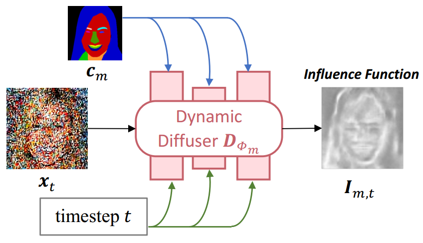
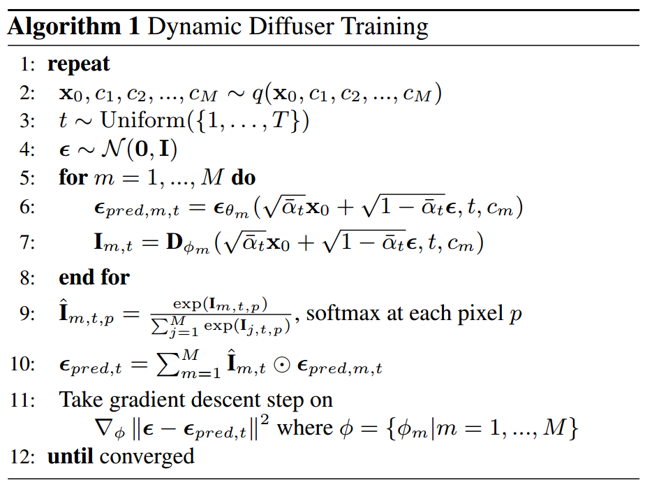

[toc]

> [Collaborative Diffusion for Multi-Modal Face Generation and Editing](https://arxiv.org/abs/2304.10530)
>
> [official code](https://github.com/ziqihuangg/Collaborative-Diffusion)

# 贡献

- 早期对于**多个控制信息自适应融合**的尝试 (之前多个控制信息一般都是有专门的注入结构，并不是真正意义的“融合”)。通过一个预训练的网络，预测不同的网络预测出的噪声对于某个像素的“贡献” (可以看做是预测除了一个**权重矩阵**)

  > 论文中的预测网络使用 unet 实现，感觉某种程度上也可以看做是在复用预测网络的结构 (但是参数量少了很多)，从预测每个像素的噪声变成了预测每个像素对应的权重

# 思路

## Framework

- 论文中将这个权重预测网络称作 dynamic diffuser $D_{{\Phi}_m}$

- 该网络使用 **unet** 实现，输入是时间步 t，控制信息 $c_m$ 和这个时间步输入的 latent image $x_t$

  > 详细的网络结构在 A. Implementation Details 中
  >
  > 时间步 t 的注入方式改为 AdaLN，$c_m$ 由 cross attn 注入

  

  - 简言之，对于 $M$ 个不同的控制信息 (应该也会对应 $M$ 个不同的预测网络)，通过 dynamic diffuser 预测出**权重矩阵**，然后通过 Softmax 对 $M$ 个权重矩阵进行归一化，与 $M$ 个预测出的噪声加权得到一个融合后的噪声

    > 损失函数还是使用重建损失，感觉和 controlnet 一样是“硬训”出来的