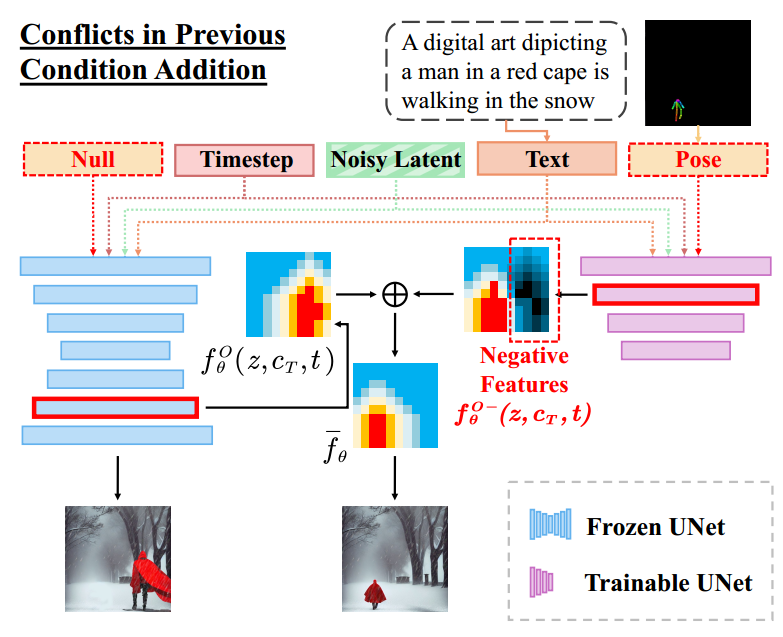
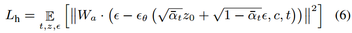
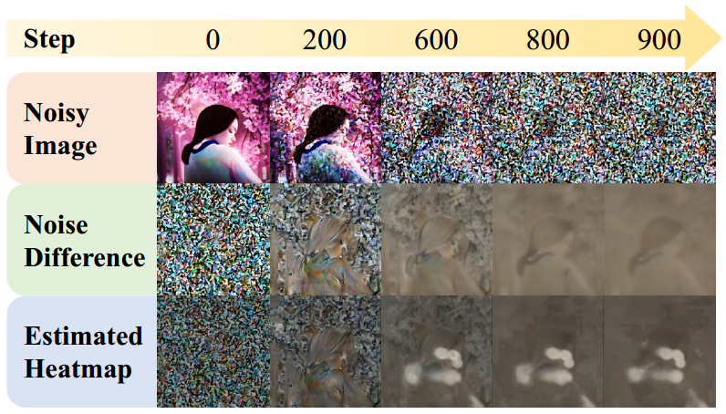

[toc]

> [HumanSD: A Native Skeleton-Guided Diffusion Model for Human Image Generation](https://arxiv.org/abs/2304.04269)
>
> [源码](https://github.com/IDEA-Research/HumanSD)

# 贡献

- 提出了 ControlNet 这种双分支 (Dual Branch) 结构引入 condition 时可能存在矛盾
- 通过 **concat 的方式**引入 pose condition
- 提出了利用 heatmap，增加对人物部分生成的监督的权重，并且**权重可以根据训练过程自适应调整** (基本上是**对于引入的控制信息的监督在去噪前期权重要大一些，后期权重要小一些**)

# 思路

- ControlNet 在生成过程中的矛盾

  

  简言之，由于 ControlNet 其实是在 SD 已经通过 encoder 进行了一定的生成后再引入控制的，那么除了要额外引入 condition 外，<u>*还需要修改已经生成的 latent image 中生成错误的部分*</u> (e.g. 上图中 Negative Features，黑色表示要抑制 $f_{\theta}^O$ 中位置生成不正确的红色高亮部分)；论文认为**使用 concat 的方式让控制信息在生成的一开始就被引入**是更好的选择

  > 但目前还是有很多工作是基于 ControlNet 的

-  **The Heatmap-guided Denoise Loss**

  - 准确来说，这不是一个新的 loss，而是需要实现一个可以**自适应的权重 $W_a$**

    这个权重需要满足两个需求：（1）这个权重能够<u>*“自动关注”到需要被监督的“主体”上*</u> (e.g. pose 控制的是人体的生成，那么这个权重能够对人体所在的位置 / mask 使用更大的权重，而<u>*对背景部分没有大的影响*</u>)（2）能够<u>*根据时间步自适应的调整权重的大小*</u> (大体上是<u>*去噪前期大一点，去噪后期小一点*</u>)
  
    

    > 原文：As a result, we need to (1) find out what the model respectively learns at different steps and stages, and (2) determine a weight function Wa(t) based on the step-wise model behavior.

- 论文中经过实验可视化了去噪过程中图像，

  

  Noisy Image 表示对 gt 的加噪过程；Noise Difference 是**将重建损失 (添加噪声的 gt 和预测噪声的差值) 作为输入**经过采样和 vae decoder 生成的 image；Estimated Heatmap 是通过一个预训练的 pose estimator 预测出的 pose heatmap

  > <u>*Noise Difference 随着加噪越来越清晰*</u>，应该是可以看做在添加噪声的 <u>*gt 的基础上添加了一个高斯噪声*</u> (900 步的时候预测出的噪声应该是比较接近高斯噪声的，而减去高斯噪声和加上高斯噪声差别不大)，反过来可以看做这个<u>*差值在去噪早期其实是对噪声的 gt 比较接近的预测*</u>，所以有较为清晰的人体的“形状”，因而 pose estimator 可以做出比较准确的预测，相当于**能够在去噪早期识别出人体的形状并自适应的增加损失函数的权重**
  >
  > 理论上也可以通过 mask 和参数 $\beta$ (和 $\alpha_t$ 挂钩) 来进行控制 (确实也有论文是这样做的)。感觉该论文提出的方法的好处，一方面是通过模型提取的 heatmap 比“定死了”的 mask 更灵活，生成过程中理论上模型可以自适应调整；另一方面，是如果两次抽取到同一个时间步，使用 $\beta$ 就直接写死了权重，但第二次生成的效果应该是比第一次更好的 (i.e. 分配的损失函数权重应该稍微减小一点)