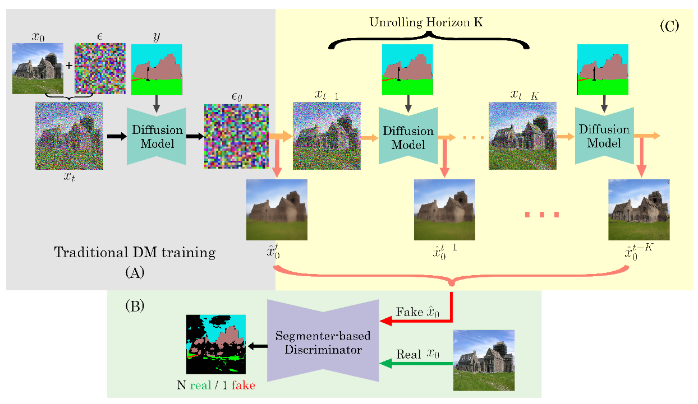
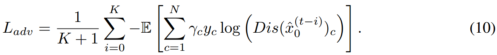

[toc]

>[Adversarial Supervision Makes Layout-to-Image Diffusion Models Thrive](https://arxiv.org/abs/2401.08815)
>
>[official code](https://github.com/boschresearch/ALDM)
>
>ICLR 2024

# 贡献

- 将 GAN 中的 **discriminator 的对抗损失**添加到损失函数中 (论文中对 layout 进行监督，但使用其它的 discriminator 应该也可以监督其它的信息)
- 因为 discriminator 一般需要比较清晰的图像才能”公平“判断 (e.g. 对于添加噪声比较多的时间步，采样得到的生成图像是很模糊的，discriminator 很”轻松“可以分辨出是 fake 的，导致 unet 一直被惩罚)；论文中提出将一个**滑动窗口中的多个图像一起交给 discriminator 做判断**，这样多少可以传入一些比较清晰的图像，以保证训练的稳定

# 思路

## Framework

**Segmenter-based Discriminator**

- 将通过 vae decoder 的图像经过 discriminator 产生**对抗损失**

  > 在论文特定的 layout2image 任务中，discriminator 是一个 multi-class 分类器，每个 segmentation mask 对应类的 id，再加上一个特殊的 fake 类

**Unrolling Horizon K**

- 本质上是一个**长度为 K 的滑动窗口**，为了解决噪声比较多的时间步还原出的 $x_0$ 图像比较模糊，容易被 discriminator 判断为 fake 的问题

  **K 个时间步的 $x_0$ 会分别交给 discriminator 做判断**，平均值作为对抗损失

  

- 这种做法对 GPU 的压力比较大，所以虽然计算了 K 个对抗损失，但是并不会对 K 个时间步都进行梯度回传，只有第一个使用平均对抗损失进行梯度回传，后续的<u>*当做无梯度的常数看待*</u>不进行梯度回传

  > 原文：Since the denoising UNet model is the same and reused for every step, we propose to simply accumulate and scale the gradients for updating the model over the time window, instead of storing gradients at every unrolling step. This mechanism permits to harvest the benefit of multistep unrolling with controllable increase of complexity during training.