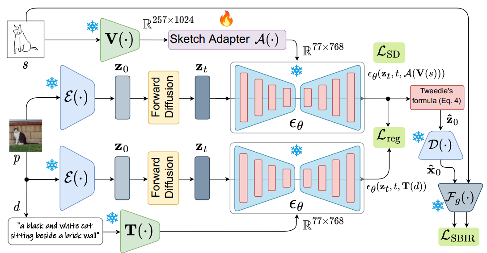
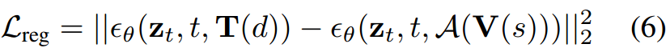
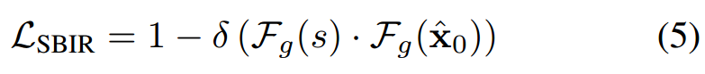
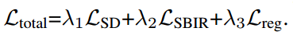
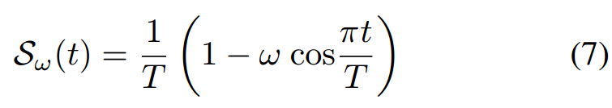
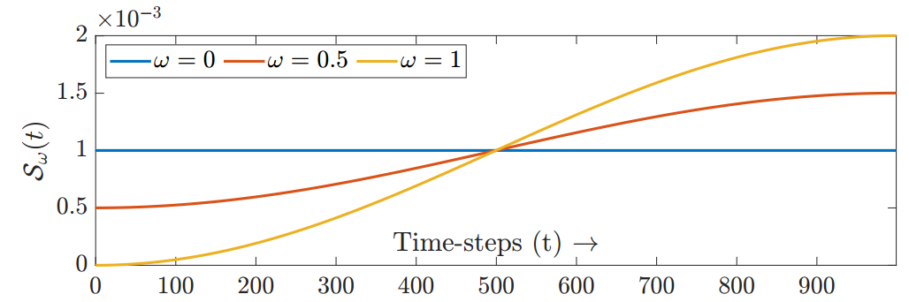

[toc]

> [It's All About Your Sketch: Democratising Sketch Control in Diffusion Models](https://arxiv.org/abs/2403.07234)
>
> [official code](https://github.com/subhadeepkoley/StableSketching)

# 贡献

- 将 sketch 图像控制信息经过一个 CLIP image encoder 然后通过一个 adapter (conv + attn + fc) 与 **CLIP text embedding** (i.e. 77×768) **对齐**；i.e. 将控制信息视作一种<u>*”特殊的“文本*</u>

  > 本文比 IP-Adapter 早

- 通过**增加一个去噪网络**，将这个去噪网络的输出当做**新的 gt**

- 在<u>*推理过程中*</u>，sketch 在<u>*抽象程度上有很大的区别*</u>，提出了一种**自适应地**在去噪**早期时间步的采样密集一些，后期稀疏一些**；论文训练了一个 CLIP 网络，来量化输入的 <u>*sketch 图像的抽象程度*</u>

# 思路

## Framework

- 论文中提出将 adapter 的输出视作一种**“特殊的” text embedding**

  > In that, instead of treating the input sketches spatially, we encode them as a sequence of feature vectors [42] as an  equivalent fine-grained textual embedding.

- **损失函数：**

  - 通过增加一个去噪网络，将这个去噪网络的预测的噪声当做新的 gt

    

    > 猜测这么做的原因是该模型的预期是一个“纯粹”的图生图模型，但是在训练过程中完全不引入 text 控制会导致训练的困难，所以这样可以算是间接地引入了 text 控制以便于训练

  - 论文使用 FG-SBIR 模型，该模型可以<u>*判断原图和 sketch 是否接近*</u>

    

    > 最重要的可能是得能找到这样能直接拿来用的模型

  - 完整的损失函数，

    

- **自适应的采样方式：**

  

  这个函数的图像为，

  

  简言之，在<u>*推理过程*</u>中，引入一个<u>*“抽象程度”*</u>，如果 sketch 很抽象，这个值就大一些，然后作为上面这个函数的 $w$ 参数，就可以自适应地在更高的噪声时间步采样更多的步

  > 猜测这个思路需要搭配一个可以跨时间步进行采样的方法 (e.g. DDIM)

  论文额外训练了一个 CLIP 模型来得到这个“抽象程度”