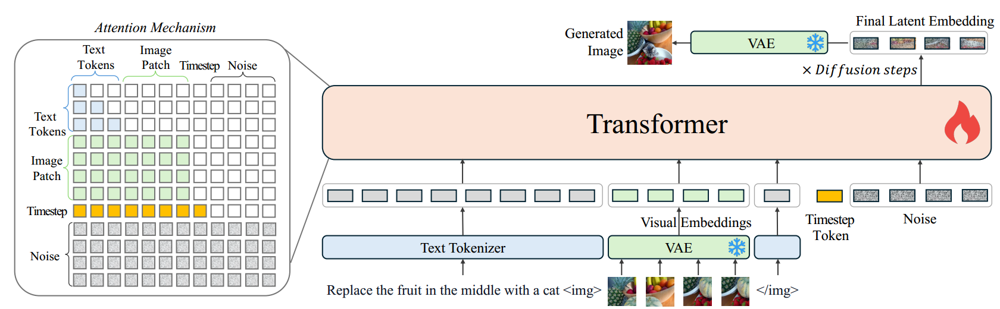

[toc]

> [OmniGen: Unified Image Generation](https://arxiv.org/abs/2409.11340)
>
> [源码](https://github.com/VectorSpaceLab/OmniGen)

# 贡献

- 仅<u>*通过训练 VAE 和 Transformer*</u>，就可以使用<u>*同一个模型执行*</u> Text-to-Image Generation，Image Editing，Subject-Driven Generation，Visual-Conditional Generation，Computer Vision Tasks 等一系列任务

# 思路

## Framework

**Special Token**

- 使用 <u>*`</img>` 作为 special token*</u>，来指明其中的部分是 visual embedding

**VAE**

- <u>*训练 VAE 提取 visual embedding*</u>

**Attention Mechanism**

- 在 Transformer 中融合了单向注意力和双向注意力，i.e. <u>*每组 token 以内是双向注意力，每组 token 之间是单向注意力*</u>

  > 但是 Text Tokens 好像在组内用的也是单向注意力，不知道为什么要这么设置

## Training Strategy

- 使用 <u>*rectified flow*</u> 方法优化模型参数
- 对于 prompt 中<u>*输入的图像和 gt 图像中不一致的像素点*</u>，在计算损失函数时，<u>*给予更高的权重*</u>
- <u>*从低分辨率开始训练，逐步训练到高分辨率上*</u>

## 数据集

> [数据集地址](https://huggingface.co/collections/yzwang/x2i-dataset-674c66d1d700f7f816a9590d)

- 提出了 <u>*X2I*</u> 数据集；因为只对 VAE 和 Transformer 进行训练，所以需要<u>*对 prompt 的格式进行统一，以同时在多个任务上进行训练*</u>

  

# Evaluation Metric

- 在不同的任务上使用了该任务常用的 evaluation metric (e.g. CLIP，SSIM e.t.c.)

# Ablation

- 单向注意力和双向注意力的设置是有效的
- 对不同的像素点使用更多的 loss 权重是有效的
- VAE 和 CLIP 提取 visual embedding 的效果差不多，VAE 的效果略好
- 模型有着较强的泛化能力