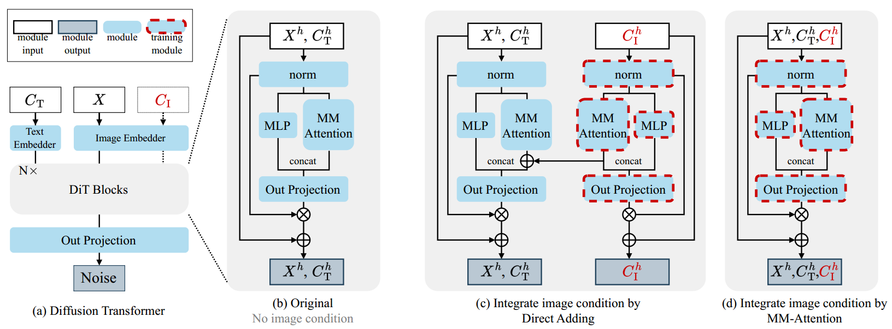
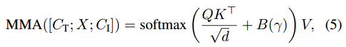

[toc]

> [OminiControl: Minimal and Universal Control for Diffusion Transformer](https://arxiv.org/pdf/2411.15098v3)
>
> [源码](https://github.com/Yuanshi9815/OminiControl)

# 贡献

- 对于基于 <u>*DiT*</u> 的扩散模型，通过 <u>*attn 机制直接融合 control 信息*</u> (<u>*更加轻量级*</u>，不使用相加融合，也不像 ControlNet 引入新的结构)

# 思路

## Framework

- $C_T$ 表示 text embedding，$C_I$ 表示 image embedding；图 (a) 是原始结构，图 (b) 是相加融合，图 (c) 是该论文提出的，直接<u>*在 attn 中使用 concat 融合*</u>

- 对于<u>*位置编码*</u>分为两种情况，

  - 如果注入的 $C_I$ 是<u>*需要对齐 aligned 的*</u> (e.g. canny map)，则和 $X$ 使用<u>*相同的位置编码*</u>
  - 如果注入的 $C_I$ 是<u>*不需要对齐 unaligned 的*</u> (e.g. subject driven)，则在 $X$ 的基础上<u>*偏移位置编码*</u>

- 可以通过一个<u>*超参数 $\gamma$ 来控制 $C_I$ 的强度*</u>,

  

  $B(\gamma)$ 基本是一个 0-1 矩阵，通过增强权重来加强 attn 值

## 数据集

- <u>*Subjects200K*</u> 数据集；收集了很多<u>*通过一个 subject 在不同*</u>环境、不同视角等

# Evaluation Metric

- 图像质量 (e.g. t2i 任务)

  - FID 

  - SSIM

  - MAN-IQA：一种使用模型对生成图像进行无参评估的方式

  - MUSIQ：一种使用模型对生成图像进行无参评估的方式、

  - CLIP Score

- 可控性 (e.g. canny map，depth map)
  - F1 Score 
  - MSE