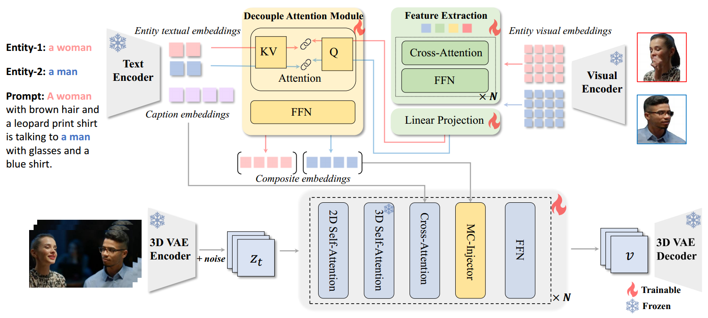

[toc]

> [ConceptMaster: Multi-Concept Video Customization on Diffusion Transformer Models Without Test-Time Tuning](https://arxiv.org/abs/2501.04698)

# 贡献

- 论文提出可以通过 concept-entity pair 数据，用户可以通过引入 concept 来自定义生成 (e.g. 用户可以把 "cogi", "husky" 之类特殊的狗都关联到 "dog" 这个 entity 上，模型就会懂得 "cogi"，"husky" 这些 concept 是 "dog" 的一种并使用 "dog" 的知识来生成)
- 使用 <u>*cross attn 机制将 text embedding 相关的控制和引入 "subject" 的控制解耦*</u>

# 思路

## Framework

**Decouple Attention Module (DAM)**

- <u>*entity visual embeddings 通过 QFormer 作为 query，entity textual embedding 通过 T5 作为 key 和 value*</u>

  > 原文：Therefore, unlike these approaches, we employ T5-encoder to encode each concept label individually
  >
  > 没有看懂这里是单独对 entity 使用 T5 编码然后替换，还是直接使用 T5 对整个 caption 编码？

**MC-Injector**

- 本质上是 <u>*cross attn*</u>

  > 原文：Specifically, the MC-Injector is an additional specialized cross-attention layer integrated within each transformer block, positioned after the original text cross-attention layer.

## 数据集

- 设计了详细的过滤和 entity 提取过程

  > 参考 4.3. MC-Oriented Video Data Construction

# Evaluation Metric

- CLIP-I 和 CLIP-T 对相似度进行评估
- OWLv2 确定每个概念的框区域，在这些区域中再进行一次评估
- 使用 VBench 评价质量

# Ablation

- DAM 模块有效
- QFormer 的引入是有效的