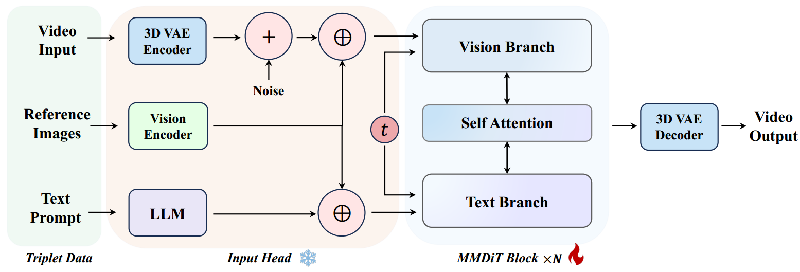

[toc]

> [Phantom: Subject-consistent video generation via cross-modal alignment](https://arxiv.org/abs/2502.11079)

# 贡献

- 通过 <u>*self-attn 融合 I2V 和 T2V 的输出*</u>

# 思路

## Framework

> 这个 Video Input 没有看懂是什么

## 数据集

- 论文认为连续的 frame 组成的训练集可能导致模型忽略 text 的控制，

  > 原文：In-paired data involves selecting keyframes from videos as reference images. While this ensures consistency between the subjects in the images and videos, the high visual similarity may lead the model to overlook the text prompts, resulting in generated videos that simply copy-paste the input images

  所以收集一系列 <u>*unpaired data*</u>；i.e. 选择其它 frame 或同种 "subject" 的其它存在

# Evaluation Metric

- Identity Consistency

  - FaceSim-Arc，FaceSim-Cur，FaceSim-glink；使用不同面部识别模型计算相似度

- Prompt Following

  - ViCLIP-T

- Subject Consistency

  > 可能 Identity 专指面部相似度？

  - CLIP-I，DINO-I，CLIP-Seg，DINO-Seg