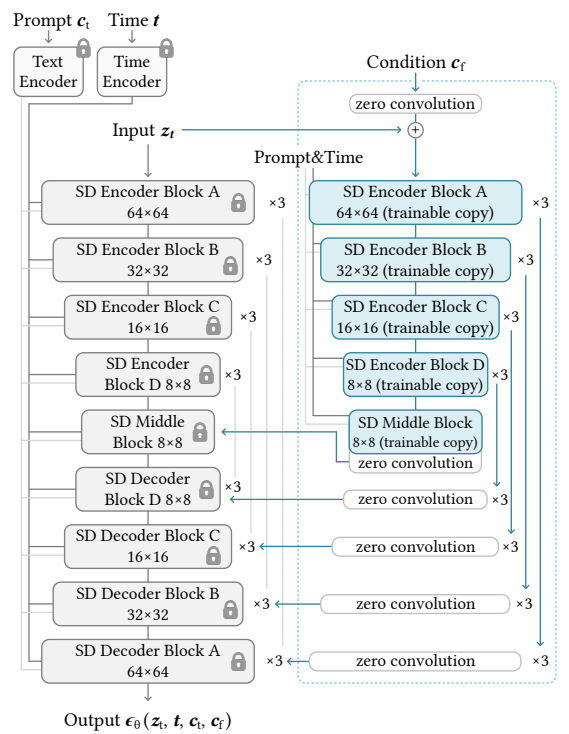

[toc]

> [Adding Conditional Control to Text-to-Image Diffusion Models](http://arxiv.org/abs/2302.05543)
>
> [源码](https://github.com/lllyasviel/controlnet)
>
> ICCV 2023

# 贡献

- 通过<u>*复用 sd encoder 结构*</u>的方式，引入新的控制信息

# 思路

## Framework

- 将其它控制信息 (如 mask、骨骼、边缘图等)，作为一个附加的网络，与原始的 diffusion model 进行组合

  这些控制信息的特征提取网络，<u>*复用了 Stable Diffusion Encoder*</u>

  

- <u>*零卷积网络 zero convolution*</u>；该卷积网络初始化时，参数与 bias 均<u>*置为零*</u>

  零卷积网络可以保证原始 SD 网络，在早期的训练阶段，参数不会被严重破坏，减少遗忘

- Stable Diffusion Encoder 计算结束后，ControlNet 每一层的输出，会和对应层 Stable Diffusion Encoder 的输出<u>*先进行相加融合*</u>；然后计算过后的 Encoder 输出再和 Stable Diffusion Decoder 对应层的输出进行 skip connection 操作

- 在训练 ControlNet 的过程中，<u>*原始的 Stable Diffusion 模型全部处于冻结状态*</u>

- <u>*对于不同的控制类型，需要专门训练 ControlNet*</u>

> ControlNet 完全复制了 Stable Diffusion Encoder，会输入 time embedding 和 text embedding 并进行处理

# 参考文献

- [ControlNet 的具体网络结构，输入、输出维度；以及代码介绍](https://blog.51cto.com/u_13788151/10408967)