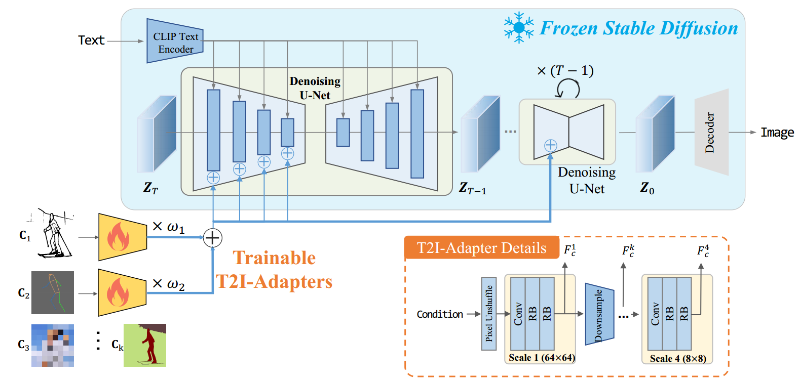
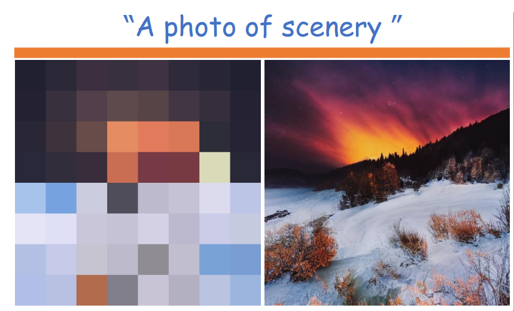
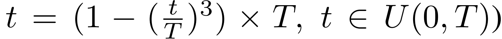

[toc]

> [T2I-Adapter: Learning Adapters to Dig out More Controllable Ability for Text-to-Image Diffusion Models](https://arxiv.org/pdf/2302.08453)
>
> [源码](https://github.com/TencentARC/T2I-Adapter)
>
> AAAI 2024

# 贡献

- 使用 <u>*adapter 模块*</u>对不同的控制控制信息进行学习，经过 <u>*downsample 后与 unet 的特征图分辨率对齐*</u>后进行<u>*相加融合*</u>

  > 思路上和 ControlNet 很接近

# 思路

## Framework

**structure**

- 使用 <u>*adapter 模块*</u>对不同的控制控制信息进行学习，经过 <u>*downsample 后与 unet 的特征图分辨率对齐*</u>后进行<u>*相加融合*</u>

- Adapter 由 <u>*pixel unshuffle 下采样*</u> (一种通过 channel 维度进行无损的下采样算法) 后，<u>*卷积*</u>和<u>*残差块*</u>组成

  > downsample 块使用的应该是有损的下采样

- 不同的控制信息需要重新训练 Adapter (与 ControlNet 一致)

  - 大多数控制信息都有专门的模型进行提取 (e.g. canny model，depth model e.t.c.)

  - 特别地，论文提出了一种通过类似“马赛克”的大像素来<u>*控制颜色*</u>

    > 从 gt 中提取这种带颜色的像素块的具体做法，可以查看论文的 Spatial color palette 段落

    

- 当存在多个控制信息时，可以<u>*通过加权相加的方式融合多种信息*</u>

  > 感觉这一点 ControlNet 论文虽然没说但好像也能做到

**training strategy**

- 论文中提出，T2I-Adapter 的<u>*训练在去噪的早期进行*</u>更为有效；因此，论文提出了一种非均匀的时间采样算法 (提高采样到更大的加噪步数的概率)

  

