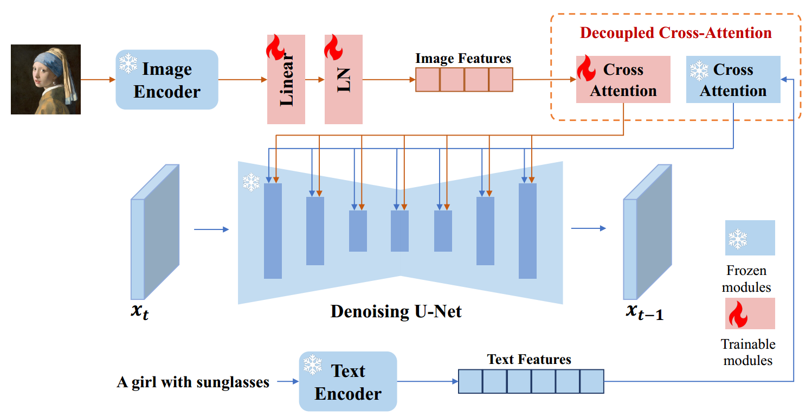
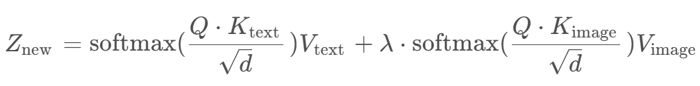

[toc]

> [IP-Adapter: Text Compatible Image Prompt Adapter for Text-to-Image Diffusion Models](https://arxiv.org/abs/2308.06721)
>
> [源码](https://github.com/tencent-ailab/IP-Adapter)

# 贡献

- 将 "subject" 的 <u>*image 形式*</u>的输入，按照 <u>*prompt 的方式进行 embedding 和 cross attn 注入*</u>

# 思路

## Framework

- 简言之，将包含新 "subject" 的 image 看做一种"特殊的 text"；通过 <u>*image encoder 提取 visual embedding*</u> 后，利用 <u>*linear 层进行对齐*</u> (维度对齐，进入同一个 embedding 空间)，然后通过 <u>*cross attn 融合*</u>

- 与通过 cross attn 后的 text embedding <u>*相加融合*</u>

  

