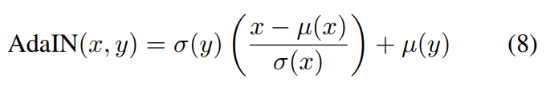
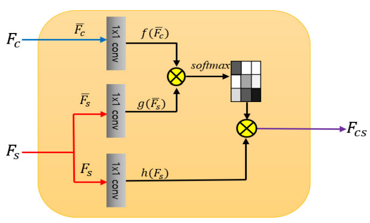
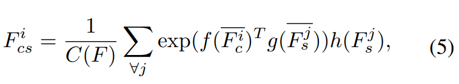
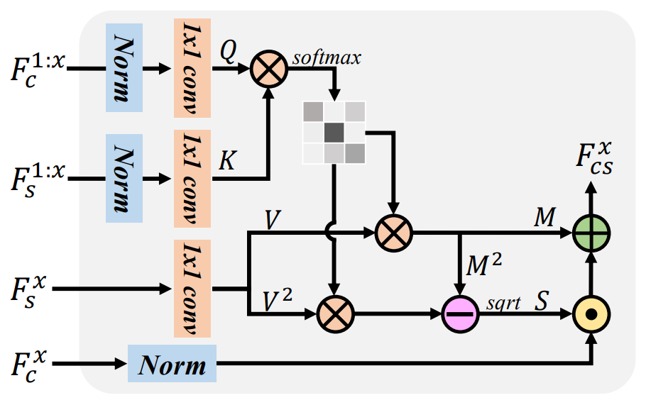
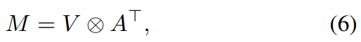
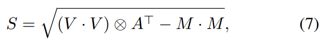
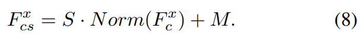

[toc]

> [Arbitrary Style Transfer in Real-time with Adaptive Instance Normalization](https://arxiv.org/pdf/1703.06868)

# AdaIN

- **思路：**使用目标风格图像的**均值和方差**来实现风格迁移；是一种 training-free 方法

  $x$ 为源图像，$y$ 为目标风格图像；$\sigma$ 表示方差，$\mu$ 表示均值

  

> [Arbitrary Style Transfer with Style-Attentional Networks](https://arxiv.org/pdf/1812.02342)

# SANet

- **思路：**将 attn 机制引入，**源图像 $x$ 作为 query，目标风格 $y$ 作为 key 和 value**

  

  

  > attn 机制一般使用的是 softmax，不知道为什么这里使用的是 exp

> [AdaAttN: Revisit Attention Mechanism in Arbitrary Neural Style Transfer](https://arxiv.org/pdf/2108.03647)

# AdaAttN

- **思路：**AdaAttN 可以看做 AdaIN 和 SANet 的结合；i.e. 利用 **attn score map 作为权重矩阵**，计算目标风格图像的均值和方差

  

  

  

  

  > $M=V\otimes A^T$ 很像是一个加权求平均的操作

  

  