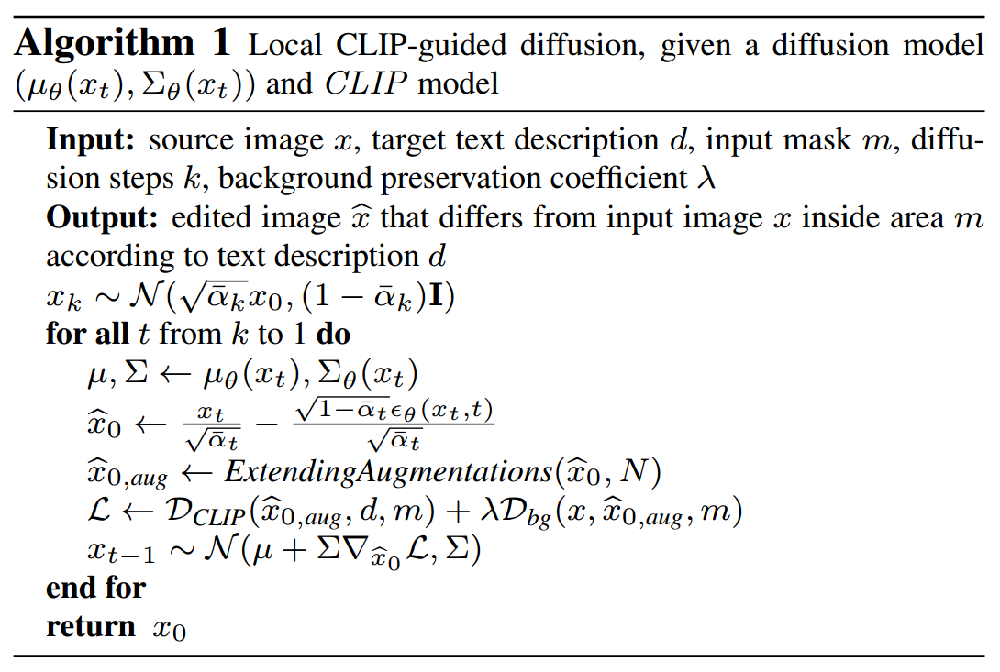
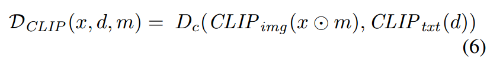
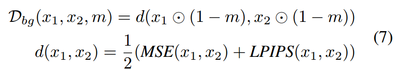
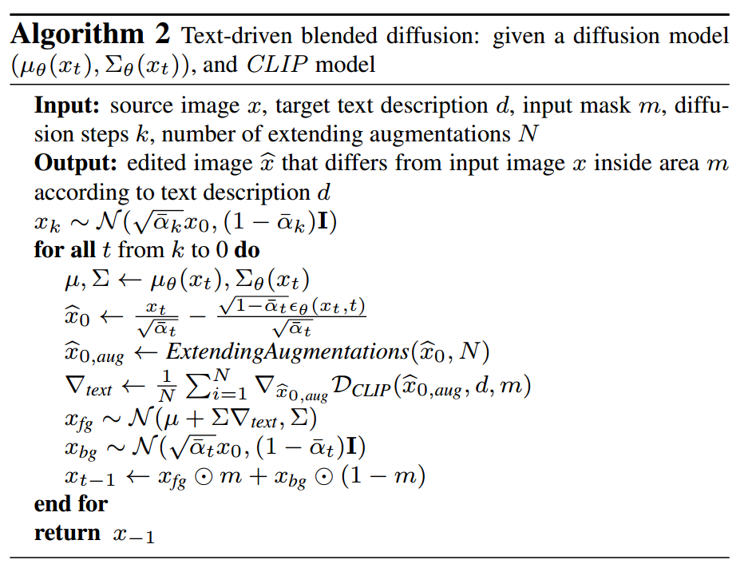
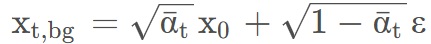
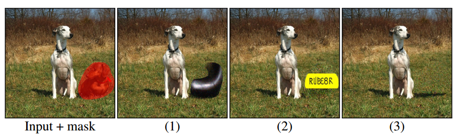
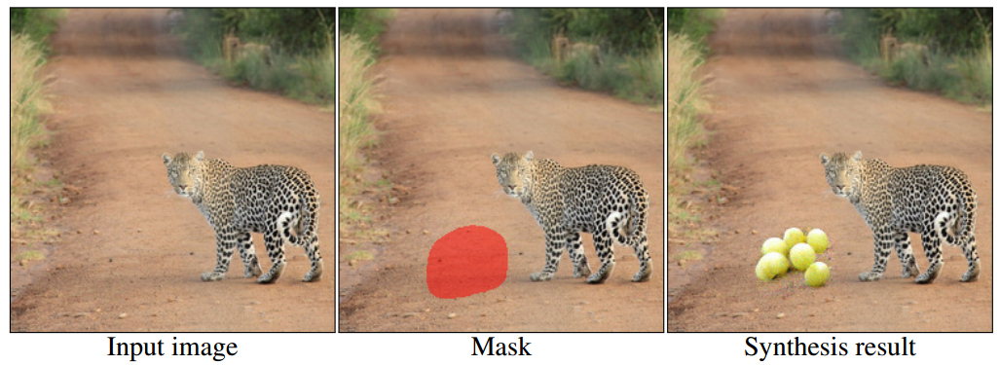
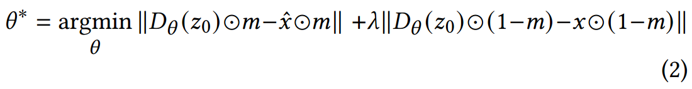
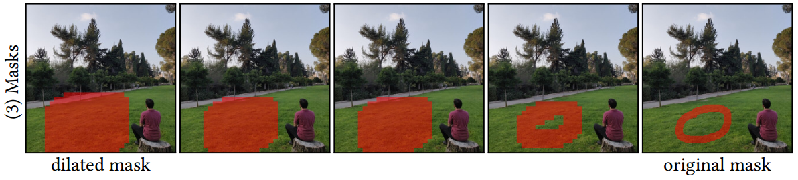
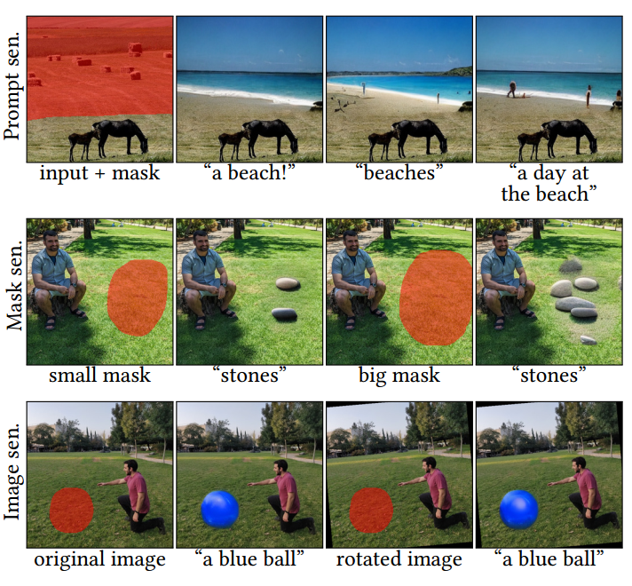

[toc]

# Blended Diffusion

> [Blended Diffusion for Text-driven Editing of Natural Images](https://arxiv.org/abs/2111.14818)
>
> [official code](https://github.com/omriav/blended-diffusion)
>
> CVPR 2022

## 问题提出

- 之前的都是 GAN-based 的方法，它们一般都会局限于某个特定的任务

## 贡献

- 通过 CLIP loss 利用梯度更新对 mask 部分进行监督
- 前景去噪、背景加噪，平衡 inpainting 和对原图的忠实

## Preliminary

- 在 inpainting 任务中，一般将 mask 标定的需要被修改的部分称作<u>*前景 foreground (fg)*</u> 而将剩余的部分称作<u>*背景 background (bg)*</u>
- 在使用 CLIP 的过程中，可能会遇到 **adversarial examples** 这一问题；简单来说，就是<u>*模型并没有生成符合 caption 的图像，但是却拿到了较高的 clip score*</u>

## 思路

**CLIP-guided diffusion**

- 该论文算法的核心之一，是使用 **CLIP cosine sim** 来计算 fg 和 bg 是否符合 caption 的需求

  一般会只用 CLIP loss **直接对预测噪声/预测均值进行更新**

**Extending Augmentations**

- 为了解决 adversarial examples 问题，论文提出对于每一个时间步还原出的 $\hat x_0$，都**使用翻转等方式进行数据增强**，之后的 CLIP loss 都<u>*基于增强之后的多个数据进行后平均*</u>

**算法一**

-  作为**前景损失**

   作为**背景损失** ($x_1$ 代入 $x$，$x_2$ 代入 $\hat x_0$)

- 在预测出的**均值上进行梯度更新**

**算法二**

- 不再对背景进行额外的监督，而是利用  一步加噪，与前景组合在一起 (i.e. **前景进行去噪，背景进行加噪**)

- 论文发现算法二的效果更好

**Result ranking**

- 一次生成多个结果，选择 $D_{clip}$ 中最好的作为最后的输出

## Limitation

- CLIP 可能被部分生成的物体“欺骗”，这可能是由于 $D_{clip}$ 的排序只关注 mask 以内的部分，而生成的物体实际可能不完全在 mask 内 (pic 1)
- CLIP 本身的能力可能不足，导致对一些物体生成错误的语义信息 (e.g. rubber -> "rubber" 这个单词) (pic 2)
- 不正常的影子 (pic 3)

- 错误的大小比例 (e.g. 葡萄太大了)

# Blended Latent Diffusion

> [Blended Latent Diffusion](https://arxiv.org/abs/2206.02779)
>
> [official code](https://github.com/omriav/blended-latent-diffusion)
>
> SIGGRAPH 2023

## 问题提出

- 之前不使用 latent 的扩散模型计算速度较慢

## 贡献

- 从 VAE Decoder 的角度对每张图像进行后处理
- 去噪早期使用腐蚀后的 mask，去噪晚期使用更精细的 mask

## 思路

**Background Reconstruction**

- 论文中发现，即使在进行编辑之前，VAE 对图像的重建结果就不是很好 (e.g. 人脸)

  论文提出，对于每一张图片，**对 VAE decoder 进行一定步数 (论文设置为 75 步) 的微调**，论文默认设置 $\lambda=100$，

  

  > 这里比较奇怪的，是 $\hat x$ 也被考虑到了，相当于原图的被编辑的区域也要和编辑后的该区域相近，但是 $\lambda$ 又给予了一个很大的值

**Progressive Mask Shrinking**

- 论文认为，对于较为 "thin" 的 mask，容易在去噪后期被忽视，所以 **mask 应该从粗糙 (进行腐蚀操作) 变到精细**

  

## Limitation

- blended latent diffusion 对于输入有时会很敏感，

   第一行稍微改变 prompt，第二行稍微改变 mask，第三行稍微改变原图

# 参考

- [csdn 对 blended diffusion 的笔记](https://blog.csdn.net/nappingman/article/details/127818606)