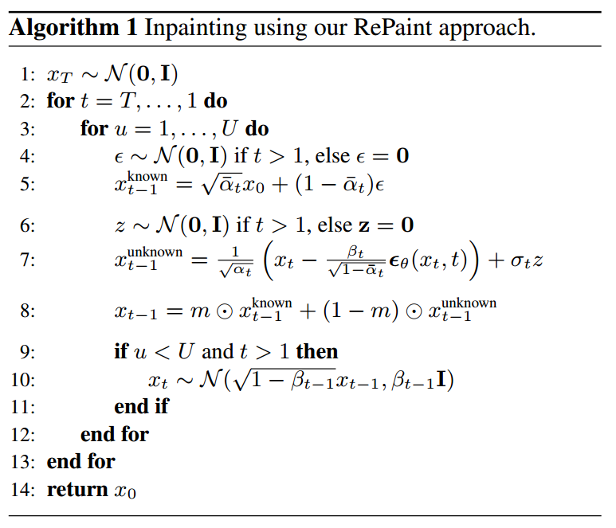
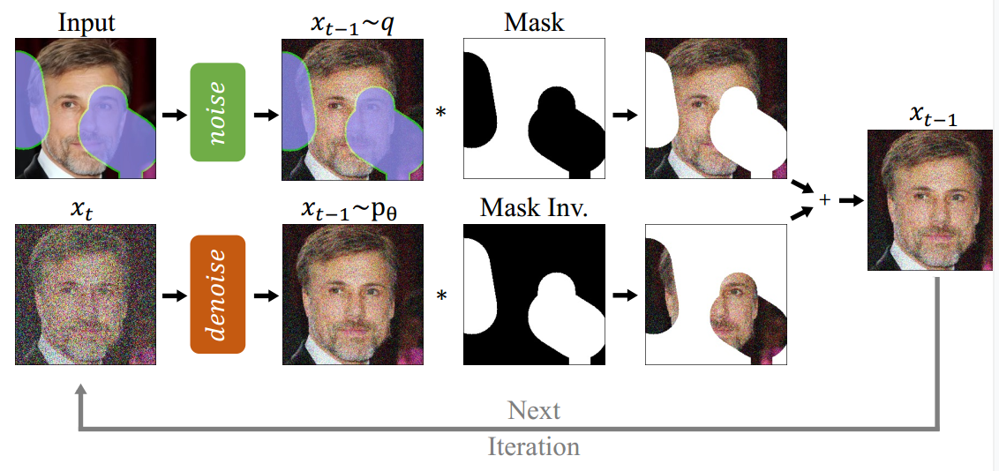

[toc]

> [RePaint: Inpainting using Denoising Diffusion Probabilistic Models](https://arxiv.org/abs/2201.09865)
>
> [official code](https://github.com/andreas128/RePaint)
>
> CVPR 2022

# 问题提出

- 之前的方法需要提供 mask 并对模型进行重新训练

# 贡献

- 在 mask 以内去噪、以外加噪的基础上，回退一部分过程 (对结果进行加噪)，然后重新去噪以更好地融合 mask 内外的语义

# 思路

- <u>*内循环是对在 mask 以内去噪、以外加噪的实现*</u>

  >  该论文使用的 mask 是 1 表示背景，0 表示前景

- step 10 表示对于 step 8 合并后的结果，**加噪到 $x_{t+j}$ (公式默认 $j=1$ 但实际论文设置 $j=10$)，然后重新进行去噪**；这个$加噪\to 重新去噪$ 过程持续默认 $r=10$ (公式使用 $U$ 表示)

  > 该算法的弊端之一是会导致推理时间增大很多倍

# Limitation

- 有时候 inpainting 效果还是不太好

# 参考

- [知乎 RePaint 笔记](https://zhuanlan.zhihu.com/p/650347229)