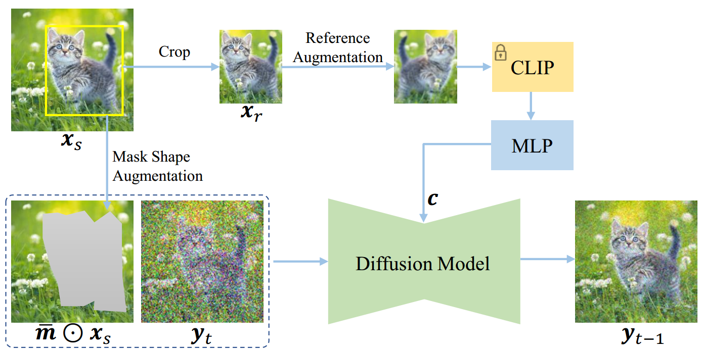
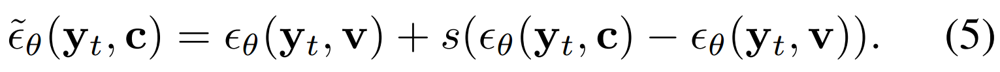
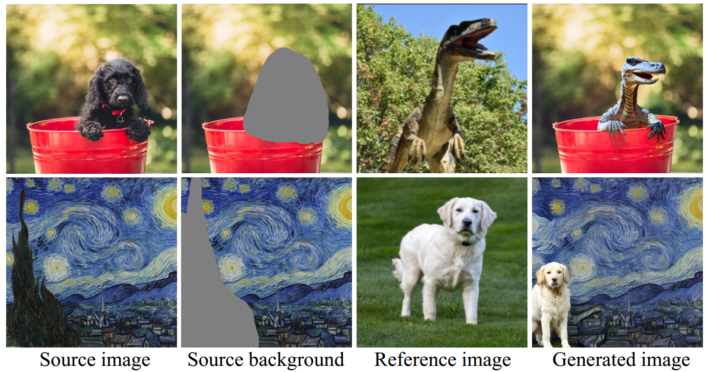

[toc]

> [Paint by Example: Exemplar-based Image Editing with Diffusion Models](https://arxiv.org/abs/2211.13227)
>
> [official code](https://github.com/Fantasy-Studio/Paint-by-Example)
>
> CVPR 2023

# 问题提出

- 之前的工作使用“文本”的方式描述需要绘制的对象，这种方式不够直接、便捷

# 思路

- 使用 reference image 的 CLIP embedding 注入控制信息，同时从数据、编码等方向破坏 embedding 中的细节/高频信息

# 贡献

- 论文认为对于数据集，（1）收集包含 example、background、gt 的三元组非常困难（2）如果从 gt 中 crop 出 example，然后指定 mask 让模型学习绘制是一个<u>*更容易的方法*</u>，但这个任务对模型来说太“简单”了 (i.e. 模型只需要将 example <u>*“复制”*</u>到 mask 上)

- 为了防止模型只是学会简单的“复制黏贴”，模型提出以下的方法，

  - **Compressed representation**

    通过 CLIP 编码 reference image，但是论文发现如果将图像以默认方式编码为 257 个 token，**CLIP 提供了“太多的”信息**，导致模型更倾向于简单的“复制黏贴“；论文提出，**将 reference image 编码为 1 个 1024 维的 token**，这样的编码丢弃了大多细节信息

  - **Mask shape augmentation**

    该论文收集的数据集只有 bbox 而没有 mask，论文提出了一种**将 bbox “腐蚀”为 mask** 的方式 (不使用 segmentation 模型)

    <u>*将 bbox 替换为贝塞尔曲线，选择其中 20 个点，随机移动 1-5 个像素*</u>

  - **Reference image augmentation**

    为了进一步防止简单的“复制黏贴”，对 reference image 进行<u>*翻转、旋转、模糊、弹性变换*</u>等数据增广

  - 损失函数使用的是普通的 recon loss

- 论文同样提出使用 cfg 提高生成质量；在 text 中使用空字符串，而 image 中则不存在对应的“空图像”，论文选择在训练过程中将 20% 的 **reference image 替换为一个可训练的向量 $v$** (i.e. 可以看作一个空向量)，然后就可以在推理过程中使用 cfg 了，

  

# Limitation

- (上) 对训练集中的长尾对象的学习效果有限，(下) 对 style 的学习能力有限

  