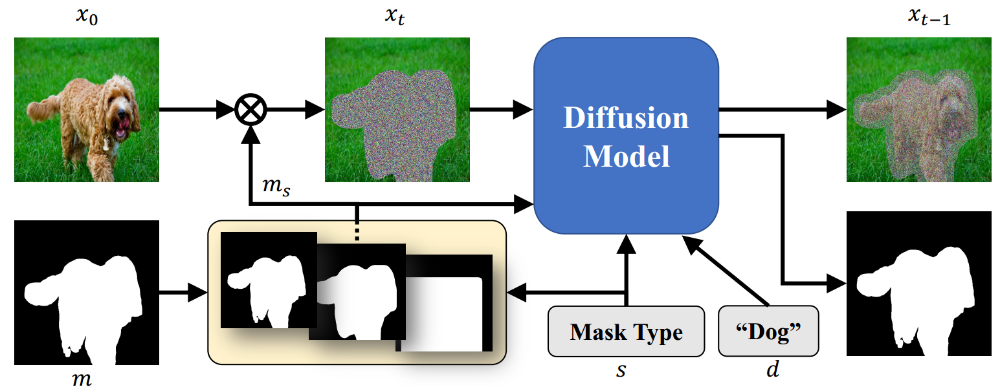
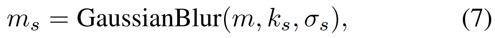
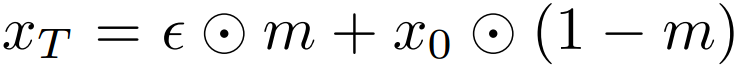

[toc]

> [SmartBrush: Text and Shape Guided Object Inpainting with Diffusion Model](https://arxiv.org/abs/2212.05034)
>
> CVPR 2023

# 问题提出

- 之前的方法中，对 text conditioning 的忠实度可能不足，导致模型使用背景填充 mask 区域，而非填入指定的对象
- 之前的方法中，CLIP embedding 对于倾向于提取全局和高频的细节信息，倾向于“复制”原来的图像而不是听从 mask 的引导

# 贡献

- 在不同”精细程度“的 mask 上进行训练
- 训练过程中增加对 mask 的预测，以在推理过程中进行替换，最大程度保存背景

# 思路

**加噪方式 / 损失函数**

- 仅对 mask 区域进行加噪，但是对整张图片计算 recon loss

**Shape Precision Control**

- 论文认为精细的 mask 有助于模型学习忠实于 mask 的形状，而粗糙的 mask 则更符合推理阶段用户的输入，<u>*不同精细程度*</u>的 mask 都是有必要包含在训练过程中的

- 通过控制高斯模糊的 kernal size 和标准差，可以**将 mask 从精细变得粗糙**，$s\in [0,S]$，

  

  i.e. 一张图会被训练 $S$ 次，**每次使用不同精细程度的 mask**

**Background Preservation**

- 在**训练过程中额外增加模型对最精细的 mask 的预测**，预测出的 mask 会使用到**推理过程中**，这样即使用户输入的 mask 较为粗糙，也可以**使用预测出的精细 mask 替代**进行  去噪，<u>*最大程度保存背景*</u>
- 对 **U-Net 的输出增加一个 channel** 作为预测出的 mask，使用任何合适的分割损失皆可

**数据集修正**

- 将 caption 集中在 mask 部分上，使用 segmentation dataset 中的 caption 或重新用 BLIP 打标

**Multi-task Training**

- 20% 的训练中 mask 会被替换为整张图 (i.e. 变为 t2i 任务)

# Limitation

- 当物体存在影子时，mask 很难将影子也包括在内，导致生成效果不佳