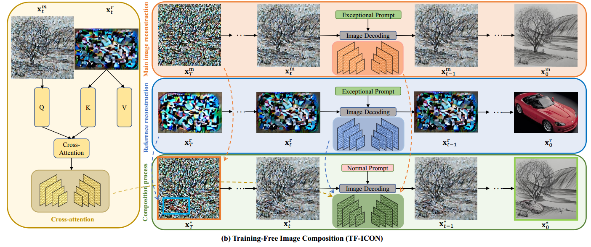

[toc]

> [TF-ICON: Diffusion-Based Training-Free Cross-Domain Image Composition](https://arxiv.org/abs/2307.12493)
>
> [official code](https://github.com/Shilin-LU/TF-ICON)
>
> ICCV 2023

# 问题提出

- 之前的工作进行的额外训练，可能破坏模型的先验知识，还可能导致模型只有在特定场景下的生成能力

# 贡献

- 基于 ODE 的 inversion 方法，新的 Null Embedding 的编码方式
- 通过 self attn map 融合原图和参考图

# 思路

> 排除 inversion 的训练，该方法其它部分是 training-free 的

**基于 ODE 的 inversion**

- 和 null text inversion 的思路类似，为了缓解 cfg 带来的”误差累计“，使用一个 "null embedding" 来学习误差
- 论文提出 **Exceptional Prompt**，核心思路是消除 null embedding 中全部的语义信息，
  - 去除所有的 SOT 和 EOT 和 PAD 这些特殊的 token，而是**随机挑选一个 token 进行填充** (token 的具体值并不重要)
  - **去除所有的 positional embedding**

**Noise incorporation**

- 为了弥合 reference image 和 main image (i.e. 原图) 之间大小、形状上的差距，

  - 使用预训练的 segmentation 模型将 object crop 出来

  - 上标 $r$ 表示 reference image，$m$ 表示 main image；$M^{seg}$ 表示 crop 出的 object，$M^{user}$ 是用户指定的 inpainting 区域 (一般会比 $M^{seg}$ 粗糙)；而 $M^{user}$ 和 $M^{seg}$ 之间的空隙则使用高斯噪声 $z$ 填充

    

**Composite self-attention map injection**

1. 通过去噪过程**获取 reference image 和 main image 的 self-attn map**

2. 论文认为根据  直接进行去噪，对于 main image 和 reference image 的保留还是不足

    两行图都可以看到 Injection 前的保留不足

   > 这幅图中 Exception Prompt 的效果好像和 null text prompt 在对原图的保留上的差距较大

   论文通过操作 self-attn map 的方式，除了在 inpainting 位置注入 reference image 的 inversion (图(a) Latent Space)，还**将 reference image 的 self-attn map 一并注入**

   但是，这样注入的 self-attn map 会缺少 main image 中的上下文信息，所以额外**计算 cross attn map 替换与 reference image 和 main image “交互”部分的 self-attn**

   

3. 对于 self-attn map 的操作只发生在去噪的前期

4. 在去噪前期使用 $x^m_t$ 替换背景， (和前景去噪，背景加噪的思路一致，但是纳入 inversion 后，前、背景应该都是去噪了)

> 原文：The exceptional prompt is applied only in image inversion but not in the composition process.
>
> 虽然 $x^*_T$ 来自于 inversion，但是在 Composition Process 却没有使用 Exception Prompt，不知道是什么原因

# Limitation

- 操作 attn map 对 reference image 有着较大的限制 (e.g. reference image 是正面的，通过 self-attn map 注入的方式想要生成其它的角度会较为困难)