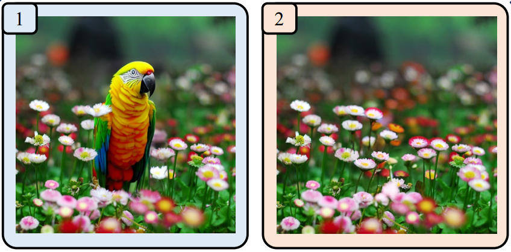
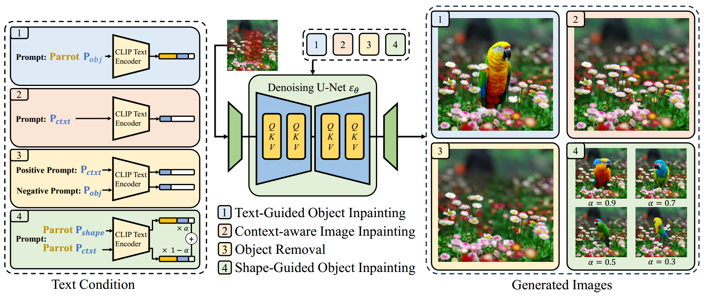
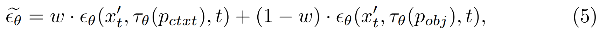
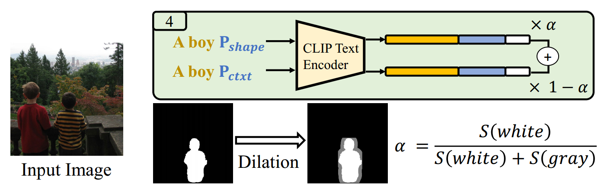
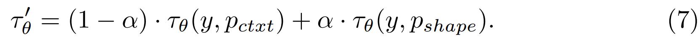

[toc]

> [A Task is Worth One Word: Learning with Task Prompts for High-Quality Versatile Image Inpainting](https://arxiv.org/abs/2312.03594)
>
> [official code](https://github.com/open-mmlab/PowerPaint)
>
> ECCV 2024

# 问题提出

- 在之前的工作中，使用 text 引导 inpainting 和 context aware inpainting 是分开的两个任务，没有统一在一起

   (左) text guided inpainting，在 mask 位置生成鹦鹉，(右) context aware  inpainting，根据四周的图像信息，还原 mask 位置

# 贡献

- 将多种不同的 inpainting 任务统一到一个模型中
- 引入 3 种不同的 learnable task prompts，concat 在 text embedding 后引导不同任务的生成

# 思路

**大一统模型**

- 在论文中提出 PowerPaint 可以执行 <u>*4 种任务*</u>，（1）Text-Guided Object Inpainting（2）Context-aware Image Inpainting（3）Object Removal（4）Shape-Guided Object Inpainting

  > Text-Guided Object Inpainting = text + coarse mask / bbox，Context-aware Image Inpainting $\approx$ outpainting，Shape-Guided Object Inpainting = text + mask

**Context-aware Image Inpainting**

- 在训练过程中，**随机 mask 掉 $x_0$ 中的区域，然后增加可训练的 $P_{ctext}$**；随后使用普通的 recon loss
- $P_{ctext}$ 是可训练的

**Text-guided Object Inpainting**

- 在训练过程中，使用检测**物体的 bbox 作为 mask**，除了描述 mask 区域的 prompt token，还**增加可训练的 $P_{obj}$ token**；随后使用普通的 recon loss

  > 原文：To achieve this, we introduce a learnable task prompt, denoted as $P_{obj}$, which serves as the <u>*task hint*</u> for textguided object inpainting.

**Object Removal**

- 利用**已经训练好的 $P_{ctext}$ 和 $P_{obj}$，使用 cfg 实现，**

  

**Controllable Shape Guided Object Inpainting**

- 在使用精确的 mask 时，可能会让模型过度依赖 mask 的形状而导致与 object 的真实形状“不协调”

- 在训练过程中，**精确的 mask 会经过不同程度的腐蚀**，**引入可训练的 $P_{shape}$ token**，

  

  然后通过线性组合得到 embedding，

  这里的 **$\alpha$ 是腐蚀前后 mask 的面积比值**，$\alpha$ 越高表示越接近精确的 mask；在推理过程中，$\alpha$ 可以由用户指定

# Limitation

- 当 reference object 在图中所占面积较小时，生成效果不佳