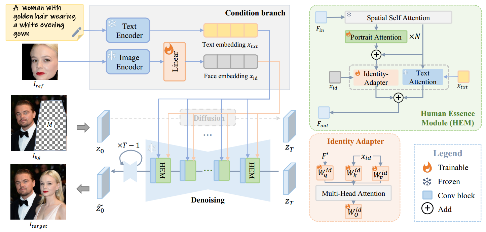
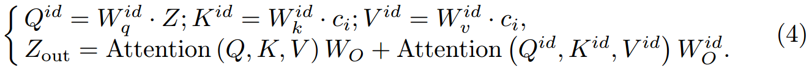
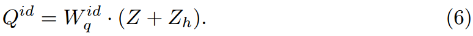

[toc]

> [AddMe: Zero-shot Group-photo Synthesis by Inserting People into Scenes](https://www.ecva.net/papers/eccv_2024/papers_ECCV/papers/03028.pdf)
>
> ECCV 2024

# 问题提出

- 之前的方法没有针对“人物肖像”的 inpainting 场景进行优化

# 贡献

- 对人脸场景下的 inpainting 任务的专用模型
- 延续 IP-Adapter 的思路，通过修改结构增强脸部参考信息的注入和 text condition 的解耦

# 思路

**Disentangled Identity Adapter**

- 与 IP-Adapter 相比，该论文提出的方法不使用共用的 query embedding，而是**重新计算一个新的 query**，

  ，$Q^{id}$ 是重新计算的 query，不与 text 共用

**Enhanced Portrait Attention**

- 额外增加一个残差 + self-attn

   

  $Z_h$ 初始化为全零矩阵

> 这一系列的网络结构看起来不是很有解释性

**Training & Data Augmentations**

- 在训练中从数据中 crop 出人脸和整个肖像，训练模型还原原图 $x_0$
- 为了防止模型只学会简单的“复制黏贴”，对人脸进行翻转、旋转、亮度/对比度调整、模糊等增广

# Limitation

- (左) 当提供作为参考的人脸较小时，生成效果不佳；(右) 由于 $x_{id}$ 是针对整张脸的，所以希望通过 prompt 再对发色等细节属性进行控制是比较困难的

  