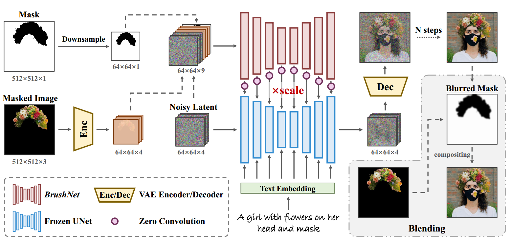
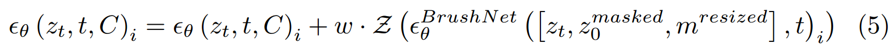

[toc]

> [BrushNet: A Plug-and-Play Image Inpainting Model with Decomposed Dual-Branch Diffusion](https://arxiv.org/abs/2403.06976)
>
> [official code](https://github.com/TencentARC/BrushNet)
>
> ECCV 2024

# 问题提出

- 论文中将现有的 inpainting 方法分为两类（1）前景、背景分别加噪/去噪（2）在 channel 维度上扩展 mask 和 masked image 信息
  - 对于方法 (1)，该论文认为 mask 会被 resize 到和 latent image 一致，可能导致 mask 的不准确；此外，mask 内外的上下文信息不足
  - 对于方法 (2)，论文认为如果 mask 等信息在最开始进行融合，后续结构获取到的 mask 信息会被 text condition “污染“；且 channel 维度的增加给 UNet 的学习带来更大的难度

# 贡献

- 提出一种类似 ControlNet 的方式进行 inpainting 任务

# 思路

**Dual-Branch Design**

- **冻结原始的 UNet 分支**，增加一个完整的 (down+mid+up) 的 UNet 分支，**新增的 UNet 分支的输入为 channel 上 concat 在一起的 noisy latent + mask + masked image** (channel 数为 4+4+1=9)

  与原始分支通过 zero convolution 相加融合 (和 ControlNet 一致)

  $w$ 用于控制融合强度

  

- 在新分支中并**不引入 text condition**

> ControlNet 的思路相似，但是 ControlNet 更多是依赖 text condition 的稀疏控制，并不能完全实现像素级的控制

**Blending Operation**

- 论文认为在推理过程中，背景直接复制黏贴的做法是可行的，但是使用精确的 mask 可能导致边界部分的不和谐；论文提出先对用户指定的 mask 进行高斯模糊，适当放大 mask 内的区域，然后再和原图的背景拼接在一起

# Limitation

- 对于 shape 比较“极端“的 mask，生成效果不佳