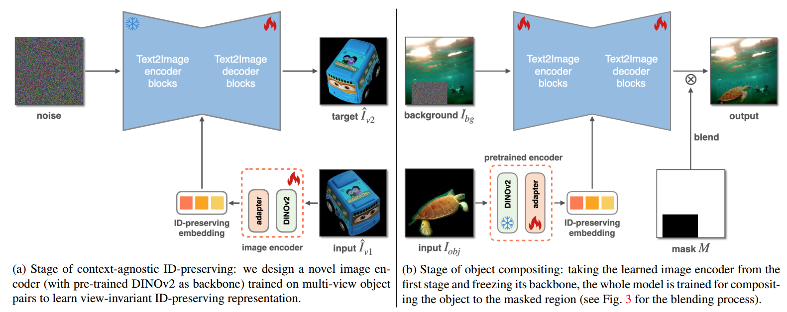
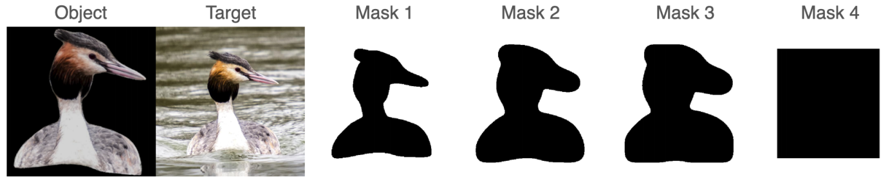
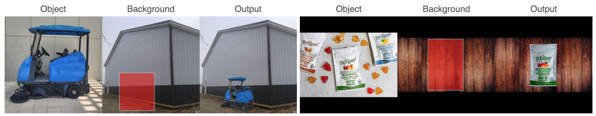

[toc]

> [IMPRINT: Generative Object Compositing by Learning Identity-Preserving Representation](https://arxiv.org/abs/2403.10701)
>
> CVPR 2024

# 问题提出

- 之前的工作在提供 image example 的场景下的生成效果不佳 (e.g. 视角、姿势单一)

# 贡献

- 为了实现对 reference object 的多视角、姿势、光照的 inpainting 任务，使用一个两阶段的模型，第一阶段训练得到适用于多视角、姿势、光照的 embedding，第二阶段进行 inpainting 训练

# 思路

**第一阶段：Context-Agnostic ID-Preserving**

- 为了得到可以**用于不同视角、姿势生成的 embedding**，在训练过程中**输入视角 $\hat I_{v1}$，期望生成视角 $\hat I_{v2}$**

**第二阶段：Compositing Stage**

- 这一阶段的训练有两种不同的训练数据，（1）来自**静态数据** (i.e. 只有一张图)，**$I_{obj}$ 会经过数据增强**（2）来自**视频数据** (i.e. 会有两帧图)，**$I_{obj}$ 来自其中一帧，模型需要生成不同视角、光照、姿势等的另一帧**

**数据收集**

- 论文中对 mask 进行从粗糙到精细的增广

  

- 对于静态数据集，对 $I_{obj}$ 进行仿射变换和颜色与光照扰动；对于视频数据集，主要限制相邻帧数 $|n_1-n_2|\le7$，以保留背景

- 对于第一阶段训练需要的多视角数据集，有开源数据集可以直接使用

# Limitation

- (左) 当视角变化较为剧烈时，对 object 的忠实度会下降；(右) 当 object 上的存在精细的细节时，这些细节可能无法被准确保留

  