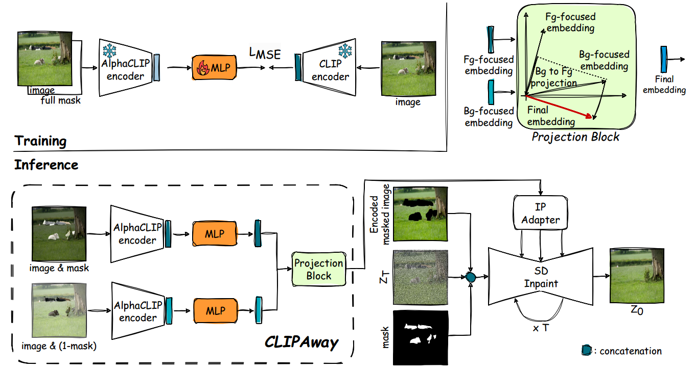
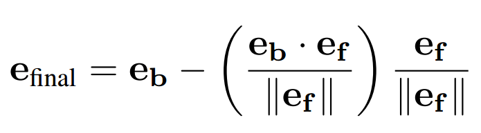
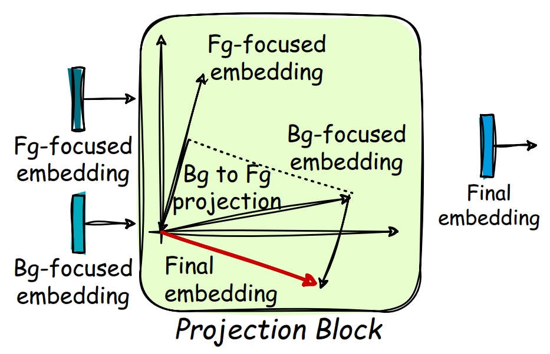

[toc]

> [CLIPAway: Harmonizing Focused Embeddings for Removing Objects via Diffusion Models](https://arxiv.org/abs/2406.09368)
>
> [official code](https://github.com/YigitEkin/CLIPAway)
>
> NeurIPS 2024

# 问题提出

- 之前基于 diffusion model 的物体移除模型倾向于向 mask 位置生成新的物体而不是使用背景进行填充

# 贡献

- 提出利用 AlphaCLIP 得到额外关注前景、背景的 image embedding，通过从 $e_{bg}$ 中减去 $e_{fg}$ 得到“纯粹”的背景 embedding

# Preliminary

**AlphaCLIP**

- Alpha‑CLIP 是对 OpenAI CLIP 模型的增强版本，通过在输入图像中添加 alpha 通道 (i.e. 额外透明度通道)，让 **CLIP 模型能够聚焦于图像中的特定区域** (i.e. mask)，而不是只能对整张图像进行全局理解
- **AlphaCLIP 得到的 embedding 并不是只对特定区域编码**，**而是指定区域的编码会被增强**，但也不会完全忽视剩余部分区域的编码

**SD-Inpaint**

- stable diffusion 的 inpainting 版本

# 思路

> CLIPAway 中的核心部分是 training-free 的

**训练阶段**

- AlphaCLIP 和 OpenCLIP ViT-H/14 在维度上有区别，所以通过**将 AlphaCLIP 的 mask 设置为整张图**，**对齐两者的维度**

**Projection Block**

 

- $e_{bg}$ 表示使用 AlphaCLIP 对背景的编码，$e_{fg}$ 表示前景的编码

  $e_{bg}$ 包含物体移除的需要的背景信息，但是 **$e_{bg}$ 仍然有残留的前景信息**，这些信息需要被移除

- 移除的操作转为数学语言，是 **$e_{bg}$ 先向 $e_{fg}$ 做投影 (i.e. 表达出背景中残留的前景信息)，然后将这个投影从 $e_{bg}$ 中减去**

# Limitation

- 如果 mask 没有包含，对于物体的影子的去除效果不佳