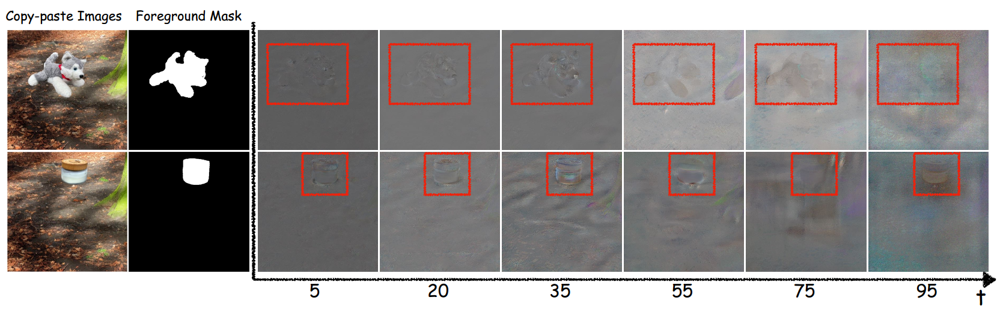
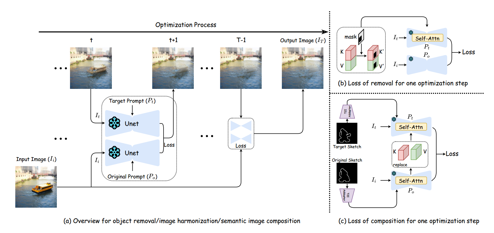
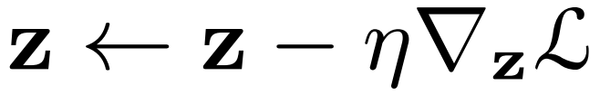
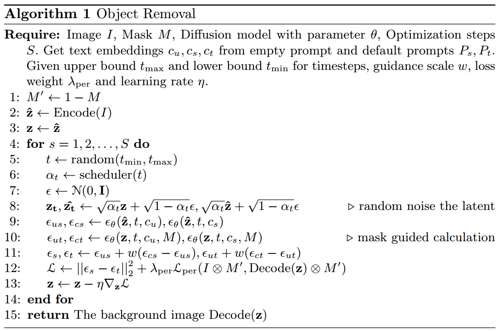
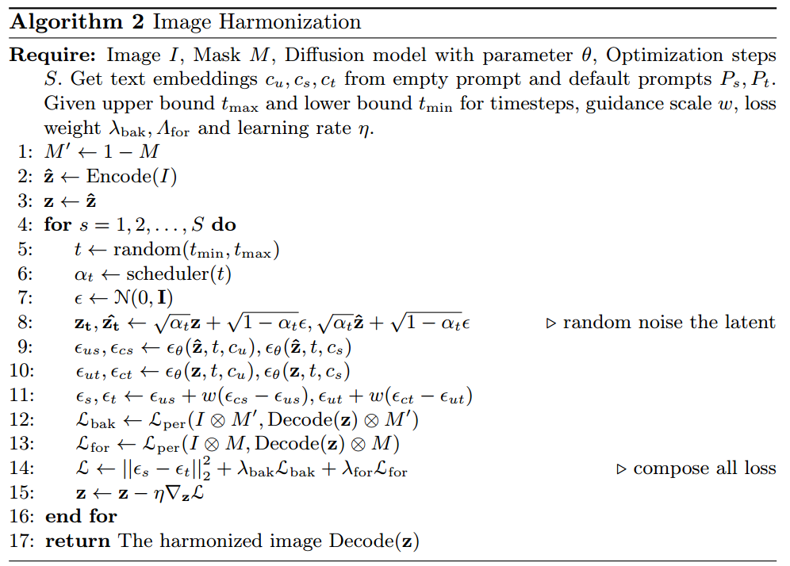
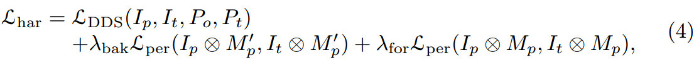
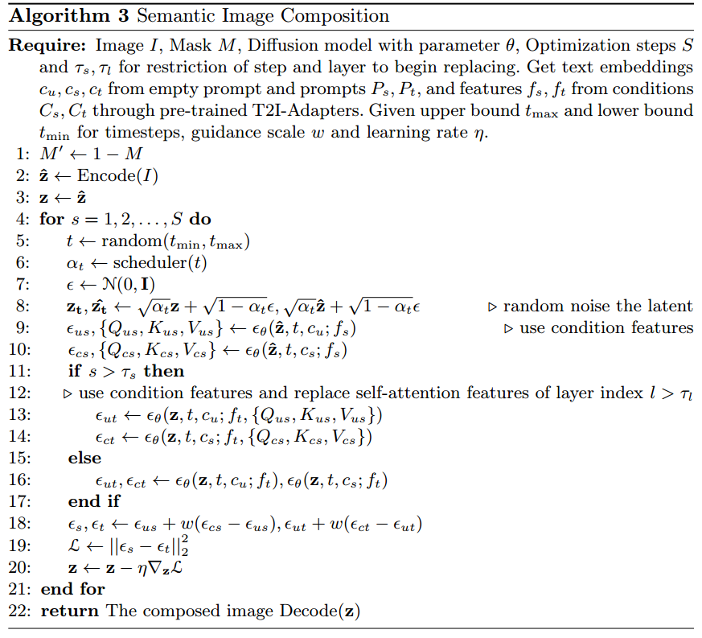
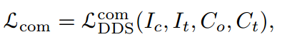

[toc]

> [FreeCompose: Generic Zero-Shot Image Composition with Diffusion Prior](https://arxiv.org/abs/2407.04947)
>
> [official code](https://github.com/aim-uofa/FreeCompose)
>
> ECCV 2024

# 问题提出

- 之前的工作依赖于训练集的数据分布，导致方法不够通用

# 贡献

- 论文提出可以利用噪声的差值来判断简单的“复制黏贴”噪声的“不自然”的位置和更新方向

- 将 inpainting 任务划分为 3 个子任务（1）移除物体 Object Removal（2）融入参考物体 Image Harmonization（3）调整参考物体 Semantic Image Composition

  提供了一个 pipeline 可以适用于 3 个任务

- 利用 DDS loss 和 Perceptual loss 对 latent image 直接更新；通过 attn map 对前、背景进行操作

# 思路

> FreeCompose 算是某种程度的 training-free 方法，所有模型参数都是被冻结的，它们不是训练的对象

**Observations on the diffusion prior**

> 可以看到图中，被黏贴的 object 的位置附近的噪声预测与周围“自然“的背景差距较大

- 如果将一个 object 直接复制黏贴到另一张背景图上，在噪声预测时，**会在“不自然”的位置 (i.e. object 黏贴到的位置) 产生较大的噪声**

  所以利用 object 黏贴前后的**噪声预测的差值** (i.e. DDS Loss)，可以**表明对于黏贴上的 object 的图像在什么位置进行更新，以及怎样进行更新** (i.e. 对差值求梯度并更新 latent image) <u>*以消除“不自然”*</u> 

**General Pipeline**

- 论文将 inpainting 任务划分为 3 个子任务（1）移除物体 Object Removal（2）融入参考物体 Image Harmonization（3）调整参考物体 Semantic Image Composition；并提供了可以**适用于 3 个任务的 pipeline**

  > 不确定任务 2 和 3 是不是互斥的

- **DDS Loss**

  简言之，对两个 diffusion model 使用相同的初始化 $\epsilon$，然后计算**两个网络的噪声预测的差值**

  **Perceptual loss**；一般是使用 VGG 网络，然后计算每一个特征层之间的差距

- 对于两个去噪网络，分别使用 $I_t,P_t$ 和 $I_i,P_i$；$I_t$ 初始化为 $I_i$

- 论文中提出的方法**直接在 latent image 上进行更新** 

**Object Removal**

- 将 $I_i$ 设置为原图，$P_i$ 设置为 "Something in some place"；$P_t$ 设置为 "Some place"

- 将 mask 区域的 self-attn score 移除

  > 原文：the semantic information of the masked region is replaced by its surroundings
  >
  > 不清楚这里的 replaced by its surroundings 具体是如何实现的？

- 损失函数，$M^{\prime}$ 表示仅关注背景区域 ($M$ 表示前景)

  

**Image Harmonization**

- 将 $I_i$ 设置为**直接将 reference object 黏贴到 Object Removal 输入的背景图**上形成的图像；$P$ 均设置为 "A harmonious scene"

- 损失函数，增加对前景的 perceptual loss，

  

**Semantic Image Composition**

- 使用 T2I-Adapter 引入控制信息

- 将 $I_i$ 设置为**直接将 reference object 黏贴到 Object Removal 输入的背景图**上形成的图像；$P$ 根据需要引入的控制信息设置 (e.g. "XXX object")

- 为了更好地保存 object，一定时间步后，对于一定的 layer，**将 $I_t$ 的 self-attn map 替换为 $I_i$ 的 self-attn map**

  > 可能是 $I_i$ 分支引入的控制信息和 $I_i$ 本身高度相似 (e.g. 引入的 canny map 其实本身是从 $I_i$ 中提取到的)，使得 $I_i$ 在一定时间步后能够很好地重建出 reference object，所以将这些“更好”的 self-attn map 替换掉 $I_t$ 的 self-attn map

- 损失函数，因为替换 self-attn map 的步骤保留了前、背景信息，所以只需要 DDS loss，

  

# Limitation

- 对于 Object Removal 阶段，（1）如果 mask 过大，可能导致没有足够的上下文恢复背景（2）mask 如果没有框住需要擦除的物体，物体的剩余部分可能被错误地保留（3）使用 mask 的方式可能导致 diffusion model 使用其它 object 填充而非背景

- 对于 Harmonization 阶段，如果 object 和背景的差距过大，生成效果可能不佳
- 对于 Semantic Image Composition 阶段，控制信息的选择对生成效果影响较大 (e.g. canny map 效果不错，sketch 可能就稍差)