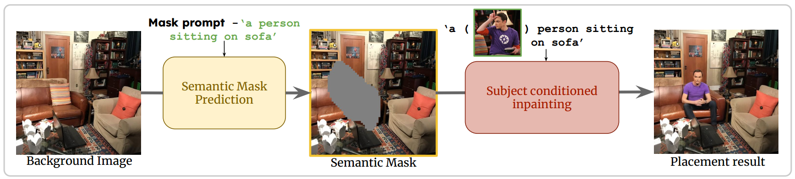
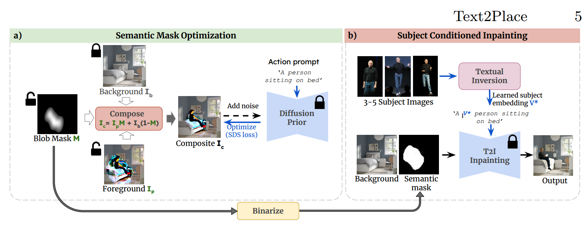
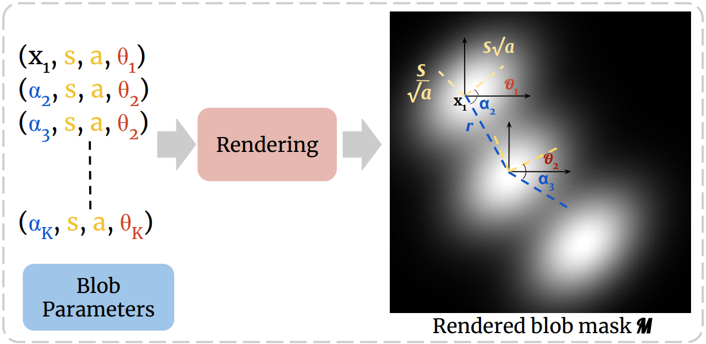
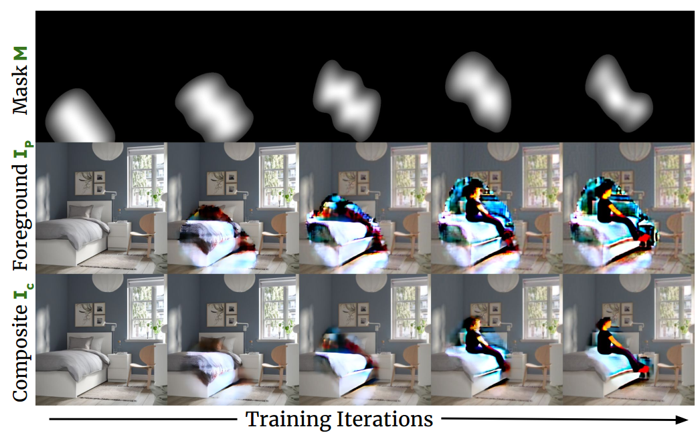
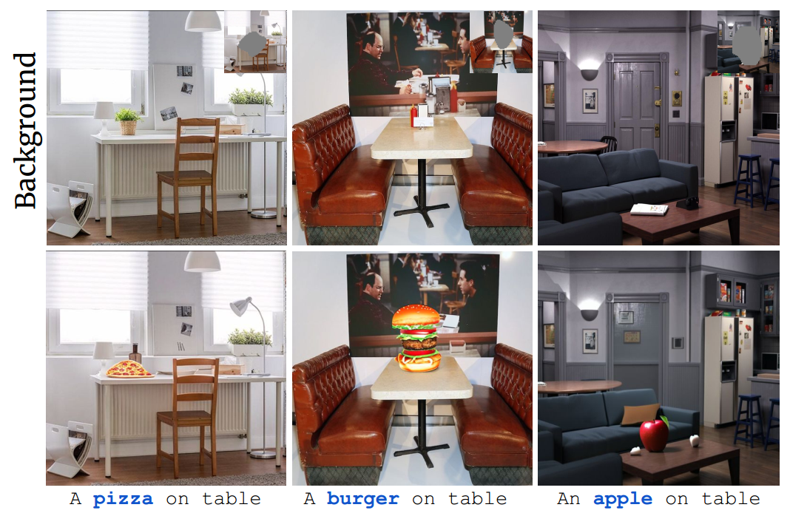

[toc]

> [Text2Place: Affordance-aware Text Guided Human Placement](https://arxiv.org/abs/2407.15446)
>
> [official code](https://github.com/Harsh-Gupta9897/Text2Place)
>
> ECCV 2024

# 问题提出

- 之前的方法可以通过 mask 控制 reference object 的位置，但是无法与背景进行交互 (e.g. 如果 object 是一个站着的人，而背景中有一把椅子，生成这个人坐在椅子上对模型来说是有困难的)

# 贡献

- 将涉及人类的 inpainting 任务拆分为 2 个子任务（1）mask 预测（2）inpainting
- 论文提出了使用一连串“椭圆”的方式表示 mask
- 结合 Textual Inversion 注入reference person

# 思路

> Text2Place 基本是一个 training-free 方法，模型的参数全部处于冻结状态；对每一张背景图进行快速的“微调”

**Semantic Human Placement**

- 论文中提出了名为 Semantic Human Placement 的任务 (e.g. 让 reference person 坐在场景中的沙发上)

  Text2Place 将任务拆分为两个阶段（1）进行 mask 预测（2）将 reference person 绘制到图像中

**Blob Mask Representation**

- 论文并没有直接使用像素级别的 mask，而是绘制数个“椭圆”

  这些“椭圆”有一个起点 $(x_1,s,a,\theta_1)$，$x_1$ 是椭圆中心的坐标，$s$ 和 $a$ 可以得到椭圆的长轴和短轴，$\theta_1$ 表示“椭圆”的旋转角度；而对于后续的“椭圆”的中心坐标则是通过角度 $\alpha_i$ 和一个固定的、预先设置的距离 $r$ 计算得到

  这种做法比像素级的 mask 更灵活、收敛速度更快

- **$x_1$，$\theta$，$\alpha$ 这 3 个参数是可训练的**，其它则冻结 (通过消融实验这样的效果最好)

**Semantic Mask Optimization**

- $I_b$ 是用户输入的背景图，$I_p$ 初始化为 $I_b$；仅有 $M$ 和 $I_p$ 是可训练的 ($I_p$ 应该是直接在 latent image 上更新)
- 通过 $M$ 拼接前、背景后，得到 $I_c$；对 $I_c$ 加噪后，使用 text conditioning 进行噪声预测，然后计算 recon loss，并梯度回传更新 $M$ 中的参数和 $I_p$；以此循环
- 再通过二值化得到像素级的 mask，对多个“椭圆”的每个像素计算平均值，将超过 threshold (论文设置 0.2) 的像素置为 1

**Subject conditioned inpainting**

- 结合 Textual Inversion 和预测得到的 mask 进行 inpainting 

# Limitation

- blob mask representation 方法生成的 mask 一般占整张图的面积较大，当 reference object 本身较小时，大小上不匹配的 mask 会导致生成效果不佳

  