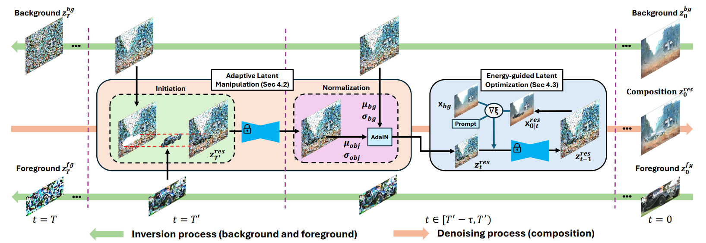
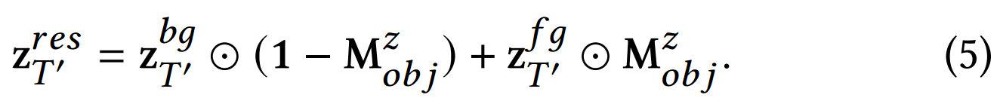
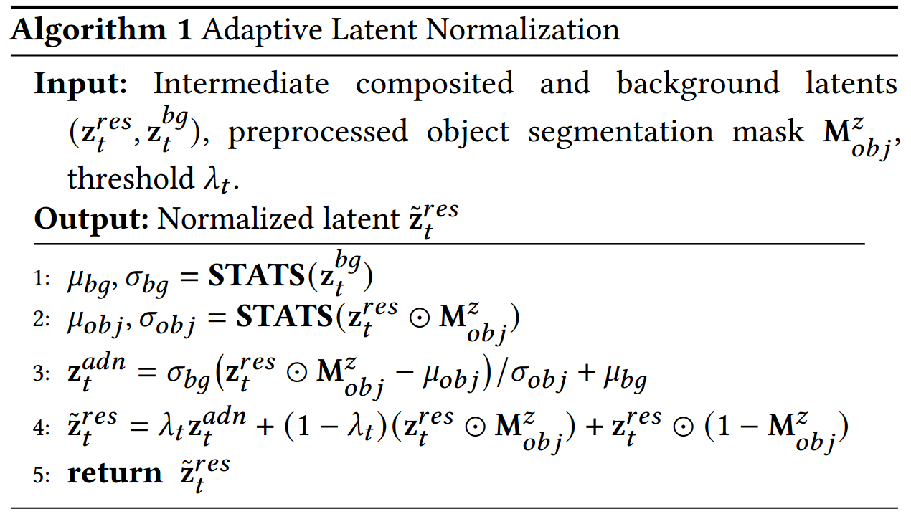
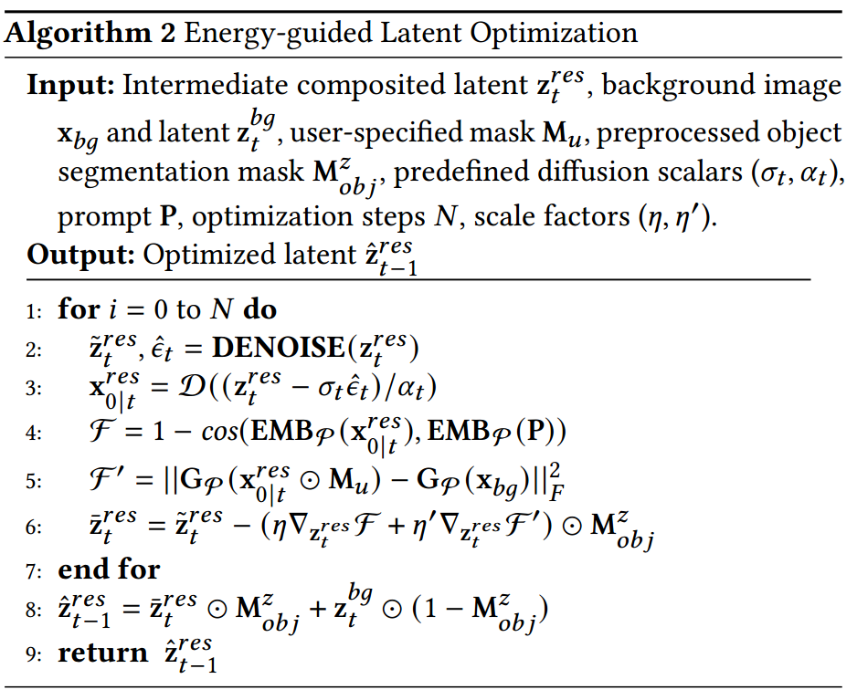
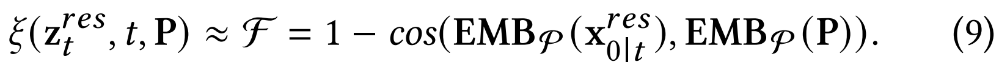
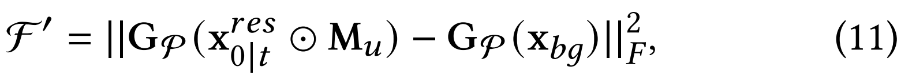

[toc]

> [TALE: Training-free Cross-domain Image Composition via Adaptive Latent Manipulation and Energy-guided Optimization](https://arxiv.org/abs/2408.03637)
>
> [official code](https://github.com/tkpham3105/TALE)
>
> ACM 2024

# 问题提出

- 之前有一些工作需要专门的数据集或只适用于专门的场景；另一些 training-free 的工作 (e.g. TF-Icon) 则关注于使用 attn map 进行融合，但是面临着 reference object 保存不完整、与背景风格融合效果差的问题

# 贡献

- 延续 TF-Icon 的思路
- 使用 AdaIN 调整 reference object 的风格；CLIP 和 Gram Matrix 作为损失函数

# 思路

**Selective Initiation**

- 将背景和 reference object 分别通过 inversion 还原到 $z_T$，然后拼接在一起

  

  和 TF-Icon 的区别是删除了使用高斯噪声 $z$ 填补空隙的部分；论文通过实验认为 <u>*$z$ 可能导致风格的不统一*</u>

  > 少见的仅对之前的工作的删减作为一个小创新点

**Adaptive Latent Normalization**

- 在<u>*去噪前期*</u>，通过 **AdaIN** 对融入的 object 进行风格调整
- 增加超参数 $\lambda_t$ 平衡 AdaIN 前后的 object 

**Energy-guided Latent Optimization**

- 在<u>*去噪后期*</u>，将图像还原到 image 空间中，引入 2 个额外的损失函数，

  **CLIP Loss**；

  **Gram Matrix**；

  然后<u>*直接在 latent image 上更新*</u>