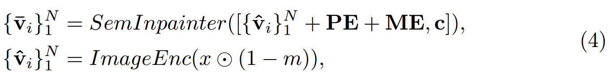

[toc]

> [Improving Text-guided Object Inpainting with Semantic Pre-inpainting](https://arxiv.org/abs/2409.08260)
>
> [official code](https://github.com/nnn-s/catdiffusion)
>
> ECCV 2024

# 问题提出

- 之前的一些工作没有显式地将语义信息和背景进行融合

# 贡献

- 类似 IP-Adapter 的思路，但额外对注入的 image embedding 在 CLIP 空间上进行训练和对齐

# 思路

**Semantic Inpainter**

- 提取 masked image 的 embedding (e.g. CLIP Image Encoder)

  SemInpainter 是一个<u>*多层 transformer*</u>，PE 表示位置编码，ME 表示 mask 编码，c 表示 text embedding，[·] 表示 concat 操作

  SemInpainter 预测结果仍然<u>*是一个 CLIP Image 空间的编码*</u>，作用是尝试将 mask 部分在语义上进行补全 (这个难度可能更低一些)

  

- 损失函数；因为仍然是与 CLIP Image 空间对齐的，所以可以使用 CLIP(x) 进行监督 (这里的 x 应该是指原图)，

  

> 在推理过程中，对于不同时间步，SemInpainter 应该不需要重复计算，因为它与噪声和去噪过程无关

**Reference Adapter Layer**

- 为了将 SemInpainter 的输出注入 U-Net，**在 self-attn 和 cross-attn 中增加一层 cross-attn**，SemInpainter 的输出作为 Key 和 Value