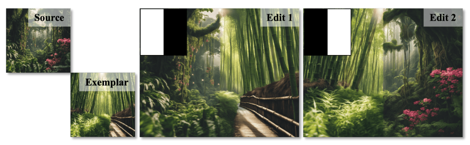
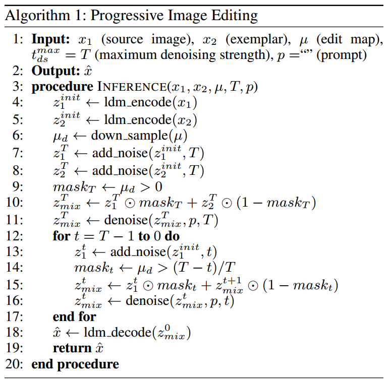
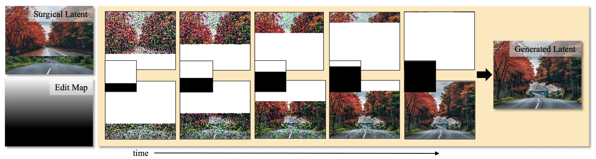

[toc]

> [PIXELS: Progressive Image Xemplar-based Editing with Latent Surgery](https://arxiv.org/abs/2501.09826)
>
> [official code](https://github.com/amazon-science/PIXELS)
>
> AAAI 2025

# 问题提出

- 之前的模型在处理边界时容易出现“不自然”

   (图像中间有着较明显的“分界线”)

# 贡献

- 通过渐进式的 mask，更好的融合前、背景

# 思路

> PIXELS 是一个 training-free 方法

 

**Non-binary Edit Map**

- 该论文提出使用一种非二值化的 mask，直观上，**越黑的部分会经历更多包含上下文的去噪过程** (i.e. 引入 reference 的区域有更多机会和背景的风格对齐)，**越白的部分越会保持原状** (i.e. 背景不需要发生变换的区域)

**Progressive Image Editing**

- 通过 step 14 的操作，$(T-t)/T$ 这一项会越来越接近 1，实现了**“渐进式”的 mask**