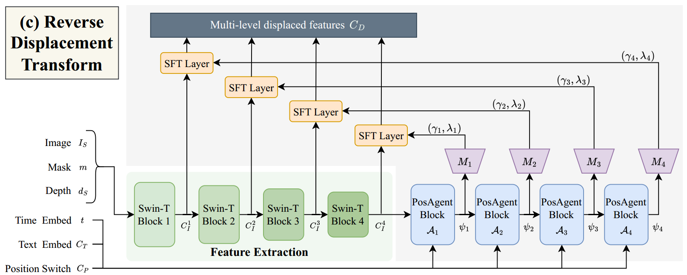

[toc]

> [Adaptive Transformation Agent for Text-Guided Subject-Position Variable Background Inpainting](https://arxiv.org/abs/2504.01603)

# 问题提出

- 之前的模型中，一般使用“硬“的 mask，这限制了 reference object 和背景在语义层面上的融合 (e.g. object 被放置在不同的位置、object 大小不合适)

# 贡献

- 基于 DiT 结构，提出新的 inpaint 任务，关注 reference object 的自适应调整，而无需用户提供 mask 和 background
- 通过预测 scale 和 shift 对 feature map 进行调整，以表示图像的放缩和移动

# 思路

> 该论文的方法基于 DiT 结构

**Text-Guided Subject-Position Variable Background Inpainting** 

- 该论文提出了一个新的 inpainting 任务，用户<u>*仅必须提供 reference object*</u> (可以选择是否提供 mask)，模型根据 text condition 生成合理的布局，生成前、背景融合的图像

   (左) 其它模型按照“硬” mask 将汽车安置在图像中间，与 prompt 中的 "on the road" 矛盾，导致 "road" 被泥土替代；(右) 该论文的方法，则将汽车移动到图像右下角，并且向前景移动，图像更和谐

**Feature extraction**

- 从 cropped subject、mask、depth 中提取出 feature map $C_I$；使用 Swin-Transformer 实现

**Reverse Displacement Transform (RDT)**

- **Position Switch**；一组 learnable embedding 表示使用 fixed position (i.e. ”硬“ mask) 还是可以自适应调整的位置

- **PosAgent Block** + $M_i$；负责对于不同分辨率的 feature map，预测**一组 scale $\gamma_i$ 和 shift $\lambda_i$**，表示对于初始给定的 reference object，为了更好地符合 text condition 的控制，应该如何**放缩和移动**，

  

- **SFT Layer**；是一个不可学习的模块，

- RDT 整体类似 U-Net 结构

**Feature fusion by subject cross-attention**

- RDT 的输出 $C_D$ 通过 Subject Cross-Attn 融入 DiT 结构；相较于 IP-Adapter，额外的信息在使用 cross-attn 注入外，**还考虑 self-attn 信息**，

  

**Training Strategy & Dataset**

- 结合固定位置（50%）和可变位置（50%）样本进行训练
- 为了获取可变位置的数据，将 object <u>*居中并等比例放大至95%*</u>，然后相同比例缩放掩码和深度图，结合原图得到训练数据对