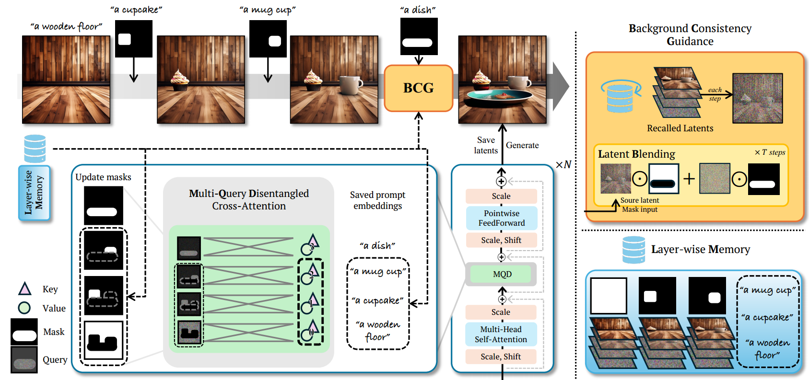
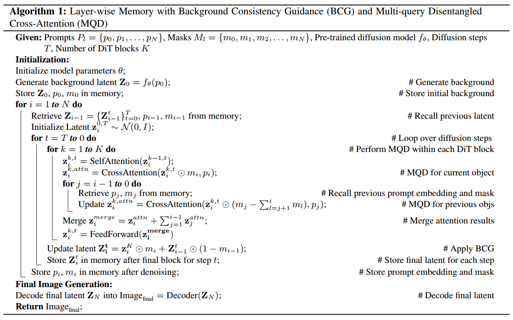
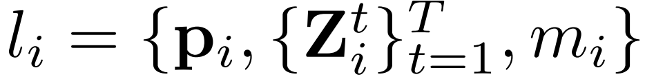
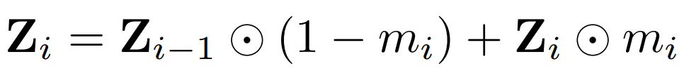
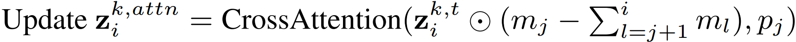
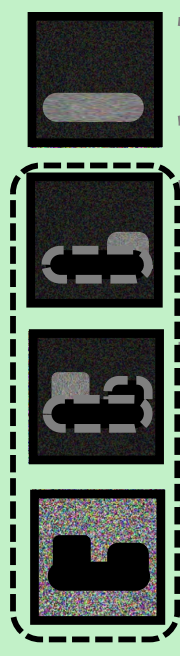
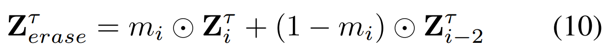

[toc]

> [Improving Editability in Image Generation with Layer-wise Memory](https://arxiv.org/abs/2505.01079)
>
> [official code](https://github.com/carpedkm/improving-editability)
>
> CVPR 2025

# 问题提出

- 之前的工作一般关注的是 "single object" 的编辑，而对多次编辑的场景效果不佳

# 贡献

- 通过保存中间状态，调整 cross attn map 以处理 overlap，实现多次编辑

# 思路

**Layer-wise memory for storing editing history**

- 为了减少后续编辑对之前编辑结果的影响、并减少重复计算，论文提出将这些“中间状态”保存起来，

  ，$p_i$ 表示对于第 i 个 object 的 prompt，$\{Z_i^t\}_{t=1}^T$ 表示生成第 i 个 object 过程中各个时间步的 latent，$m_i$ 表示对于 object 的 mask

**Background Consistency Guidance (BCG)**

- 对于第 i 个 object 的生成，会从 layer-wise memory 中提取出 i-1 状态，并组合出最终的 latent，

  

**Multi-Query Disentanglement (MQD)**

- 对于不同编辑时产生的 object overlap 问题，论文提出在进行 cross attn 计算时，**仅对 $z_i^{k,t}$ 中排除后续 object 的部分进行计算**，

  

   从下之上，图中的加噪区域排除了后续 object 的部分

**Improving Editability**

- 用于保存了“中间状态”，对于<u>*编辑过程中新增的 object*</u>，利用 i-2 的状态，就可以抹除 i-1 的状态，

  

