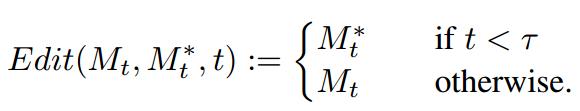
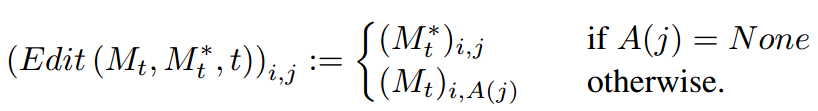
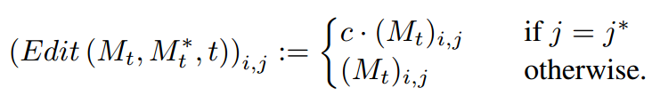

[toc]

> [Prompt-to-Prompt Image Editing with Cross Attention Control](https://arxiv.org/abs/2208.01626)
>
> [official code](https://github.com/google/prompt-to-prompt)

# 贡献

- 应该是首次提出 **cross attn map** 和 object token 的关系，以及如何通过操控 cross attn map 来控制生成
- 提出 3 个 cross attn map 可以用于的任务：（1）Word Swap（2）Adding a New Phrase（3）Attention Re–weighting

# 思路

## Word Swap

- 比如将 a big red bicycle 修改为 a big red car

> 这里到底是产生了哪些替换有些模糊

## Adding a New Phrase

- 对增加部分的 token 的 attn map 和原始 prompt 的 attn map 进行拼接

## Attention Re–weighting

- 重新对 attn map 进行赋值