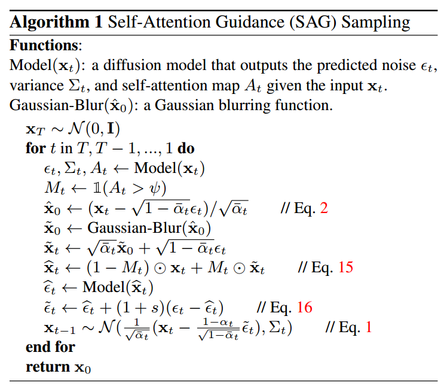

[toc]

> [Improving Sample Quality of Diffusion Models Using Self-Attention Guidance](https://arxiv.org/abs/2210.00939)
>
> [official code](https://github.com/SusungHong/Self-Attention-Guidance)

# 贡献

- 在扩散模型中，self attention 部分与模型的细节生成与质量相关；本论文**利用 self-attn map 获取模型在生成中关心的细节位置以生成 mask，然后对这些 mask 位置加上高斯模糊，利用 cfg 的方式引导模型在这些位置生成更好的细节**

# 思路

## Preliminary

- 对于 attn map，**softmax 是对每一行进行计算**的，i.e. 每一行的总和为 1；而每一列则是这个像素会“点亮”其它哪些像素 (没有总和限制，背景部分的像素对应的那一列可能全是“暗的”)

## Framework

- 这是一个 **training-free** 的方法

- 该方法需要还原到 $x_0$ 上进行操作 (step 5)

- 对 $x_0$ 添加高斯噪声进行模糊 (step 6)

  > 因为添加了高斯噪声的 $x_0$ 在后续步骤中是作为“负样本”使用的，高斯噪声模糊了高频细节 (在 cfg 中相当于要求模型更关注这部分细节，不要产生模糊)

- 对添加高斯噪声的 $x_0$ 重新添加噪声，**根据 self attn map，将细节部分替换为经过模糊的版本，其它部分保持不变**

- 在进行一次噪声预测，**将经过高斯模糊的版本作为“负样本”**，利用 cfg 计算得到最终的噪声

> 这个算法的核心简单说是造出了一个“负样本”，同时这个“负样本”可以自适应的和模型关注的生成细节匹配上，“负样本”在细节区域是模糊的，通过 cfg 就可以<u>*引导模型不要生成模糊的细节*</u>