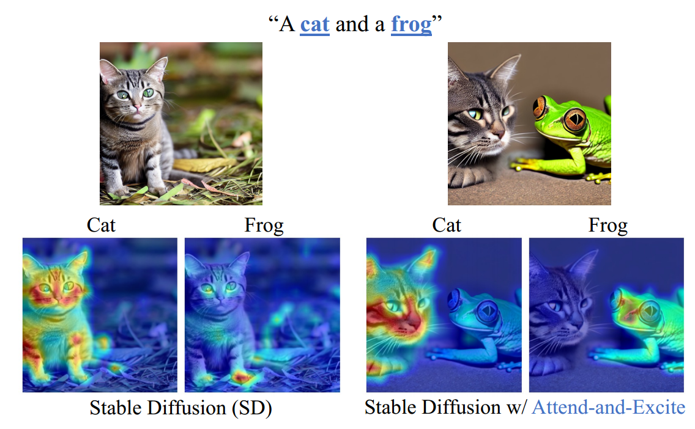
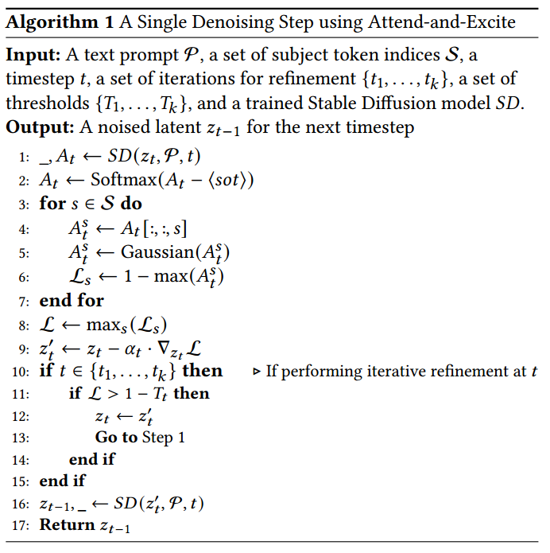

[toc]

> [Attend-and-Excite: Attention-Based Semantic Guidance for Text-to-Image Diffusion Models](https://arxiv.org/abs/2301.13826)
>
> [源码](https://github.com/yuval-alaluf/Attend-and-Excite)
>
> SIGGRAPH 2023

# 贡献

- 提出一种 <u>*training-free*</u> 的算法，通过监督需要生成的**每个 subject token 都有对应的超过一定 threshold 的 attn map**，从而缓解扩散模型在生成过程中<u>*遗漏 subject 的问题*</u>

# 思路

## Algoritthm

- 在扩散模型 (e.g. SD) 中，<u>*cross attn 部分*</u>是在生成过程中能不遗漏 subject 的关键

  

  > 这里假设模型其实有生成 subject 的能力 (e.g. cat, frog)，但是如果在 cross attn map 中没有点亮两个 ROI 区域 (e.g. 只点亮了 cat)，那么模型就会遗漏 subject
  >
  > 只要能够<u>*在数量上满足*</u> cross attn map 上存在两个高亮 (超过一定 <u>*threshold*</u>) 的区域，扩散模型就大概率可以生成正确的 subject (至于 attn map 点亮了哪些区域，这些区域的位置会不会比较离谱，如何根据这些区域绘制出图像，可以假定扩散模型大体上是能够搞定的)

- <u>*算法流程*</u>，

  

  1. 先正常计算 cross attn，并获取到<u>*与 subject 相关的 token 对应的 attn map*</u> (step 1)

  2. 实验中发现 `<sot>` 占据了较多的 attn 值，主要用于提供 global 文本信息，但对于减少 subject 的遗漏的帮助不大，所以<u>*将 `<sot>` 去掉后，重新分配 attn score*</u> (step 2)

     > attention map/score 指的是 $Q$ 和 $K$ 计算得到的权重矩阵

  3. 对于每个 subject 相关的 token 对应的 attn map 进行<u>*高斯模糊*</u>操作，防止模型过度关注某个 patch 而导致 subject 生成不完整 (step 3 - 5)

  4. 找到所有 subject 相关的 token 对应的 attn score 中<u>*距离 1 (i.e. attn score 最大取值) 最大的 attn score 作为 loss*</u> (step 6 - 9)；i.e. **找到目前时间步中关注的最少的 subject，使用它的 attn score 进行 loss 计算**

     虽然涉及了 loss，但是这仍然是个 <u>*training-free*</u> 的方法；loss 用于<u>*直接更新预测到的噪声*</u> (而不是更新 unet 的参数，更像是 cfg)

     > 不太清楚梯度 $\nabla_{z_t} L$ 是如何计算的

  5. Attend-and-Excite 算法只<u>*在去噪过程的前期进行*</u> (论文中提出 [25, 50])

  6. 论文中认为 attn score 的 <u>*threshold 是 0.8*</u>；论文中提出应该在一定的时间步上设置“检查点”，每个 subject 的 attn map 在这些检查点必须<u>*渐进地*</u>满足不同的 threshold (直到满足 0.8)，**如果在“检查点”处没有满足 threshold，则持续进行迭代** (step 10 - 13)

     > 论文中的具体设置为，We set the iterations to 𝑡1 = 0, 𝑡2 = 10, and 𝑡3 = 20 with minimum required attention values of 𝑇1 = 0.05,𝑇2 = 0.5, and 𝑇3 = 0.8

  
  > step 9 的公式表示**直接在 $z_t$ 上 (i.e. latent code) 进行了更新** (这和 cfg-like 的方法有着一定的区别)，这个做法似乎是 Attend-and-Excite 第一个提出的，论文的 section 4 提出了这个公式但是没有给出进一步的 insight，后续的一些 paper 也只是延续了这种做法
  
  

# 参考文献

- [知乎上对论文的解读](https://zhuanlan.zhihu.com/p/622658967)