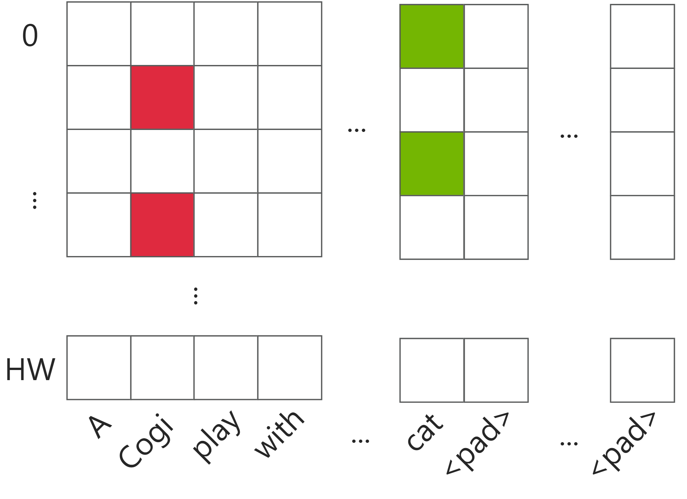
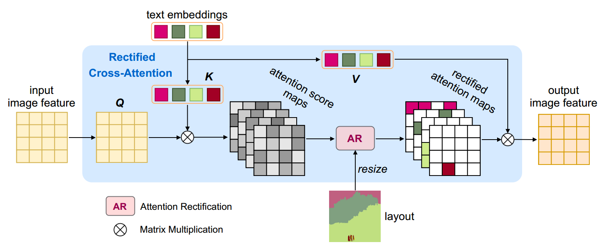
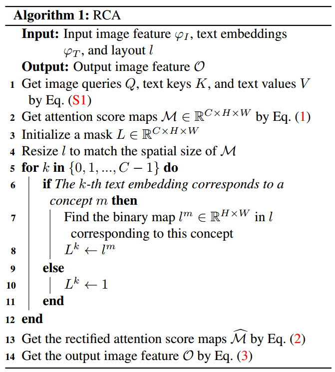
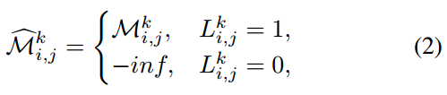
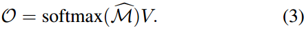

[toc]

> [Freestyle Layout-to-Image Synthesis](https://arxiv.org/abs/2303.14412)
>
> [official code](http://github.com/essunny310/FreestyleNet)

# 贡献

- 通过在 <u>*attn map*</u> 上应用 <u>*segmentation mask*</u> 对每个应该生成的 concept 的<u>*位置信息*</u>进行监督

# 思路

## 基础知识

- **attn map / attn score**：i.e. $Softmax(\frac{QK^T}{\sqrt d})$ 的计算结果，如果存在多头注意力，那么**形状为 (bs, h, seq_len_q, seq_len_k)**

  对于 diffusion 中的 **cross attn** 部分来说，**seq_len_q = HW，seq_len_k = 77** (clip 默认的 seq_len)

  

  简言之，在 diffusion 中 attn map 的<u>*每一列可以看做是某个 text token 会“点亮” latent image 中的哪几个像素*</u>

- attn map 很大程度上会影响图像中“实例”的生成位置和形状，因而可以**通过控制 attn map 来控制 layout**

## Framework

- 提出了 **Rectified Cross-Attention (RCA)**

  > 这<u>*不是*</u>一个 training-free 的方法

- **算法流程**

  

  1. 输入的 prompt 类似于 "dog bowl floor metal wood"，每个单词对应一个 concept

     > 复杂一点的 prompt 也可以，e.g. "dog bowl full of noodles floor metal wood" ("bowl full of noodles" 视作一个 concept)，猜测是在用户输入时或 tokenization 时有一些特殊的操作，而不是模型本身有提取出 concept 的能力

  2. 将用户指定的 segmentation map 按照<u>*不同的 concept 分离到不同的 channel 中*</u>，形成一个 <u>*mask*</u> (C×H×W) (step 3 - 12)

     > 这里的 else 逻辑猜测是对 `<pad>` 和 `<bos>` 等特殊 token 的处理，设置为 1 是表示这些 token 对应的 attn map 允许“点亮” 任意的像素，不会进行 attn score 的重新分配

  3. <u>*重新分配 attn score*</u>，将 segmentation mask 以外的部分设置为 `-inf` (经过 softmax 后权重几乎为 0) (step 13 - 14)

     > 简言之，通过将 segmentation mask 应用到 attn map 上，即使模型关注到了当前 concept 不应该出现的位置 (i.e. 不符合 layout)，在经过 RCA 后，mask 以外的 attn 被几乎清零，从而监督模型学习按照 layout 进行生成

     

     

     