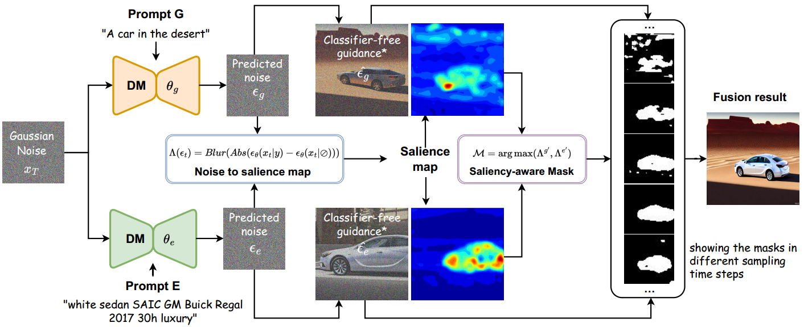
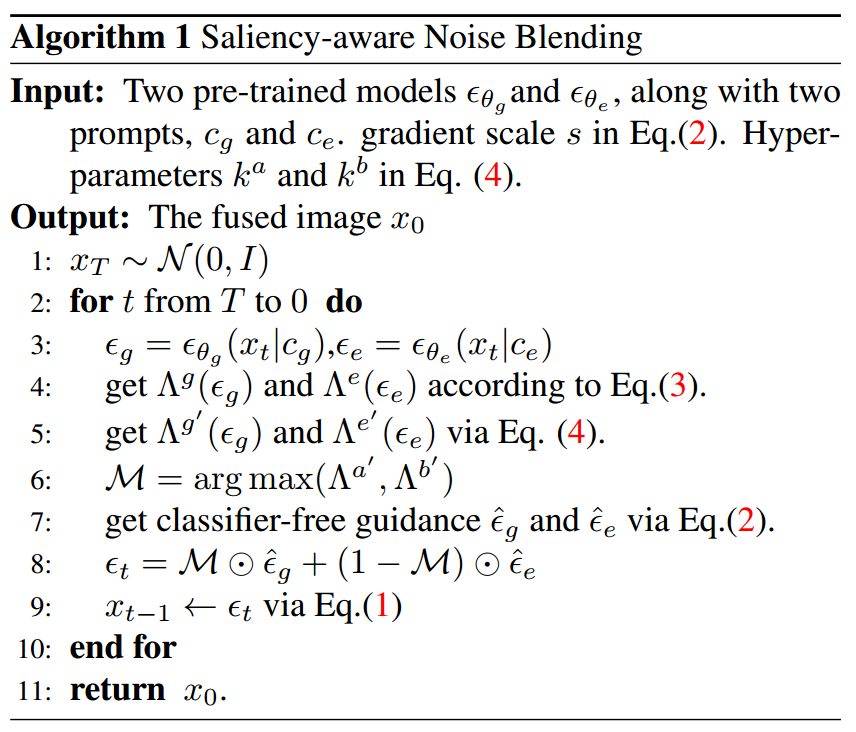
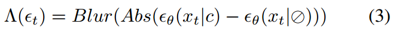

[toc]

> [MagicFusion: Boosting Text-to-Image Generation Performance by Fusing Diffusion Models](https://arxiv.org/abs/2303.13126)
>
> [official code](https://github.com/MagicFusion/MagicFusion.github.io)

# 贡献

- **将 cfg 中计算的 $\epsilon(x_t,c)-\epsilon(x_t,\emptyset)$ 的差值作为“关注程度”的依据 (差距越大，表示该区域越需要关注)**

- 通过计算得到的”关注程度“图，**将一个一般性的生成模型和一个专家性的模型预测出的噪声相结合**，”各取所需“

# 思路

## Framework

- $\Lambda$ 的计算方式为：

  

  $\epsilon(x_t,c)-\epsilon(x_t,\emptyset)$ 的差值作为“关注程度”的依据，**值越高越需要关注**

- **选择 $\Lambda$ 值更大的对应下标** (只有两个元素，所以下标只有 0 或 1)，从而**得到一个二元 mask** (step 6)

- **使用 $M$ 对预测出的噪声进行拼接**

  > 按照公式和结构图中后几个时间步的 mask 的可视化发现在推理后期车辆所在位置基本都是值为 1 了，i.e. 这部分的预测噪声都由一般性模型 $G$ 来提供，感觉这个公式还是比较反直觉的，第一反应是 mask 值为 1 的部分会由专家模型 $E$ 来提供